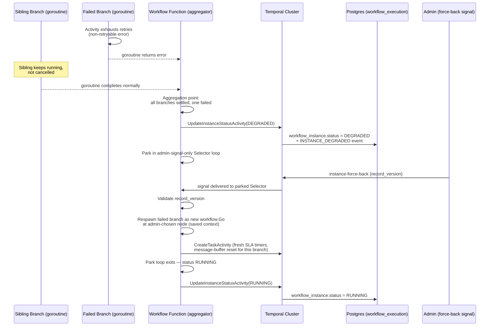
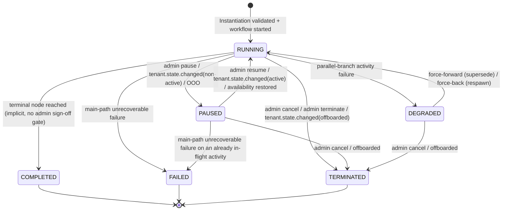
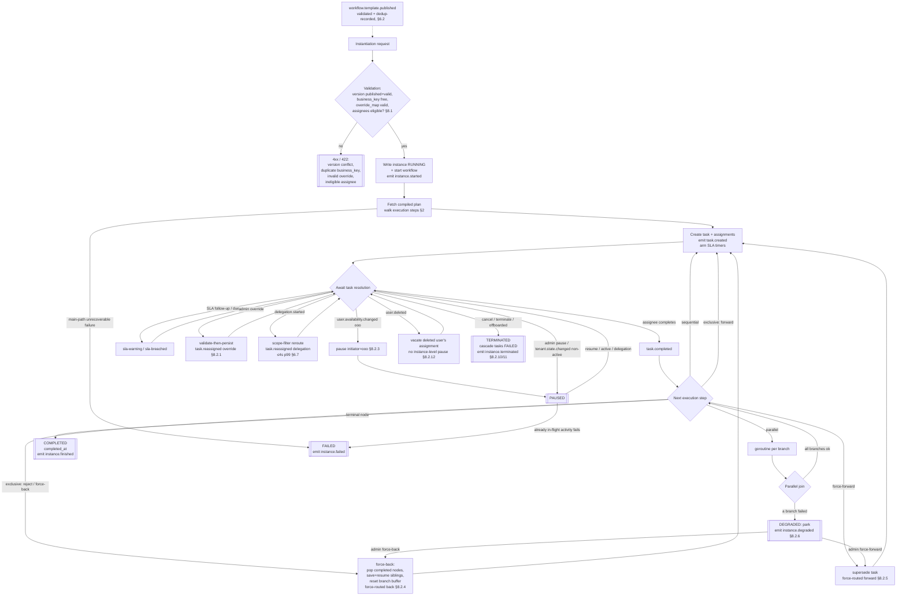

# Execution Service — Low-Level Design

> This is the in-repo copy of the LLD (`docs/lld/`), kept content-identical to the design repo's published copy. The two are intentionally allowed to differ only on embed-vs-link mechanics (e.g. this copy may link to this repo's own `api/asyncapi.yaml` instead of embedding it) — never on content.

The **Workflow Execution Service** is the runtime control plane for the BPMN-driven Workflow Engine. It instantiates and drives compiled workflow instances to completion on top of a shared Temporal cluster, handling instance/task lifecycle, admin overrides, retry/failure semantics, and the full domain event surface. Unlike the Definition Service, which owns design-time authoring and versioning, Execution Service owns runtime orchestration state and is the only service in the platform with a Temporal dependency.

---

## Table of Contents

1. Overview & Scope
2. DSL & Temporal Semantics
3. Temporal Operations
4. Data Model
5. API Design
6. Events & Integration Topology
7. Testing & Infrastructure Strategy
8. Worked Example: Tender Lifecycle Walkthrough
9. Security
10. Non-Functional Requirements

- Appendix A: Design Decisions
- Appendix B: Open Items
- Appendix C: Database Migration Scripts
- Appendix D: Glossary
- Appendix E: Coding Style
- Revision history

---

## 1. Overview & Scope

### 1.1 Service Definition and Platform Role

Execution Service is the runtime that instantiates and drives BPMN-derived workflow instances to completion. It is one of three services in the Workflow Engine platform, all sharing a single Temporal cluster:

- **Definition Service** — BPMN ingestion, structural/semantic validation, DSL compilation, DRAFT → PUBLISHED → ARCHIVED versioning.
- **Execution Service** — instance/task API, signal forwarding to Temporal, the subject of this document.
- **Temporal Workers** — the workflow function and its activities;

Execution API and Temporal Workers are *one logical domain* split across two deployable processes (`cmd/server`, `cmd/worker`) for independent scaling and rollback, not two services — both connect to the same `workflow_execution` database.

Execution Service hosts a domain-generic orchestration engine: today's only tenant workload is tender approval, but the engine must not bake tender-specific concepts into its own schema, API, or event contracts. `business_key` is an opaque, domain-scoped identifier for this reason; a future domain (e.g. PMS) can be a first-class citizen of the same engine.

### 1.2 Architectural Principles

- **Identity-agnostic.** No local auth, no user/department storage — only UUID references. Every request carries gateway-injected headers (`x-tenant-id`, `x-user-id`, `x-tenant-roles`, `x-departments`, `x-plan`, `x-feature-flags`). Trial tenants share a Keycloak realm, so `x-tenant-id` is the real isolation boundary.
- **Signal-Only API.** The HTTP/gRPC layer validates and forwards to Temporal as a signal; it never writes the DB directly. Temporal Activities are the sole DB writers, avoiding the dual-write problem between orchestration state and relational state.
  - **Documented exception.** Bulk tenant/delegation events (`tenant.state.changed`, `delegation.started`, etc.) write the DB directly in one transaction, then signal Temporal in a loop — routing thousands of per-instance signals through a single SQS-handler invocation would blow the visibility timeout.
- **Transactional outbox.** State change and domain event commit in one transaction; a background runner publishes to SNS after commit (§6).
- **Triple-layer tenant isolation.** Gateway header (rejected before DB on mismatch) → Postgres RLS (`tenant_id = current_setting('app.tenant_id')::uuid`, GUC per-transaction, no `BYPASSRLS`) → Temporal task-queue partitioning (`wf-queue-<tenant_uuid>`) for enterprise/noisy-neighbor isolation. The Temporal Web UI/cluster itself is not a fourth tenant-isolation layer and doesn't need to be one: it's never exposed to any tenant-facing surface, only to internal ops/cluster-operator access. An admin who needs to scope a query to one tenant filters or groups by the `TenantId` Search Attribute (§3.6) — no additional isolation layer is required.
- **Optimistic locking.** `workflow_task.record_version` and `workflow_instance.record_version` are bumped on state-changing writes; every admin signal is version-checked against them.

### 1.3 Cross-Service Integration

Execution Service depends on Definition Service for compiled plans and validates against it at two points:

- **`DefinitionService.GetCompiledWorkflow(tenant_id, workflow_version_id) → {workflow_id, version_id, version_number, status, is_valid, compiled_plan_json}`** — called at instantiation (`POST /instances`) and re-validated authoritatively inside `GetCompiledPlanActivity`; rejects a `DRAFT`/`ARCHIVED` version (`409 VERSION_NOT_PUBLISHED`) or an invalid one (`409 VERSION_INVALID`). The compiled plan is cached in Valkey by `(tenant_id, version_id)` (shared across API replicas), cache-aside with write-through on a miss (rev 1.36 — no separate eager populator; see §6.2's `workflow.template.published` row and Appendix A.5 decision 19), fail-open on cache miss/unreachable-cache.
- **`ExecutionService.CheckActiveInstances(tenant_id, workflow_id) → {has_active, count}`** — the archive-guard RPC Definition Service calls into Execution before allowing `POST /workflows/:id/archive`; blocks the archive if any instance is `RUNNING` or `PAUSED`. Archiving a template version never affects instances already running against it — they hold their compiled plan from the moment they started and never re-fetch it.

`ExecutionService.PauseUserTasks(tenant_id, user_id)` is the safety-net RPC Definition Service calls on `department.membership.revoked`/`user.deleted` — Execution runs no separate subscription for these.

Beyond Definition Service, Execution integrates with:

- **Org & Membership / User Profile (IAM)** — inbound events (delegation, tenant lifecycle, user lifecycle, availability) and outbound synchronous eligibility calls (§6, §5).
- **The browser** — calls Execution's business-action and read endpoints (claim/complete/defer/reassign/overrideNodeAssignee, list/detail) directly through the platform's API gateway, the same trust model any other caller uses (gateway-injected headers, §5.6/§5.7). No intermediary service sits in this path (Appendix A.2, decisions 19/20/31, RESOLVED rev 1.34 — an earlier "BE-for-UI" intermediary was designed for this role and is retired; see those decisions for why). UUID-to-display-name enrichment is likewise not Execution's or any backend's concern: the browser composes Execution's raw-UUID responses with IAM's `/users:batch`/`/departments` directly (§5.9).
- **Dashboard Stream Gateway** — a separate SSE fan-out service (not Execution's), consuming Execution's outbound event stream and routing per-user pushes. Its own subscription mechanism, connection-auth ticket, and backfill design are owned by that service.
- **Tender Service** — consumes `workflow.instance.finished` as a post-hoc finalization notification only. For the approval/signing flow itself, Tender's own backend calls Execution's Complete endpoint directly, synchronously, immediately after its own signing step succeeds (§3.5) — the same caller-agnostic contract any direct caller uses, not a call routed through an intermediary.

### 1.4 Document Map

| § | Content |
| --- | --- |
| 2 | DSL & Temporal semantics — the compiled-plan constructs the workflow function executes |
| 3 | Temporal operations — signals, activities, retry/failure semantics |
| 4 | Data model |
| 5 | API design — HTTP/gRPC endpoints, errors |
| 6 | Events & integration topology |
| 7 | Testing & infrastructure strategy |
| 8 | Worked example — tender lifecycle walkthrough |
| 9 | Security |
| 10 | Non-functional requirements |

### 1.5 Architecture Diagram

```mermaid
---
config:
  layout: elk
---
flowchart TB
 subgraph Clients["Clients"]
    direction TB
        Admin["Tenant Admin / Browser"]
  end
 subgraph Execution["Execution Service"]
    direction TB
        API["API process<br>cmd/server<br>HTTP + gRPC"]
        Worker["Worker process<br>cmd/worker<br>Temporal Workers"]
        Outbox["Outbox Relay<br>runs in API process"]
  end
 subgraph Runtime["Runtime Infrastructure"]
    direction TB
        Valkey[("Valkey<br>compiled-plan cache")]
        PG[("Postgres<br>workflow_execution")]
        Temporal[("Temporal Cluster")]
  end
 subgraph Dependencies["Definition & Identity"]
    direction TB
        Def["Definition Service"]
        IAM["Org &amp; Membership<br>User Profile"]
  end
 subgraph Consumers["Workflow Event Consumers"]
    direction TB
        Dash["Dashboard Stream Gateway"]
        Tender["Tender Service"]
        LLM["LLM Service"]
        Notif["Notification"]
        Audit["Audit Log"]
  end
    Worker -- poll task queues --> Temporal
    Admin -- HTTP --> API
    Tender -- HTTP sync, Complete-after-signing --> API
    API -- Start / Signal / Query --> Temporal
    API -- cache read/write --> Valkey
    Worker -- Activities read/write --> PG
    Worker -- enqueue outbox event<br>same transaction --> PG
    API -- GetCompiledWorkflow gRPC --> Def
    API -- eligibility checks --> IAM
    Def -- CheckActiveInstances / PauseUserTasks --> API
    IAM -- Delegation / Tenant / User events --> Consumer["Shared Workflow-Events Consumer"]
    Def -- "workflow.template.published" --> Consumer
    Consumer -- POST /internal/events --> API
    Outbox -- poll outbox_events --> PG
    Outbox -- publish --> SNS[/"SNS<br>wf-workflow-events"/]
    SNS --> Dash & Tender & LLM & Notif & Audit
  ```

### 1.6 Technical Stack

- **Language**: Go 1.26
- **HTTP Framework**: Gin (REST APIs), used identically to Definition Service for the `cmd/server` API process.
- **Workflow Orchestration**: Temporal Go SDK (`go.temporal.io/sdk`) Execution Service is the only service in the Workflow Engine platform that talks to the shared Temporal cluster; it owns the workflow function (`runSteps`, boundary-event handling, park/resume mechanism, §2/§3) and every Activity implementation.
- **gRPC**: `grpc-go`, for the two-way contract with Definition Service — Execution calls `GetCompiledWorkflow` (outbound) and serves `CheckActiveInstances`/`PauseUserTasks` (inbound) on the same port-9090 pattern Definition Service already ships (§5.3).
- **Shared Middleware Library**: `platform-gincommon v1.2.1` — the same correlation-ID, OTel HTTP/gRPC span, Prometheus metrics, structured Zap logging, panic recovery, gateway header authentication, tenant context propagation, per-route RBAC, per-request timeout, and graceful telemetry shutdown middleware Definition Service uses, wired identically in `cmd/server`. `cmd/worker` uses only the subset that applies to a process with no business HTTP surface — OTel init, Zap logger, and the minimal health/metrics HTTP server (§7.5/§7.6) — not the gateway-header or RBAC middleware, since the Worker receives no gateway traffic.
- **Database**: PostgreSQL (schema: `workflow_execution`), physically separate from Definition Service's `workflow_definition` schema (§4.1), shared between the API process and the Worker process as a documented same-domain exception to database-per-service (§5.1).
- **Database Driver**: `platform-pgcommon v1.1.1` — the same pgx/v5 wrapper Definition Service uses: RLS GUC injection (`app.tenant_id`, `app.user_id`, `app.tenant_roles`), slow-query logging, OTel tracing, Prometheus pool metrics, transaction helpers, pool health check, and `migrate.Runner`. Both processes' pools are instrumented identically (§7.6).
- **Database Tooling**: `sqlc` for type-safe query generation, `platform-pgcommon migrate.Runner` for schema migrations (one shared migration Helm hook runs before either Deployment rolls, §7.5). Proto stubs generated via `buf`, mirroring Definition Service's `make generate` split.
- **Distributed Cache / Store**: Valkey 8.0 (Redis-compatible), via `github.com/redis/go-redis/v9`. Used by the API process (`cmd/server`) for the compiled-plan cache (§1.3, §6.2), cache-aside with write-through on a miss, fail-open, falling through to the `GetCompiledWorkflow` gRPC call — the Temporal Worker process (`cmd/worker`) has no Valkey dependency at all (§7.6). `cmd/connector-worker` (`workflow_connectors.md` §6.1) is a third, separate process with its own, new Valkey dependency — a Stream consumer for connector-typed `workflow.task.created` events (`workflow_connectors.md` §6.5), unrelated to either of the above two usages.
- **Event Bus (Outbound)**: `platform-events` — typed event envelopes, SNS publisher, transactional outbox runner, all mirroring Definition Service's shipped configuration (§6.6). The single outbox relay runs in the API process only; the Worker process enqueues via Activities but never publishes.
- **Prometheus**: `client_golang` — the same `status`/`result`-labeled `CounterVec` convention as Definition Service, extended with Temporal-specific metrics (`workflow_activity_duration_seconds`, `instance_degraded_total`, `worker_active_queues`, §7.6) registered by both processes.
- **OpenTelemetry**: The existing OTel initializer, run in both processes' `main()`, instrumenting every hop of the signal-only chain (HTTP handler → Temporal signal → Activity → outbox enqueue → SNS publish, §7.6).
- **Structured Logging**: `go.uber.org/zap` via `platform-gincommon/pkg/logger`, used identically by both processes.
- **Mocks**: `go.uber.org/mock` (GoMock / `mockgen`) — generates mocks for all `core/port/` interfaces, the same convention as Definition Service (§1.5.3).

**Two binaries, one module.** Unlike Definition Service, which ships a single `cmd/server` binary, Execution Service ships **two binaries from one Go module**: `cmd/server` (the API process — HTTP `:8080` + gRPC `:9090`, the outbox relay, and the Temporal client used to `SignalWorkflow`/`StartWorkflow`/`QueryWorkflow`) and `cmd/worker` (the Temporal Worker process — polls task queues, hosts the workflow function and Activities, no business HTTP/gRPC surface). They share `go.mod`, `internal/core/domain`, and `internal/core/port`, but are independently built, containerized, deployed, scaled, and rolled back (§7.5) — a same-logical-domain, two-deployable-process split, not two services (§1.1).

### 1.7 Internal Package Layout

The service follows the same clean architecture Definition Service established: nothing in `core/` imports from `adapter/`, and nothing in `core/` or `internal/workflow/` imports from `adapter/`. Concrete adapters are wired to interfaces in two places instead of one — `cmd/server/main.go` for the API process's dependencies, `cmd/worker/main.go` for the Worker process's.

- **`workflow-execution-svc/`** (Project Root)
  - **`cmd/server/`**
    - `main.go` — API process bootstrap: starts the Gin HTTP server, the gRPC server (`CheckActiveInstances`/`PauseUserTasks`), and the outbox relay; wires the Temporal client adapter and the Definition Service gRPC client adapter.
  - **`cmd/worker/`**
    - `main.go` — Temporal Worker process bootstrap: connects to the Temporal frontend, registers the workflow function and every Activity against the default task queue plus every currently-active tenant-isolated queue (`active_task_queues`, §4.6), runs the dynamic queue-registration loop. No outbox relay, no gateway-header middleware, no `INTERNAL_API_TOKEN` validation (§7.6).
  - **`internal/`**
    - **`core/`** — fully decoupled from external libraries and from `internal/workflow/`.
      - `domain/` — entities (`WorkflowInstance`, `WorkflowTask`, `WorkflowTaskAssignment`, `WorkflowEvent`, the `CompiledCollaboration` DSL types consumed from Definition Service, §2.1), sentinel errors.
      - `port/` — interface contracts: `Transactor`, `OutboxRepository`, `InstanceRepository`, `TaskRepository`, `TaskAssignmentRepository`, `DefinitionServiceClient` (the outbound `GetCompiledWorkflow` caller), `IAMClient` (eligibility checks), `TemporalClient` (the `SignalWorkflow`/`StartWorkflow`/`QueryWorkflow` contract the API process's Temporal adapter implements), `CacheStore`.
      - `port/mocks/` — GoMock-generated mocks for all port interfaces. Gitignored, regenerated via `make mock`.
      - `service/` — business logic orchestrating use cases: `InstanceService` (instantiate, admin signals), `TaskService` (claim/complete/reassign), `DelegationHandler`, `TenantLifecycleHandler`, `UserLifecycleHandler` — imports `domain` + `port` only, exactly Definition Service's rule.
    - **`workflow/`** — **the one new architectural layer, with no analogue in Definition Service.** Contains the Temporal workflow function itself (`runSteps`: stage dispatch, boundary-event `Selector` handling, force-back/`DEGRADED` park-and-respawn, SLA timer registration, §2.5–§2.9) and every Activity implementation (`GetCompiledPlanActivity`, DB-writing Activities for task/assignment/event rows, §3.1). This package imports `core/domain` + `core/port` only — an Activity is, from `core/`'s perspective, just another caller of `core/service`/`core/port` interfaces, same as an HTTP handler is. It does **not** import from `adapter/`.
      - **How it gets wired without an inverted dependency.** `internal/workflow` is never imported by `adapter/outbound/temporal` (the API process's outbound Temporal client wrapper) or vice versa — the two packages are peers, not a dependency pair. The connection between them is runtime registration, not a Go import: `cmd/worker/main.go` imports `internal/workflow` directly and calls `worker.RegisterWorkflow`/`worker.RegisterActivity` against a `worker.Worker` instance obtained from the Temporal SDK; `adapter/outbound/temporal` (used only by `cmd/server`) never references `internal/workflow` at all — it only issues `SignalWorkflow`/`StartWorkflow`/`QueryWorkflow` calls by workflow-type string and task-queue name, which the Temporal frontend routes to whichever Worker process has registered that type. The two processes are decoupled at the Temporal wire protocol, not at the Go module graph.
    - **`adapter/`** — outward-facing transport and driver implementations, imports `port` + `domain` only.
      - `inbound/http/` — Gin handlers, routes, and middleware (API process only), mirroring Definition Service's `inbound/http` shape.
      - `inbound/grpc/` — the `ExecutionServiceServer` implementation: `CheckActiveInstances`, `PauseUserTasks` (API process only).
      - `outbound/postgres/` — sqlc-generated DB layer (`db/`, gitignored) and hand-written repo adapters implementing `InstanceRepository`/`TaskRepository`/etc. Used by both `core/service` (via the API process, for reads) and by Activities in `internal/workflow` (for writes) — the same repository adapters are wired into both processes' DI graphs.
      - `outbound/temporal/` — the Temporal client wrapper the API process uses to make `SignalWorkflow`/`StartWorkflow`/`QueryWorkflow` calls; implements `port.TemporalClient`. API-process-only; the Worker process never calls this package, since Activities talk to Postgres directly, not back through a Temporal client.
      - `outbound/valkey/` — `CacheStore` implementation (API process only, §1.6).
      - `outbound/grpc/` — the Definition Service gRPC client, implementing `port.DefinitionServiceClient` (`GetCompiledWorkflow`), used both by the API process at instantiation and by `GetCompiledPlanActivity` in `internal/workflow` for the authoritative re-fetch (§3.1) — this is the one outbound adapter both processes wire independently into their own DI graphs.
    - **`config/`** — env var loading into a typed `Config` struct, `WORKER_MODE`-gated: the Worker's `main.go` validates only the Worker's required subset, the API's validates the full API set (§7.6).
  - **`test/fixtures/`, `test/unit/`, `test/integration/postgres/`, `test/integration/temporal/`, `test/e2e/`, `test/workflow/`** — as already described in §7 (Testing & Infrastructure Strategy) of this document.

**Import-direction rule, restated for this service's shape:** `domain ← port ← service`. `adapter/*` depends on `port` + `domain` only. `internal/workflow` depends on `domain` + `port` only — it is architecturally a peer of `core/service`, not a child of `adapter/`, even though it is only ever *invoked* (via Temporal's own registration/dispatch mechanism, not a Go call) from a binary (`cmd/worker`) that also wires up `adapter/outbound/postgres`. Nothing in `core/` or `internal/workflow` imports from `adapter/`. The only two places concrete adapters are wired to interfaces are `cmd/server/main.go` and `cmd/worker/main.go` — each binary's own composition root, matching the one-composition-root convention Definition Service already established, doubled for the two-process shape.

---

## 2. DSL & Temporal Semantics

### 2.1 Compiled-Plan DSL Shape

Execution consumes a `CompiledCollaboration` — the JSON artifact Definition Service's compiler emits and hands over via `GetCompiledWorkflow`/`GetCompiledPlanActivity` (§3.1). It is not a single flat script; it is a small, typed DSL whose top-level shape drives everything the Temporal workflow function does.

```go
CompiledCollaboration{ main_plan, plans[]CompiledPlan, messages[]MessageDef }
CompiledPlan{ name, task_queue?, ignored?, departments[]DepartmentDef, execution ExecutionPlan, visual_elements[]? }
DepartmentDef{ id, label, ignore?, props{}, stages[]StageDef }
StageDef{ type, activity, node_id, role, default_assignees[], due_date, follow_up_date,
          boundary_timer?, boundary_message?, engine_note, extras{}, is_zeebe_user_task }
ExecutionPlan{ steps[]ExecutionStep }
ExecutionStep{ sequential[]?, parallel[]ParallelBranch?, exclusive[]ExclusiveBranch?,
               sub_workflow?SubWorkflowStep, call_pool?CallPoolStep, io_mapping?IOMapping,
               extras{}, message_paths[]? }
```

Each `ExecutionStep` carries **exactly one** populated variant field — `sequential`, `parallel`, `exclusive`, `sub_workflow`, or `call_pool` — and `runSteps` (§2.5) dispatches purely on which one is set. `ParallelBranch` (`dept`, nested `steps[]`), `ExclusiveBranch` (target/revert field groups, §2.6), `SubWorkflowStep` (a nested `ExecutionPlan` plus its own `error_paths`/`timer_paths`/`message_paths`), and `CallPoolStep` (just `{pool}`) are the four step bodies. `TargetDept`/`RevertToDept` (on `ExclusiveBranch`) are already resolved, at compile time, to the concrete department the boundary/path's outgoing flow lands in — the workflow function never has to re-derive routing from raw BPMN flow edges.

`StageDef.Extras` and `DepartmentDef.Props` are opaque passthrough bags of Zeebe custom properties — treated as forward-compatible metadata unless a specific key is given defined meaning in the shared DSL contract, **with one production exception**: `StageDef.Extras["message"]` is load-bearing, not opaque (§2.5). `CompiledPlan.VisualElementDef` entries (e.g. `dataStoreReference`) and `CompiledCollaboration.Messages` (the `bpmn:messageFlow` catalogue) are both diagram-only — the workflow function ignores them entirely; real cross-task correlation runs through `Extras["message"]`, never through `Messages`.

`IOMapping` (`Inputs`/`Outputs`, each an ordered `{Source, Target}` pair list) is populated only for `callActivity` inlining. The workflow function applies an `IOMapping` on entry to the inlined segment only — inputs are copied into `context_json` before the segment runs; outputs are not separately re-applied on exit, since the segment's own steps write `context_json` directly as they execute. No real fixture exercises non-trivial `IOMapping` beyond department remapping today; revisit if one does.

### 2.2 Boundary Events

Boundary events (timer, error, message) have no dedicated JSON wrapper of their own — they are flattened into the attached node's step at compile time, and where they land depends on the host element:

| Host element | Timer | Error | Message |
| --- | --- | --- | --- |
| Plain task (`userTask`/`sendTask`/`receiveTask`) | `StageDef.BoundaryTimer` (singular) | Not supported — a compile-time rejection | `StageDef.BoundaryMessage` (singular) |
| `subProcess` | `SubWorkflowStep.TimerPaths[]` | `SubWorkflowStep.ErrorPaths[]` | `SubWorkflowStep.MessagePaths[]` |
| `callActivity` | Compile error | Compile error | `ExecutionStep.MessagePaths`, patched onto the first inlined step |

A plain task carries at most one timer boundary (compiler-enforced). Definition Service's validator rejects a task with more than one message boundary event at compile time, the same enforcement the timer boundary already has (tracked as an implementation TODO in Definition Service's own repo). `ErrorPath.ShortCircuit` is declared in the struct but never populated by the compiler and carries no runtime meaning until one is assigned.

**Runtime handling.** Before entering any step that carries boundary data, the workflow function registers one `workflow.Selector` case per boundary alongside the case awaiting the host's own completion:

1. **Timer boundary** → `workflow.NewTimer(ctx, duration)`.
2. **Message boundary** → a signal channel scoped to the boundary's message name.
3. **Error boundary** (`subProcess` only) → a dedicated `workflow.Channel` the recursive call for that subprocess pushes to on a matching `ErrorCode`.
4. `Selector.Select` blocks until exactly one case fires. If the host's own completion fires first, any pending timer is cancelled and an unfired non-interrupting boundary is simply abandoned.
5. If a boundary fires first: an **interrupting** boundary cancels the in-flight host and transfers control to `TargetDept`; a **non-interrupting** boundary lets the host keep running while control *also* proceeds at `TargetDept` — both continue independently.

### 2.3 subProcess, CallPool, and callActivity Constructs

Three distinct BPMN constructs exist for reusing or nesting process fragments, and they compile to three different runtime shapes:

1. **`subProcess`** compiles to `ExecutionStep.SubWorkflow`. The workflow function interprets it **inline/recursively, inside the same Temporal workflow execution** — never as a child workflow.
2. **Crossing into a different BPMN pool** (an external participant reached via message flow) compiles to `ExecutionStep.CallPool{Pool}`. Only the main pool may emit a `call_pool` step — enforced at compile time. Handling branches on the target plan's `Ignored` field:
   - **`Ignored: true`** (the only pattern real usage exhibits) is not a child workflow — the target plan has no compiled steps at all (`Execution.Steps: null`), so there is nothing to orchestrate. Instead, the workflow function creates an ordinary admin-completed task, reusing the same `CreateTaskActivity` + claim/complete machinery as `prep`/`review`/`approve` (§3.1), gated to `tenant_admin`-equivalent permission. Completing it is what lets the main pool's flow proceed.
   - **`Ignored: false`, default** — currently theoretical, no real fixture needs it — recurses inline, the same as `subProcess`.
   - **`Ignored: false`, when a concrete trigger justifies it** (independent lifecycle/audit trail, a different tenant/task-queue, or timing fully decoupled from the parent) — a genuine `workflow.ExecuteChildWorkflow` call, available as a second mode, not the default.
3. **`callActivity`** (calling another process in the same collaboration) is flattened directly into the parent's step list at compile time — pure compile-time macro-expansion. There is no wrapper of any kind; Execution never sees a `callActivity` as a distinct construct. It leaves at most two artifacts on the first inlined step only: `IOMapping` and, if a message boundary was attached, `MessagePaths`.

Practical consequence: `sub_workflow` always recurses inline; `call_pool` branches on the target's `Ignored` field (admin task / inline-by-default / child-workflow-when-triggered); and there is zero special-case code for `callActivity` — by the time a plan reaches Execution, it is already ordinary steps.

### 2.4 Stage-Type Dispatch

`StageDef.Type` is not uniform across task kinds — the workflow function needs four distinct dispatch branches:

| `Type` | Compiled fields | Dispatch |
| --- | --- | --- |
| `prep` / `review` / `approve` | `Activity` = registered Temporal activity name | `CreateTaskActivity` + claim/complete signal wait — a human claims, works, and submits `result_json`. LLM assistance during `prep` drafting is entirely Frontend ↔ LLM Service ↔ User Profile, outside Execution's call chain; Execution's only touchpoint is the pre-existing one-way async cache pre-warm event. |
| Unrecognized `Type` | `EngineNote` set to a "not a defined class" string | **Does not fail** — the intended forward-compat path for IAM adding role levels beyond the initial three. Dispatched exactly like the row above, using the raw `Activity` string as a generic label; `EngineNote` is logged for audit, never used to fail the instance. |
| `send_task` | `Extras["message"]` = resolved message name | Fires the message named `Extras["message"]`; proceeds immediately, no wait. |
| `receive_task` | `Extras["message"]` = resolved message name | Waits (a `Selector` case) for an inbound signal matching `Extras["message"]` before proceeding. |
| Connector-typed (`connector:<name>`) | `connector_type` = the connector's name | `CreateTaskActivity` + signal wait — dispatched exactly like the first row above, except the wait resolves via one of two signals, both from `execution_service`'s own `cmd/connector-worker`, never a human: `stage-transition` on success, or the new `stage-fail` (§3.1) on an exhausted/failed call or an unregistered connector type. See `workflow_connectors.md` for the full design. |

**Cross-pool message correlation** (a `sendTask` in one pool, a `receiveTask` in another, connected via a `call_pool`-spawned child workflow) correlates by matching `Extras["message"]` using ordinary Temporal signal-to-child/parent mechanisms once `call_pool` has established the child's workflow ID. `CompiledCollaboration.Messages` plays no role.

**Intra-pool message correlation** — a `sendTask` and `receiveTask` inside the same Temporal execution — has no Temporal signal to ride on, so the workflow function maintains a **workflow-local message buffer**: a `map[string][]nodeKey`, message name → an ordered list of node keys that fired an as-yet-unconsumed send.

1. **Scope: instance-wide**, shared across every `Parallel` branch and every inline `SubWorkflow` recursion — not per branch. A send in one parallel branch and a receive in a sibling branch of the same gateway is an ordinary concurrent-lane pattern; a per-branch buffer would leave the sibling's receive blocked forever with no error or timeout.
2. **`send_task` fires (node N).** If a `receiveTask` is currently blocked on this message name (any branch's), deliver directly and skip the buffer. Otherwise append `N` to `buffer[messageName]` and proceed immediately.
3. **`receive_task` reached.** If `buffer[messageName]` is non-empty, pop the oldest entry (FIFO) and proceed immediately — the popped entry may have been fired by any branch, which is exactly the cross-sibling correlation the instance-wide scope enables. Otherwise block on the signal channel.
4. **Unconsumed entries** persist harmlessly for the rest of the execution and are discarded with the execution's own state at completion — fire-and-forget, matching a dangling cross-pool send.
5. **Reset on regression.** A force-back (§2.7) or a DEGRADED force-back respawn (§3.3) that rewinds a branch past a `send_task`'s node removes, from `buffer[messageName]`, only the **unconsumed** entries whose firing node key falls in that branch's rewound span — never a sibling's. Consumed entries are already gone (step 3 popped them); a send a sibling already consumed is not undone.

Because Temporal workflow goroutines are cooperatively scheduled on a single thread, this shared map needs no mutex and stays replay-safe by construction. It is a distinct mechanism from Temporal's own native signal-channel buffering (§3.3) — that is the SDK buffering a signal delivered before its `Selector` case is live; this is an application-level map for the case where no Temporal signal exists between the two tasks at all.

### 2.5 Workflow-Function Execution Algorithm

1. On workflow start, the workflow function calls `GetCompiledPlanActivity` and holds the resulting `CompiledCollaboration` for the workflow's lifetime; it resolves `main_plan` and begins interpreting that plan's `Execution.Steps` via `runSteps`.
2. `runSteps` iterates the step slice in array order, dispatching on the populated variant:
   1. **`Sequential`** — for each department ID in order, dispatch each `StageDef` under it per §2.4, advancing only once the current stage resolves.
   2. **`Parallel`** — spawn one `workflow.Go` goroutine per branch, each independently calling `runSteps` for its own department; the parent blocks on a `Selector`/aggregation channel until every branch signals completion.
   3. **`Exclusive`** — evaluated per §2.6.
   4. **`SubWorkflow`** — recurse via `runSteps` on the nested plan, inside the same Temporal execution, registering the step's `ErrorPaths`/`TimerPaths`/`MessagePaths` as concurrent `Selector` watches (§2.2) active only while the recursive call is in flight.
   5. **`CallPool`** — resolve per §2.3.
3. When `runSteps` returns with no `Terminates`/revert pending, the workflow function calls `UpdateInstanceStatusActivity` with a terminal `COMPLETED` status.

**DSL-shape backward compatibility for in-flight instances.** Step 1's "fetched once, held for the workflow's lifetime" behavior is what makes an in-flight instance immune to a later re-publish of the same template: once `GetCompiledPlanActivity` returns a `CompiledCollaboration`, that struct — not a live pointer to Definition Service's current data — is what `runSteps` interprets for the rest of the execution, including across every replay. A DRAFT → PUBLISHED → ARCHIVED transition on `version_id` after instantiation has no effect on a running instance; it only changes what a *future* `StartWorkflow` resolves. The one case where this immunity has a hard edge is the DSL schema itself: `GetCompiledPlanActivity`'s fail-closed check (§3.1/§3.3) rejects a `CompiledCollaboration` whose `dsl_schema_version` major version the running Worker binary does not understand, and that rejection is deliberately **non-retryable** (§3.3's retry-policy table) rather than backed off — a major-version bump is a breaking shape change no amount of waiting resolves, so the instance fails fast into `FAILED`/`DEGRADED` (per branch scope, §8.2.6) instead of retrying against a plan it can never correctly interpret. Minor/patch schema revisions are additive by convention and never trigger this check.

`GetCompiledPlanActivity`'s concrete implementation (the gRPC call into Definition Service) lives in cmd/worker, not yet built. Until then, the fail-closed check and strategy resolution both run in the workflow function (`Execute`), immediately after `GetCompiledPlanActivity` returns — the same placement `Execute` already uses for its `mainPlan`-not-found check. Rejecting inside the Activity itself, once built, only saves a retry against Definition Service for an unsupported major; `Execute`'s own check is authoritative either way.

**Multi-version compatibility: Factory/Strategy layer.** A `SchemaVersion` major mismatch does not always mean rejection. `internal/workflow/compat.go` holds a registry, `map[int]schemaStrategy`, keyed by `SchemaVersion`'s major value; each entry normalizes that major's `CompiledCollaboration` shape into whatever `runSteps` expects. One running Worker binary interprets every major it has a registered strategy for — old in-flight instances alongside new ones — no second deployment. A major with no registered strategy fails closed per the paragraph above. An entry is deleted once its last in-flight instance completes.

**Points of change.** Other shared contracts can break in-flight instances the same way the DSL schema can:

| Point of change | Location | Compatibility posture |
| --- | --- | --- |
| `pkg/dsl` struct JSON shape | `workflow-models` `pkg/dsl` | Additive only; a JSON-tag change is a MAJOR bump (`workflow-models` `VERSIONING.md`). |
| Compiler output semantics | Definition `internal/bpmn_compiler` | No structural versioning; a compiler behavior change alters interpretation of newly-compiled plans without a struct-shape change. |
| NodeKey encoding | `internal/workflow/stage.go`'s `stageNodeKey` | Persisted in Postgres task rows and Temporal signal payloads; an unrecognized `StageDef.Type` already passes through rather than erroring. |
| Signal payloads (`adminSignal`, `stageTransitionSignal`, `stageDeferSignal`) | `internal/workflow/signals.go` | Sent by external callers; no versioning. |
| gRPC/proto contracts | Definition `api/proto/*/v1/*.proto` | Versioned by package (`v1`); a breaking wire change gets a new major package, `v1` keeps serving. |
| DB status-string encodings | `internal/core/domain` | Persisted as strings; no pressure point today. |

Only the DSL schema has a concrete compatibility mechanism today (the Factory/Strategy layer above). Everything else is additive-by-default; a genuinely breaking change at any of these points needs the same treatment before it ships.

### 2.6 Exclusive-Gateway Evaluation

Scoped to the dominant real-world shape: a binary yes/no check after a completed user task, deciding forward progress vs. a revert loop. This is the permanent scope: richer boolean/arithmetic condition expressions have no real BPMN fixture that needs them today, and no third-party expression-evaluation dependency is adopted. Revisit only if a real workflow needs more than a single equality/inequality check.

1. For each `ExclusiveBranch`, in array order: if `ConditionExpression` is non-empty, evaluate it as a single equality/inequality check — `<field> == "<literal>"` or `<field> != "<literal>"` — against the just-completed task's decision field, sourced from that stage's `result_json`. The comparator is a small built-in (split on `==`/`!=`, trim, string-compare) — no third-party expression-evaluation dependency at this scope.
2. The first branch whose condition evaluates true wins; no further branches are evaluated.
3. If no branch's condition evaluates true, fall back to the one branch (if present) with an empty `ConditionExpression` — the implicit else. Definition Service's validator enforces that exactly one outgoing flow per exclusive gateway may be conditionless (sourced from BPMN's own `default` flow marker on the gateway, not inferred), rejecting zero-or-multiple-default configurations at compile time (tracked as an implementation TODO in Definition Service's own repo).
4. The winning branch decides what happens next: `Terminates: true` ends the instance; a populated `RevertTo*` group transfers backward (structurally the same as a force-back, §2.7, but condition-triggered rather than signal-triggered); otherwise a populated `Target*` group transfers forward.

`ExclusiveBranch`'s eight target/revert fields are two mutually exclusive four-field groups — every compiler construction site populates exactly one:

| Field (forward / revert) | Role |
| --- | --- |
| `Target` / `RevertToDept` | Department/lane routing key — the coarse destination. |
| `TargetStage` / `RevertToStage` | A stage-type string, copied verbatim from the target's stage type (`prep`, `review`, `approve`, `sub_workflow`, `send_task`, `receive_task`, or empty). |
| `TargetNodeID` / `RevertToNodeID` | Precise, machine-addressable routing — populated only when dept+stage alone would be ambiguous; left empty for plain `prep`/`review`/`approve` stages. |
| `TargetName` / `RevertToName` | Human-readable label for audit/UI, always paired with the NodeID field, never used for routing. |

Dispatch uses `TargetNodeID`/`RevertToNodeID` when present, falling back to `Target`+`TargetStage` otherwise. `Terminates: true` on a branch means no target/revert group is populated at all.

### 2.7 Force-Back and the Parallel-Gateway History Model

The workflow function maintains `completedNodes` — an append-only history stack of node keys, one pushed as each node completes. On `instance-force-back`, entries are popped down to the admin-chosen target, the in-flight task is regressed, and `runSteps` re-enters at the target.

Force-back **is** supported while a parallel gateway is active (`current_node_keys` has multiple entries):

1. The target node is popped from `completedNodes` pre-fork — the entry recorded before the parallel branches began, not any single branch's in-flight position.
2. Each parallel branch's goroutine still active at the time of the force-back is signalled to **save** its position rather than being cancelled — a paused flag the goroutine checks between steps, keeping its `workflow.Go` state valid for later resume.
3. The workflow function proceeds exactly as in the non-parallel base mechanism for the popped node.
4. Once the force-back resolves, each saved sibling branch **resumes from its saved position** — it does not restart — so side-effecting steps the branch already completed are never re-fired.
5. **Cross-pool reverts are manual, not automated.** If an `ExclusiveBranch`'s revert group ever names a dept/node outside the current plan/pool — currently theoretical — the workflow function surfaces the same admin-completed task pattern as an `Ignored`-pool `call_pool` step: an ordinary task, gated to `tenant_admin`-equivalent permission, that a human completes to perform the revert manually.

### 2.8 SLA Semantics: `DueDate`/`FollowUpDate`

`StageDef.DueDate`/`FollowUpDate` are real, populated compiled-plan fields, sourced verbatim from a BPMN task's `dueDate`/`followUpDate` XML attributes — raw strings, not typed dates, since Camunda/Zeebe allows either a plain ISO-8601 date-time or a FEEL expression there. Definition Service makes no attempt to parse or validate either field; it is a raw passthrough.

`dueDate` is the "this task should be done by" convention; `followUpDate` an earlier "check in on this" checkpoint. `CreateTaskActivity`'s input carries both fields when present, exactly like every other compiled field — this document fixes only that they flow through; the runtime SLA-timer mechanism itself is designed in §3.3/§3.4.

**Accepted scope limit:** only a plain ISO-8601 date-time is supported for `DueDate`/`FollowUpDate`. A FEEL expression is out of scope, consistent with §2.6's binary-only condition-expression evaluator — no real fixture needs richer date logic today.

---

## 3. Temporal Operations

### 3.1 Signal, Activity & Query Catalogue

Every signal name is either part of the Definition↔Execution DSL contract (`stage-transition`/`stage-defer`, and the `PrepActivity`/`ReviewActivity`/`ApproveActivity` names the compiler writes) or is entirely Execution's own design space — Definition Service has no stake in naming an admin/lifecycle signal the compiled DSL never encodes. Execution designs `instance-reassign` as its own mechanism, independent of whether `assignee-override` is itself DSL-addressed.

**Signals:**

| Signal | Payload | Precondition |
| --- | --- | --- |
| `stage-transition:{instanceID}` | `{dept_id, to_stage, node_id?, user_id, result_json, record_version}` | Addressed `(dept_id, to_stage)` must match a currently-active step. Realizes `Exclusive`'s forward branch and the plain `Sequential` advance. |
| `stage-fail:{instanceID}` | `{dept_id, node_id, connector_type, error_class, record_version}` | Addressed node must be a currently-active connector-typed task. Feeds the same `FAILED`/`DEGRADED` transition logic a non-retryable Activity error already drives — `FAILED` on the main/Sequential path (§3.3), contributes to `DEGRADED` inside a `Parallel` branch (§2.7). New signal, `workflow_connectors.md` §10 Decision #9 — `cmd/connector-worker` is its only caller; no human ever sends it. |
| `stage-defer:{instanceID}` | `{dept_id, from_stage, reason, user_id, record_version}` | Realizes `Exclusive`'s revert branch and the defer/regress case; pops `completedNodes`. |
| `task-claim:{taskID}` | `{user_id, assignment_id, record_version}` | Only meaningful for multi-assignee (`assignee_mode='all'`) tasks — establishes the lead assignment. No-op for single-assignee tasks. |
| `instance-pause:{instanceID}` | `{admin_user_id, reason?, record_version}` | Instance must be RUNNING. |
| `instance-resume:{instanceID}` | `{admin_user_id, record_version}` | Instance must be PAUSED. |
| `instance-cancel:{instanceID}` | `{admin_user_id, reason, record_version}` | RUNNING, PAUSED, or DEGRADED. Graceful cancel: marks active tasks FAILED, then exits. |
| `instance-force-forward:{instanceID}` | `{admin_user_id, target_node_key, record_version}` | RUNNING or DEGRADED. Admin-invoked jump beyond the compiled graph's explicit edges. |
| `instance-force-back:{instanceID}` | `{admin_user_id, record_version}` | RUNNING or DEGRADED. Pops `completedNodes` (§2.7), extended for the active-parallel-gateway case. |
| `instance-reassign:{taskID}` | `{admin_user_id, old_user_id, new_user_id, record_version}` | Task READY/IN_PROGRESS, new user ≠ current. Execution's own mechanism regardless of `assignee-override`'s status. |

`record_version` is present on every admin signal, guarding the same stale-client-view race that task-level signals already guard against. The bulk-signal-loop paths (`tenant.state.changed`, `PauseUserTasks`) are the one exception: a version mismatch there is logged and skipped per-instance rather than aborting the whole bulk operation, since they iterate many instances from a single event with no per-instance human review.

**Direct client call:** `instance-terminate` uses `TemporalClient.TerminateWorkflow` directly — immediate cutoff, no in-workflow cleanup. Because this bypasses the workflow entirely, the service layer writes the terminal DB state itself in the same request: mark `workflow_instance` TERMINATED, mark every currently-active `workflow_task` FAILED and vacate their open assignments, then call `TerminateWorkflow`. If `TerminateWorkflow` fails after that DB commit, the resulting drift (DB says TERMINATED, the Temporal execution may still be alive) is an explicitly open item.

**Retired:** `admin-route` as a distinct name — its `"goto"` case is `instance-force-forward`; its `"terminate"` case is the direct client call above, not a signal at all.

**Activities:**

| Activity | Inputs → Outputs | DB writes | Used by |
| --- | --- | --- | --- |
| `GetCompiledPlanActivity` | `tenantID, versionID → CompiledPlan` | None (read-only gRPC) | First activity, always. Also where the DSL schema-version fail-closed check runs, on the response before it reaches the workflow function. |
| `CreateTaskActivity` | `instanceID, tenantID, nodeKey, compiledNode, contextJSON, overrideMap → taskID` | Inserts `workflow_task` (READY) + N `workflow_task_assignment`; enqueues `TaskCreated` | `prep`/`review`/`approve`, unrecognized-`Type` passthrough, `call_pool` admin-stub task, connector-typed automatic tasks (`workflow_connectors.md` §5.1). Also where `DueDate`/`FollowUpDate` SLA-timer setup starts, if present. |
| `UpdateInstanceNodesActivity` | `instanceID, tenantID, nodeKeys[] → —` | Updates `workflow_instance.current_node_keys` | Every step transition. |
| `ClaimAssignmentActivity` | `assignmentID, tenantID, userID, recordVersion → —` | Sets `is_lead=true` on the claiming assignment; bumps `workflow_task.record_version` (the contested resource is the task, not the assignment, matching `CompleteAssignmentActivity`'s own scope); enqueues `TaskClaimed` | `task-claim`. |
| `CompleteAssignmentActivity` | `assignmentID, tenantID, resultJSON, record_version → allDone` | Sets `claimed_at`/`completed_at`; bumps `record_version`; enqueues `TaskCompleted` | `stage-transition`, admin-stub completion, Tender's post-signing Approve call. |
| `DeferTaskActivity` | `taskID, tenantID, userID, assignmentID, reason, recordVersion → newTaskID` | Marks task DEFERRED; sets `completed_at` on the deferring assignment(s); creates regression task+assignments; pops `completedNodes` | `stage-defer`. |
| `UpdateInstanceStatusActivity` | `instanceID, tenantID, status, completedAt → —` | Updates `workflow_instance.status`; enqueues `WorkflowFinished` on terminal status. On `FAILED` specifically, also marks any still-open task(s) FAILED and vacates their assignments. | Instance completion, `DEGRADED` transition, `FAILED` transition. |
| `PauseInstanceActivity` / `ResumeInstanceActivity` | `instanceID, tenantID, adminUserID, recordVersion → —` | Version-checked status update; writes event | Admin lifecycle signals. |
| `CancelInstanceActivity` | `instanceID, tenantID, adminUserID, recordVersion → —` | Marks active tasks FAILED and vacates assignments, then updates status to TERMINATED; writes both event classes | `instance-cancel`. |
| `ReassignAssignmentActivity` | `taskID, tenantID, oldUserID, newUserID, adminUserID, recordVersion → —` | Vacates old assignment, inserts new; writes `TASK_REASSIGNED` | `instance-reassign`. |
| `RecordForceRouteActivity` | `instanceID, tenantID, oldNodeKeys[], targetNodeID, adminUserID, recordVersion → —` | Marks bypassed task(s) SUPERSEDED and vacates assignments; writes both a `FORCE_ROUTED` and a `TASK_SUPERSEDED` event | `instance-force-forward`, paired with `UpdateInstanceNodesActivity` (must read `oldNodeKeys` before that activity overwrites them). |
| `RecordSLAWarningActivity` / `RecordSLABreachActivity` | `instanceID, tenantID, taskID, nodeKey → —` | Audit-only `outbox_events` row (§4.5), no status change | `FollowUpDate`/`DueDate` timer firing. |

**Explicitly removed:** `CreateInstanceRecordActivity` — the instance record is written synchronously by the API service layer, before the Temporal workflow starts, not as the workflow's first activity.

**Explicitly out of scope here:** the code that actually executes a connector-typed automatic task (fetching from storage, sending an email) is never part of Execution's own workflow interpreter — it runs in `cmd/connector-worker`, a separate binary inside this same repo (`workflow_connectors.md` §6.1), and completes *or fails* the task through this catalogue's signal path — `stage-transition` on success, the new `stage-fail` above on an exhausted/failed call or an unregistered connector type. See `workflow_connectors.md` for the full design; this document only carries the footprint changes that design needs (`stage-fail` above, the dispatch-table row in §2.4, and `connector_type` in §4.3/§6.4).

**Query:**

| Query | Returns | Notes |
| --- | --- | --- |
| `get-workflow-status` | `{status, current_node_keys, active_tasks[], saved_sibling_branches[]}` | The one handler, by design — `saved_sibling_branches` folds in force-back's saved-but-not-restarted parallel branches rather than a separate query. |

**Claim, formalized.** Claim exists only for multi-assignee (`assignee_mode='all'`) tasks, to establish a lead assignee — the one who can act/complete — versus read-only co-assignees. Single-assignee tasks skip claim entirely; `stage-transition`/`stage-defer` are valid directly against the sole assignment.

### 3.2 Worker Topology & Task-Queue Registration

Temporal Workers run in a **separate deployment/repository** from the HTTP+gRPC API — the two are one logical domain (both connect to the same `workflow_execution` database, a documented exception to database-per-service) but never call each other directly; all coordination is mediated by the Temporal cluster and the shared database. `InstanceService.Start`'s flow is: validate → re-validate node defaults → write `workflow_instance` (transaction, enqueues `WorkflowStarted`) → `StartWorkflow` (`WorkflowIDReusePolicy: AllowDuplicate`) → return. `GetCompiledPlanActivity` is the workflow function's first activity, run after all of this.

**Task-queue registration is dynamic, not static.** `CompiledPlan.TaskQueue` is meant to be tenant-tier-resolved at Definition Service publish time (`wf-queue-default`, or `wf-queue-<tenant_uuid>` for enterprise). A static, redeploy-to-add queue list is operationally wrong — a tenant upgrading tier shouldn't require a Workers redeploy.

1. Workers maintain an `active_task_queues` registry, populated by Execution's tenant-lifecycle handler when a `plan` delta arrives: upsert the tenant's isolated queue on upgrade, remove it on downgrade only once no active instances remain.
2. Each Worker process polls this registry on a fixed interval (proposed: 60s) and, for every queue not yet being polled, starts an additional `worker.Worker` instance against it — the Go SDK supports multiple `Worker` instances per process, started at runtime, without a restart. `wf-queue-default`'s worker is always started unconditionally at process boot.
3. A tenant's isolated queue is never removed from the registry while any instance is still running on it — a running workflow execution is permanently bound to the task queue it started on. A tier change therefore only affects instances started after the change.
4. **Per-queue concurrency, not just per-queue registration.** Registering a separate `worker.Worker` per queue is necessary but not sufficient for the priority-isolation goal: each `worker.Worker` instance is constructed with its own `WorkerOptions{MaxConcurrentActivityExecutionSize, MaxConcurrentWorkflowTaskExecutionSize}`, not a shared process-wide default — otherwise a busy default-queue tenant can starve an enterprise tenant's nominally dedicated queue.
5. **Volume-gated isolation for noisy standard-tier tenants.** Temporal has no native per-tenant fairness inside a single task queue — that's exactly why the enterprise tier gets its own queue in the first place. Rather than build a second mechanism, the same isolation trigger is generalized: alongside "enterprise plan → dedicated queue," the tenant-lifecycle handler also upserts an isolated queue for **any tenant whose `wf-queue-default` task-creation volume exceeds a rolling-window threshold**, checked on the same cadence as the plan-tier upsert. No new infrastructure — the existing `active_task_queues` registry and Worker poll-and-register loop (steps 1-2 above) handle it identically to a plan-tier upgrade. The threshold itself is a provisional number pending real traffic data (the same treatment already given `MAX_CLIENT_CONN` elsewhere in this document) — start near ~2x the median standard-tier tenant's volume and tune from observed load. A tenant promoted this way is never auto-demoted back to the shared queue; isolation is strictly better for that tenant, so there's no correctness reason to revert it.
6. **Cap on dynamically-registered queues per Worker process.** Unbounded queue registration means hundreds of enterprise/volume-promoted tenants could require hundreds of concurrently-polling `worker.Worker` instances in one process. A new config, `MAX_TENANT_QUEUES_PER_WORKER` (provisional default 200), bounds how many isolated queues a single Worker process will register from a given registry poll. Once the registry exceeds what one replica can hold, the isolated-queue set is sharded across Worker replicas by consistent hashing on `tenant_id` (mod replica count) — each replica registers only its shard, not the full registry, using the same replica identity/count the rest of the fleet already sources from its deployment (`WORKER_REPLICA_INDEX`/`WORKER_REPLICA_COUNT`, or the StatefulSet ordinal if that's the deployment shape). An alert fires when total active registry rows exceed `MAX_TENANT_QUEUES_PER_WORKER × replica_count`, signaling ops to scale out before a tenant's queue silently goes unpolled. Both the cap number and the sharding mechanism are provisional, revisit once real enterprise-tenant growth data exists.

### 3.3 Retry, Failure, and the `DEGRADED` Status

**Per-activity-class retry policy:**

| Activity class | `StartToCloseTimeout` | `RetryPolicy` | `NonRetryableErrorTypes` |
| --- | --- | --- | --- |
| DB-writing activities | 30s | `InitialInterval: 1s, BackoffCoefficient: 2.0, MaximumInterval: 60s, MaximumAttempts: 0` (unlimited) | `ValidationError`, `NotFoundError` |
| External-call activities (`GetCompiledPlanActivity`) | 10s | `InitialInterval: 500ms, BackoffCoefficient: 2.0, MaximumAttempts: 5` | Definition Service 4xx-class errors, DSL schema-version major mismatch |
| Workflow-level | `WorkflowExecutionTimeout`: none (unbounded-duration business processes) | `WorkflowTaskTimeout`: 10s | — |

`ScheduleToCloseTimeout` is deliberately unset on every class — it bounds the *sum* of all retry attempts, which would cap the unlimited-retry-with-backoff intent `MaximumAttempts: 0` already commits DB-writing activities to. No activity uses `RecordHeartbeat` today; every activity in the catalogue (§3.1) is a fast, bounded DB write or gRPC call, so the `StartToCloseTimeout`s above are sufficient. Revisit criterion: a future activity whose expected duration can legitimately exceed its `StartToCloseTimeout` due to external latency (not retry) adds `RecordHeartbeat` calls with a `HeartbeatTimeout` ≈ its own polling interval, with `StartToCloseTimeout` widened accordingly so the heartbeat becomes the liveness signal.

**Instance-level `FAILED` vs. `DEGRADED` — scoped deliberately, never overlapping:**

- **`FAILED`** is the outcome of a non-retryable activity failure **outside** a `Parallel` branch — the main/Sequential path (including `SubWorkflow` recursion and `CallPool` admin-stub steps). There is no sibling branch to preserve, so it is a clean terminal transition: the workflow function catches the error, calls `UpdateInstanceStatusActivity(FAILED)`, and returns.
- **`DEGRADED`** is scoped strictly to a `Parallel` branch's activity exhausting retries on a non-retryable error. That branch's goroutine returns an error; **sibling branches are not cancelled** — they keep running, consistent with force-back's "save, don't discard" philosophy. Surviving siblings progress between the first failure and the aggregation point; the instance is still `RUNNING` during that window. `DEGRADED` is set only once every branch has completed or failed. It requires admin intervention (force-back, force-forward, or terminate) to resolve — it is never auto-recovered.

Auto-failing the whole instance on one branch's error would discard completed sibling work; silently ignoring it would hide a real failure from the audit trail. `DEGRADED` makes the failure visible without being destructive. Detection is via the `InstanceStatus` Search Attribute (§3.6) plus an activity-failure-count metric on the `UpdateInstanceStatusActivity(DEGRADED)` call, labelled by tenant, as the alertable paging signal.

**Park/resume mechanism — one end-to-end procedure:**

1. A branch's activity exhausts retries on a non-retryable error. That branch's goroutine returns an error; siblings are not cancelled. Nothing observable happens yet — status is still RUNNING.
2. The parallel aggregator waits for every branch to settle (complete or fail) — this can take arbitrarily long if siblings still have real work in flight.
3. Once all branches have settled, the aggregator checks for any failure. None → normal completion, no `DEGRADED` transition at all. At least one → the aggregator records every branch's outcome in workflow-local state: completed branches' results, and for each failed branch its identity and last-completed node (the same saved-branch structure force-back's paused siblings use), extended with a `failed` variant carrying the branch's error.
4. `UpdateInstanceStatusActivity(DEGRADED)` is called — the first externally-observable effect: the DB row, the `INSTANCE_DEGRADED` event, and the Search Attribute all flip together.
5. The workflow function **parks**: it blocks on a `Selector` whose only cases are `instance-force-forward`, `instance-force-back`, and `instance-cancel` (`instance-terminate` bypasses the workflow entirely and lands as termination directly). No other signal case is registered — anything else arriving here is rejected at signal validation before reaching this Selector.
6. A resolution signal arrives and is validated (`record_version` check) before the exit path below runs.
7. **Exit, by signal:**
   - **Force-forward** — the failed branch's bypassed task is marked SUPERSEDED and its open assignments vacated; completed-branch results are merged; this branch is resolved.
   - **Force-back** — the failed branch is **respawned as a new `workflow.Go` goroutine** starting at the admin-chosen prior node, seeded from the saved branch context. The original goroutine already returned its error and cannot be resumed — respawn is the only mechanism available for a *failed* branch, distinct from a *paused* sibling's resume (§2.7). Task creation for the respawned branch goes through `CreateTaskActivity` again from scratch, so any SLA timers are freshly set up, not resumed.
   - **Cancel/terminate** — the existing cascades apply unchanged and exit the whole instance regardless of how many failed branches remain unresolved.
8. **Multiple failed branches:** each signal addresses exactly one failed branch; the park loop re-enters after each resolution and does not exit until every failed branch is resolved. Cancel/terminate short-circuits regardless of how many remain.
9. The park loop exits; status returns to `RUNNING`. For a respawned branch, aggregation waits on it exactly as it waited on the original — if it fails unrecoverably again, step 3 re-applies and the instance parks in `DEGRADED` again, with no cap on repeated respawn attempts.

A respawned branch also gets its instance-wide message buffer entries reset by firing-node key (§2.8) — only that branch's own unconsumed fires are dropped, never a sibling's.



### 3.4 State Machines

**Instance status** (`RUNNING | PAUSED | COMPLETED | TERMINATED | FAILED | DEGRADED`):

| From | To | Trigger |
| --- | --- | --- |
| RUNNING | PAUSED | `instance-pause` |
| PAUSED | RUNNING | `instance-resume` |
| RUNNING | COMPLETED | `runSteps` returns cleanly, no pending revert/terminate |
| RUNNING/PAUSED | TERMINATED | `instance-terminate` (direct client call) or graceful `instance-cancel` |
| RUNNING/PAUSED | FAILED | A non-retryable activity failure on the main/Sequential path — terminal, no sibling work to preserve |
| RUNNING | DEGRADED | A `Parallel` branch's activity exhausted retries on a non-retryable error; set at the aggregation point once every branch has completed or failed |
| DEGRADED | RUNNING | Admin force-forward/force-back resolves every failed branch — the park loop exits |
| DEGRADED | TERMINATED | `instance-terminate`/`instance-cancel`, same as RUNNING |

`RUNNING → COMPLETED` completes implicitly the moment `runSteps` reaches the terminal node — no explicit admin sign-off gate is adopted.

**`workflow_task` status** (`READY | IN_PROGRESS | COMPLETED | DEFERRED | FAILED | SUPERSEDED`):

| From | To | Trigger |
| --- | --- | --- |
| *(created)* | READY | `CreateTaskActivity` |
| READY | IN_PROGRESS | `task-claim` (multi-assignee only; optional, never automatic) |
| READY/IN_PROGRESS | COMPLETED | `stage-transition`, `allDone` gate satisfied |
| READY/IN_PROGRESS | DEFERRED | `stage-defer` (closes the deferring assignment(s)) |
| READY/IN_PROGRESS | FAILED | Cascaded from `instance-cancel`, `instance-terminate`, or instance `FAILED` — never an independent per-task failure |
| READY/IN_PROGRESS | SUPERSEDED | Cascaded from `instance-force-forward` bypassing this task |

`SUPERSEDED` exists precisely because a force-forward-bypassed task is neither a failure nor the assignee's own send-back — a distinct, dashboard-worth-distinguishing outcome. Unlike `workflow_instance.status`, there is no independent per-task failure mode: `FAILED` here means "swept up in the parent instance's terminal transition," never "this task failed on its own."

**`workflow_task_assignment` status** (Created → Claimed → Completed *or* Vacated):

| From | To | Trigger |
| --- | --- | --- |
| *(created)* | Created | `CreateTaskActivity` |
| Created | Claimed | `task-claim` |
| Created/Claimed | Completed | `CompleteAssignmentActivity` (normal path) or `DeferTaskActivity` (assignee's own action) |
| Created/Claimed | Vacated | `ReassignAssignmentActivity`, or cascaded from `instance-cancel`/`instance-terminate`/instance `FAILED`/`instance-force-forward` — something *other* than the assignee's own action closed it |

The naming rule this encodes: Completed = the assignee acted (including choosing to defer); Vacated = something external acted instead.

**SLA timer procedure**, running once per non-empty `DueDate`/`FollowUpDate` alongside a task's normal completion wait:

1. At task creation, for each non-empty date field parsing to a future timestamp, `workflow.NewTimer` starts and is added as an additional `Selector` case alongside the task's own resolution wait.
2. Whichever case fires first wins. Task resolution (completion, defer, force-forward supersession, `FAILED` via any cascade or via its `Parallel` branch failing unrecoverably, or a force-back regression) → cancel any pending timer. A timer firing first → call `RecordSLAWarningActivity` (`FollowUpDate`) or `RecordSLABreachActivity` (`DueDate`) — audit-only, no status change — and loop back to the wait.
3. A branch respawned after `DEGRADED` re-enters at step 1 with fresh timers; this procedure never resumes a cancelled timer's remaining duration.

### 3.5 Approval/Signing Sequencing

The adopted ordering is **Tender-first-synchronous** (RESOLVED rev 1.34 — Appendix A.2 decisions 19/20; matches `IAM/approver-approval-signature-workflow.md`'s own sequence diagram):

1. The approver clicks Approve in the UI, which calls Tender Service (not Execution).
2. Tender Service re-verifies assignee eligibility and MFA freshness (can reject with `409`), signs, and stores the artifact.
3. Only once that succeeds does Tender Service's own backend — directly, no intermediary — call Execution's Complete-task endpoint over HTTP, synchronously, the same endpoint a browser-originated Complete would hit — reusing `CompleteAssignmentActivity`, no new activity or signal.

The signed artifact precedes workflow progression, not the reverse — this is required for the non-repudiation guarantee the signing step exists to provide. Tender Service is not treated as an autonomous backend actor for this call — it forwards the approver's `x-user-id`/`x-tenant-id` gateway headers exactly as a direct browser call would, validated against the task's actual assignee exactly as any caller would be — no bypass path, no separate internal-service credential (§5.6/§5.7). Tender Service must fetch the task's current `record_version` immediately before calling Complete, the same requirement any caller has. Direct HTTP (not gRPC, not an event) is used specifically because the approval-race edge case requires a synchronous `409` back to the caller on a completed/reassigned-task race — an async event cannot deliver that.

Tender Service is the direct caller of Execution for this flow, the same way the browser is the direct caller for every other business action — no third-party intermediary sits between either of them and Execution. This generalizes beyond Tender: whichever domain service performs its own domain-specific precondition before a task can be completed calls Execution's Complete endpoint itself, immediately afterward, rather than routing through a shared intermediary. (Historical note: an earlier design inserted a "BE-for-UI" intermediary as the sole permanent caller for this flow, generalized to every business action — Appendix A.2 decisions 19/20, originally closed rev 1.2 of `IAM/tender-service-approval-sequencing-sync.md`. That redirect was a unilateral Workflow-Service decision the sync doc's own revision history shows was never actually confirmed by Tender Service. Independent re-verification found no invariant in this section that requires a third party — every property above holds identically whether Tender calls Complete itself or a third service does, and collapsing signer-and-caller into one service removes a crash window between "signed" and "completed" rather than adding one. This section now reverts to the model Tender Service's own design, `IAM/approver-approval-signature-workflow.md`, already specified. `IAM/tender-service-approval-sequencing-sync.md` itself is left unchanged — it's a Tender-Service-facing cross-team artifact, not this document's or this team's to unilaterally revise; confirming this reversion with Tender Service is a cross-team action to take separately, outside this LLD.)

**Synchronous `409` delivery under the Signal-Only API pattern.** This flow requires a synchronous `409` on a version/eligibility mismatch, but the Signal-Only pattern means the API layer forwards to Temporal as a signal and returns `202` once the signal call itself succeeds — before the version-checking activity has actually run. Per §5.10, every signal-forwarded mutating endpoint does its own synchronous HTTP-layer pre-check (mirroring node-override's pattern) before forwarding the signal, so the `409` is produced by that pre-check, not by waiting on the activity.

### 3.6 Search Attributes & Temporal Web UI Visibility

Four custom Search Attributes are registered — `TenantId`, `InstanceStatus`, `WorkflowVersionId`, `BusinessKey` (all Keyword) — set via `workflow.UpsertSearchAttributes` on workflow start and on every status transition, including `DEGRADED`. Their purpose is Temporal Web UI operational visibility (e.g., "every RUNNING workflow for tenant X"), independent of and complementary to the Postgres dashboard's own query path; `DEGRADED` instances are found the same way, via `InstanceStatus = "DEGRADED"`. This requires Temporal's Advanced Visibility (Elasticsearch-backed) store, not the default SQL-backed visibility — a real infra dependency this decision introduces. The Temporal Web UI is internal-ops-only, never tenant-facing, so cross-tenant visibility there is not a tenant-isolation gap; `TenantId` is exactly the filter an admin uses to scope a query to one tenant when needed.

The four key constants and an `UpsertInstanceSearchAttributes` helper live in `internal/observability` (added rev 1.25), using the Temporal Go SDK's newer typed `SearchAttributeKeyKeyword`/`UpsertTypedSearchAttributes` API rather than the older untyped `map[string]interface{}` form — compile-time key/type safety for a fixed, closed set of four attributes that never changes shape. The helper itself is only callable from workflow-context code (Temporal permits Search Attribute upserts only from inside a running workflow); wiring the actual call site into the workflow function's start and status-transition points is a separate task's job.

### 3.7 Worker Runtime: Instantiation-to-Execution Flow

This section specifies what the workflow function itself receives as `StartWorkflow`'s own input, and gives the end-to-end instantiate-through-first-task path a complete account, extending §3.2's instantiation-flow steps.

**Instantiation input contract.** `StartWorkflow`'s input argument is `{instanceID, tenantID, workflowVersionID, businessKey, overrideMap, contextJSON}` — exactly the columns `workflow_instance` already carries at the moment the API writes that row (§4.2). The compiled plan itself never crosses this wire: the workflow function fetches it via `GetCompiledPlanActivity(tenantID, workflowVersionID)`, its own first activity, using only the identifiers from this input — keeping the instantiation payload small and letting §2.5's `runSteps` dispatch proceed once the plan is in hand.

| Field | Source |
| --- | --- |
| `instanceID` | Pre-generated by the API service layer before either the DB write or `StartWorkflow` (the same pre-generated-ID idempotency pattern Decision 22 uses) |
| `tenantID`, `businessKey` | Request context; `businessKey` is also half of the deterministic `workflowID` (`{tenantID}:{businessKey}`) |
| `workflowVersionID` | Request — which published template version to instantiate; the identifier `GetCompiledPlanActivity` uses, not the plan itself |
| `overrideMap`, `contextJSON` | Request, validated at `Start` time (§5.5) |

`TaskQueue` on the same `StartWorkflowOptions` is `workflow_instance.task_queue` — read back from the row just written in the same request, snapshotted once from `CompiledPlan.TaskQueue` at instantiation (§4.2). This is what connects §3.2's dynamic queue registration to a specific instance's `StartWorkflow` call: the queue an instance runs on is fixed at instantiation, from the same registry Workers poll to decide which queues to serve.

**One owner at a time; replay on takeover.** Exactly one Worker replica actively executes a given run at any moment. If that replica dies mid-execution, Temporal does not hand off in-memory state — it replays the recorded event history (every signal, activity result, timer fire so far) against the workflow function's code on whichever replica next picks up the task queue, deterministically reconstructing the same in-memory state before continuing. This is why `workflow.GetVersion` patching (Decision 14) matters for any workflow-function code change: a replay must reproduce the same decisions a past execution made even after the code has moved on, and an un-gated change would replay differently — Temporal detects the resulting non-determinism as a fatal workflow error, never a soft warning.

`SignalWithStartWorkflow` (the SDK's atomic start-or-signal call) is not used anywhere in this flow (Decision 26): instantiation and every signal are always issued from a code path that already knows which situation it's in — the atomic combined call solves a problem this design doesn't have.

**Edge case: a `StartWorkflow` call targets a task queue with zero polling Worker replicas.** Temporal persists the scheduled workflow task on that queue indefinitely — no cluster-level timeout fires, and the caller's `202` succeeds regardless, since scheduling and execution are separate Temporal-side steps. A misconfigured or not-yet-scaled-up tenant-isolated queue strands an instantiated instance with no caller-visible error until some Worker replica starts polling it. §3.2's registry-removal guarantee (a queue is never removed while any instance depends on it) protects an instance already running on a queue; it does not guarantee a queue is polled by at least one replica at the moment a new instance's `StartWorkflow` call targets it. Alerting on this condition is an open item (Appendix B).

---

## 4. Data Model

### 4.1 Entity Inventory

Execution Service owns its own Postgres schema (`workflow_execution`), physically separate from Definition Service's `workflow_definition` schema — cross-schema access is forbidden even between the two services sharing one RDS instance. The schema comprises five domain tables plus three platform-convention tables reused from the shared pattern already established by Definition Service and IAM. There is no dedicated `workflow_event` table — the full internal audit trail lives in `outbox_events`' `payload` column instead (§4.5, §4.10).

| Entity | Purpose | Owner |
| --- | --- | --- |
| `workflow_instance` | One row per running/completed workflow instance — the dashboard-facing projection of Temporal's authoritative execution state | Domain (service-authored) |
| `workflow_task` | One row per dispatched stage/task (`prep`/`review`/`approve`, unrecognized-`Type` passthrough, `call_pool` admin-stub, connector-typed automatic tasks) | Domain (service-authored) |
| `workflow_task_assignment` | One row per assignee on a task; carries claim/completion/reassignment state | Domain (service-authored) |
| `active_task_queues` | Registry of currently-active tenant-isolated Temporal task queues | Domain (service-authored) |
| `assignee_overrides` | One row per admin node-override action — the API process's own synchronous audit record, written before the Temporal signal (§4.12, §5.4) | Domain (service-authored) |
| `outbox_events` / `outbox_dead_letters` | Transactional outbox envelope and dead-letter tables | `platform-events` (library-owned migration, no local `CREATE TABLE`) |
| `processed_event` | Consumer-idempotency dedup table for inbound events (§6) | Domain (service-authored, following the platform-wide convention) |

Not modeled here: Definition Service's own tables (`workflow`, `workflow_version`, `workflow_node_assignee`) — out of Execution's database entirely, per the database-per-service principle. The one documented exception to that principle is that the Execution API process and the Temporal Worker process share this one schema (§5.1) — that is a same-domain exception, not a cross-service one.

Two carried-forward entities from the legacy LLD — `workflow_comment` and `workflow_resource_link` — are removed from Execution Service's scope in this rework. Neither has a Stage 1/2 mechanic driving it, and no code exists yet to migrate; if the removal is reversed, the original design (including its RLS/soft-delete treatment) is preserved for reference rather than re-derived from scratch.

#### Entity-Relationship Summary

| Parent | Child | Relationship | FK column |
| --- | --- | --- | --- |
| `workflow_instance` | `workflow_task` | one-to-many | `workflow_task.workflow_instance_id` |
| `workflow_task` | `workflow_task_assignment` | one-to-many | `workflow_task_assignment.task_id` |
| `workflow_task` | `workflow_task` | self-reference (defer regression) | `workflow_task.deferred_from_task_id` |
| `workflow_instance` | `assignee_overrides` | one-to-many | `assignee_overrides.workflow_instance_id` |
| `workflow_instance` | `outbox_events` | one-to-many, **logical only** — a JSONB key lookup (`payload -> 'data' ->> 'workflow_instance_id'`), not a DB-enforced FK | — |
| `workflow_task` | `outbox_events` | one-to-many, nullable, **logical only** — same JSONB-key relationship, absent for instance-level events | — |

### 4.2 `workflow_instance`

| Column | Type | Notes |
| --- | --- | --- |
| `id` | `uuid` PK | Application-generated before either the DB write or `StartWorkflow`, never DB-defaulted (§4.9). |
| `tenant_id` | `uuid` NOT NULL | RLS boundary (§4.8). |
| `workflow_id` | `uuid` NOT NULL | Definition Service's `workflow.id` — lineage/reporting join, no dedicated index (§4.9). |
| `workflow_version_id` | `uuid` NOT NULL | The specific published version this instance runs. |
| `business_key` | `text` NOT NULL | The idempotent-instantiation natural key and the `temporal_workflow_id` component; an opaque, domain-scoped identifier (a `tender_id` in the tender domain, a `project_id` under a future PMS deployment). |
| `temporal_workflow_id` | `text` NOT NULL | `{tenantID}:{businessKey}` — needed to issue `SignalWorkflow`/`TerminateWorkflow` against the right execution. |
| `temporal_run_id` | `text` | Set once `StartWorkflow` returns. |
| `status` | `enum` NOT NULL | `RUNNING \| PAUSED \| COMPLETED \| TERMINATED \| FAILED \| DEGRADED`. `DEGRADED` is the one new enum value this schema introduces; Cancel and Terminate share `TERMINATED` rather than a separate `CANCELLED` value. |
| `current_node_keys` | `text[]` NOT NULL | Query-facing projection of every currently-active leaf node; updated at every step transition. |
| `saved_node_keys` | `text[]` NOT NULL DEFAULT `'{}'` | Force-back's paused-but-not-restarted sibling branches — distinct from `current_node_keys` so a status read can tell "actively running" apart from "parked, awaiting resume." |
| `context_json` | `jsonb` | The instance's variable/context store that `IOMapping` reads and writes against at runtime. The workflow function applies an `IOMapping` on entry to the inlined segment only (§2.1). |
| `override_map` | `jsonb` | The instantiation-time non-default-assignee map, captured once at `InstanceService.Start` and never mutated afterward. |
| `task_queue` | `text` NOT NULL | `wf-queue-default` or `wf-queue-<tenant_uuid>`, snapshotted once at instantiation from `CompiledPlan.TaskQueue`. Required to make the tenant task-queue downgrade rule queryable (§4.9). |
| `started_by_user_id` | `uuid` NOT NULL | Domain-specific actor column; no generic `created_by` exists anywhere in this schema (§4.9). |
| `started_at` | `timestamptz` | |
| `completed_at` | `timestamptz` | Set by the system-driven `COMPLETED` status write, the instant the workflow function returns cleanly at a BPMN end node — not gated on any downstream service's own business-completion action on its own data. |
| `record_version` | `bigint` NOT NULL DEFAULT 1 CHECK (`record_version > 0`) | Optimistic-lock token for every instance-scoped admin signal (`pause`/`resume`/`cancel`/`force-forward`/`force-back`). `instance-reassign` is the one instance-addressed exception: it is task-addressed, so its version check runs against `workflow_task.record_version`, not this column. |
| `created_at` / `updated_at` | `timestamptz` | Bumped per-statement in application SQL, not by a database trigger — every version-checked `UPDATE` sets `updated_at = now()` in the same statement as its `record_version` bump (§4.11). |

Unique index: `(tenant_id, business_key)` — the idempotent-instantiation key. This index is *partial*, to allow business-key reuse once an instance reaches a terminal state: `WHERE status NOT IN ('COMPLETED', 'TERMINATED', 'FAILED')` — a `DEGRADED` instance still needs admin resolution, so its business key is not yet reusable (Appendix C's DDL uses this predicate).

### 4.3 `workflow_task`

| Column | Type | Notes |
| --- | --- | --- |
| `id` | `uuid` PK | Application-generated. |
| `tenant_id` | `uuid` NOT NULL | |
| `workflow_instance_id` | `uuid` NOT NULL FK | `ON DELETE RESTRICT` (§4.9). |
| `node_key` | `text` NOT NULL | `{deptID}/{stageType}` addressing scheme. |
| `department_id` | `uuid` NOT NULL | Snapshotted from the compiled plan at task creation. Every BPMN lane's `DepartmentDef.ID` in the compiled plan is today a display-slug lane name, never an IAM department UUID; Definition Service's compiler reads a real IAM department UUID out of a BPMN lane's `extensionElements` (tracked as an implementation TODO in Definition Service's own repo) — this column is `uuid NOT NULL` from day one, no nullable/interim state, no backfill migration needed once that lands. |
| `status` | `enum` NOT NULL | `READY \| IN_PROGRESS \| COMPLETED \| DEFERRED \| FAILED \| SUPERSEDED`. `SUPERSEDED` is the newest value — an `instance-force-forward` bypassing this task, distinct from both `FAILED` (a real failure) and `DEFERRED` (the assignee's own choice). |
| `record_version` | `bigint` NOT NULL DEFAULT 1 CHECK (`record_version > 0`) | Optimistic lock guarding concurrent claim/complete races across *all* of a task's assignments at once — the contested resource is "who acts on this task next," not any single assignment row, so no second lock token lives on `workflow_task_assignment`. |
| `assignee_mode` | `text` NOT NULL | `single` \| `all`. |
| `connector_type` | `text`, nullable | Set only for a connector-typed automatic task (`workflow_connectors.md` §5.2), mirroring `workflow-models`' `StageDef.ConnectorType` (`workflow_models_lib.md` §2.3) — a real column, not folded into `extras_json`, since `cmd/connector-worker` needs to filter/query tasks by connector type efficiently, the same reason `department_id` is a real column. Null for every other task type. |
| `extras_json` | `jsonb` | Compiled `StageDef.Extras`/dynamic `Activity` label snapshot — needed so unrecognized-`Type` passthrough and `call_pool` admin-stub tasks render correctly. |
| `deferred_from_task_id` | `uuid` FK, self-ref, nullable | Points the regression task (created by a defer) back at the task it deferred from. `ON DELETE RESTRICT`. |
| `due_at` / `follow_up_at` | `timestamptz`, both nullable | Parsed from `StageDef.DueDate`/`FollowUpDate` at task creation, used to seed Temporal SLA timers. Purely audit/display columns — the SLA mechanism itself is a Temporal-native timer, not DB-polled, so neither column is queried by any Execution-side mechanism. |
| `created_at` / `updated_at` / `completed_at` | `timestamptz` | `updated_at` is a generic last-touched marker distinct from `completed_at`'s specific-event meaning — the row updates in place across several statuses before ever reaching `COMPLETED`. |

Indexes: `(tenant_id, department_id, status)` for dashboard/admin filtering; `(workflow_instance_id, status)` for the status-query's active-task lookup; `(tenant_id, created_at DESC, id DESC)` for keyset-ordered tenant-wide task listing (§4.9, §5.9); a partial `(tenant_id, connector_type, status) WHERE connector_type IS NOT NULL` for `cmd/connector-worker`'s own connector-task lookup (`workflow_connectors.md` §5.2).

### 4.4 `workflow_task_assignment`

| Column | Type | Notes |
| --- | --- | --- |
| `id` | `uuid` PK | |
| `tenant_id` | `uuid` NOT NULL | |
| `task_id` | `uuid` NOT NULL FK | `ON DELETE RESTRICT`. |
| `user_id` | `uuid` NOT NULL | Bare IAM UUID — no accompanying display-name column anywhere in this schema (§4.9). |
| `assigned_by` | `uuid` | Admin user ID for reassignment; null for the original compiled-default assignment. |
| `reason` | `text` | A plain-string convention, not a structured column — carries `delegation:<id>` when the assignment arose from an out-of-office delegation reroute. **Disambiguation:** this is a different field from `stage-defer`'s own signal-payload `reason` (why an assignee deferred), which is instead carried in the `TASK_DEFERRED` `outbox_events.payload` row as an audit fact, never written to this column. |
| `is_lead` | `bool` NOT NULL DEFAULT `false` | Reserved for the `assignee_mode='all'` claim mechanism, not yet fully enforced. **Disambiguation:** unrelated to IAM's own `dept_memberships.is_lead` (a department-lead concept, obsolete on IAM's side) — same word, two different tables, two different systems. |
| `is_active` | `bool` NOT NULL DEFAULT `true` | Together with `vacated_at`, this table's own domain-specific equivalent of a `deleted_at` soft-delete — more precise than a generic flag since it says exactly "no longer the live assignment." |
| `assigned_at` | `timestamptz` | |
| `claimed_at` | `timestamptz` | Only ever populated for multi-assignee (`assignee_mode='all'`) tasks — meaningless, left null, for single-assignee tasks that complete directly. |
| `completed_at` | `timestamptz` | |
| `result_json` | `jsonb` | Per-assignee completion payload — stored per assignee, not per task, since a multi-assignee task can have divergent per-assignee results. |
| `vacated_at` | `timestamptz` | Set on reassignment; a row is never deleted on reassignment, only vacated and superseded by a fresh insert. |
| `updated_at` | `timestamptz` | Bumped at claim/complete/vacate via the same statement that performs the write — application SQL, not a database trigger (§4.11). |

Unique index: `(task_id, user_id) WHERE is_active` — a correctness constraint that also serves as a performance index: nothing else stops two active rows existing for the same `(task_id, user_id)` pair from a retried activity insert or two independent reassignment paths targeting the same user. This same constraint is the actual backstop against duplicate assignment under redelivered delegation events (§6).

### 4.5 The audit trail: `outbox_events`, no dedicated `workflow_event` table

There is no local `workflow_event` table. Every domain event Execution records — the full internal audit trail — is written as a single `outbox_events` row (§4.10); the row's `payload jsonb` column (library-owned, genuinely arbitrary JSON, no schema change required to use it) carries every field a dedicated audit table would otherwise have needed as its own columns:

| Payload key | Notes |
| --- | --- |
| `workflow_instance_id` | Always present. |
| `task_id` | Present only for task-scoped events; absent for instance-level ones (`WorkflowStarted`, `WorkflowFinished`, `FORCE_ROUTED`). |
| `actor_user_id` | Present only for user-driven events; absent for system-driven ones. |
| `node_key` | Present where the event is node-scoped. |
| every other event-specific field | Same shape as the published envelope's `data` (§6.4) — the audit copy and the published payload are the same JSON, not two independently-maintained structures. |

`outbox_events.event_type` (already `text`, not a DB `enum`, matching the library's own column) and `outbox_events.created_at` (the row's own insert timestamp, which is also "when this happened" — insert and the triggering domain transition commit in the same transaction) stand in for what would otherwise have been dedicated `event_type`/`occurred_at` columns.

`outbox_events` itself is `platform-events`-library-owned — Execution authors no `CREATE TABLE` for it (§4.7) — but a service can still add its own indexes on top of a library-owned table via a service-authored migration, exactly as this schema already does for that table's RLS policy (§4.8). Two such indexes exist for audit/dashboard query access, both JSONB expression indexes: `(tenant_id, (payload -> 'data' ->> 'workflow_instance_id'), created_at DESC, id DESC)` for instance-timeline reads, carrying the keyset-ordering columns pagination needs in one composite; `((payload -> 'data' ->> 'task_id')) WHERE payload -> 'data' ->> 'task_id' IS NOT NULL` for task-scoped audit reads. The `data` hop matters: `outbox.Enqueue` (`platform-events`) `json.Marshal`s the whole CloudEvents-shaped envelope into `payload` — `{id, type, source, tenant_id, data: {...}, time, ...}` — so business fields the schema needs to filter/index on live under the envelope's own `data` key, never at `payload`'s top level.

This table is insert-only in effect for audit purposes — no row's `payload` is ever mutated after insert — but it is not schema-immutable the way a dedicated table would be: `published_at`/`attempts`/`last_error` are written by the outbox runner itself as it works the row toward publish. That's the library's own concern, not a violation of the audit trail's own append-only semantics.

### 4.6 `active_task_queues`

| Column | Type | Notes |
| --- | --- | --- |
| `id` | `uuid` NOT NULL PRIMARY KEY | Application-generated, matching every other table's PK convention (§4.11). |
| `tenant_id` | `uuid` NOT NULL | Recorded for the consumer's own upsert/lookup and operational debugging — not an RLS boundary (this table has none, see below). |
| `queue_name` | `text` NOT NULL UNIQUE | `wf-queue-<tenant_uuid>`. |
| `registered_at` | `timestamptz` NOT NULL | |
| `updated_at` | `timestamptz` NOT NULL | Single-writer-per-tenant upsert, no real concurrent-edit race, but the column is still carried for consistency. |

**No RLS on this table**, despite the `tenant_id` column, and it is the one entity in this schema with a genuine hard-delete path: Workers need to read every currently-active queue across every tenant in one query to compute their own registration set, which would be backwards to force through a per-tenant GUC context switch for what is fundamentally an operational/infra table, not tenant business data. No tenant-facing code path ever queries this table directly — only the tenant-events consumer writes it, only Workers read it, roughly every 60 seconds. A row is hard-deleted once the zero-active-instances downgrade check passes (§4.9); no soft-delete column is needed since nothing is left worth retaining at that point.

Index: `(queue_name)` unique — the registry's own upsert key. No other index is needed; the table stays small (bounded by enterprise-tenant count) and is read in full by every Worker regardless.

### 4.7 Platform Tables

**`outbox_events` / `outbox_dead_letters`** are created entirely by `platform-events`' own embedded migrations — Execution Service authors no `CREATE TABLE` for either. The service only ever calls `outbox.Enqueue(ctx, tx, envelope)` inside the same transaction as the triggering domain write; `outbox_dead_letters` is written exclusively by the library's own relay on retry exhaustion. The one thing the service does author for these tables is the RLS policy migration (§4.8) — the schema itself is not local.

**`processed_event`** is a service-authored migration, following the same platform-wide consumer-idempotency convention already used by Definition Service and IAM's `iam-user-profile`:

| Column | Type | Notes |
| --- | --- | --- |
| `event_id` | `uuid` NOT NULL | Matches Definition Service's shape (IAM's own equivalent table uses `text` here — a minor cross-service divergence that doesn't affect dedup semantics). |
| `consumer` | `text` NOT NULL | |
| `event_type` | `text` | |
| `processed_at` | `timestamptz` NOT NULL DEFAULT now()` | |

Composite PK: `(event_id, consumer)` — the dedup key is the event envelope's ID per consuming handler, so two different consumers can each process the same event exactly once. No `tenant_id` column and no RLS: the envelope ID is globally unique, and the table is infrastructure dedup state, not tenant business data. Which `consumer` values this table actually carries — the delegation pair and the `tenant.state.changed` tenant-lifecycle relay off `iam.membership.events`, plus `iam.user.events`, all forwarded via the shared Workflow-Events Consumer — is designed in §6, not here; this section fixes only the shape.

### 4.8 Row-Level Security

Every tenant-scoped table (`workflow_instance`, `workflow_task`, `workflow_task_assignment`) carries the same policy already run by Definition Service: `tenant_id = current_setting('app.tenant_id')::uuid`, the GUC set per-transaction via `pgcommon.WithGUCSet`/`WithValidatedGUCSet`. This RLS policy itself doesn't special-case any role — §9.2/§9.7's outbox-relay role is a `BYPASSRLS` exception at the connection-role level (the one process needing a cross-tenant scan), not a carve-out in the policy expression above; a prior revision of this sentence read "no `BYPASSRLS` role anywhere," which was corrected here to match §9.2/§9.7 rather than contradict them.

Two named exceptions, both deliberate:

- **`active_task_queues`** — no RLS policy at all (§4.6): an operational/infra table read cross-tenant by design, never queried by a tenant-facing code path.
- **`processed_event`** — no `tenant_id` column and no RLS: infrastructure dedup state keyed by globally-unique envelope IDs (§4.7).

`outbox_events`/`outbox_dead_letters` **do** get RLS, but the policy is itself a service-authored migration (not library-provided) — matching Definition Service's own `000005_outbox_rls` pattern exactly: `current_setting('app.tenant_id', true)` (the missing-OK variant), plain text comparison with no `::uuid` cast, since that table's `tenant_id` column is `text`.

RLS is strictly a tenant-isolation boundary, not a soft-delete visibility mechanism — a distinction that matters if `workflow_comment`/`workflow_resource_link` ever return to scope, since their soft-delete convention would need its own, separate application-layer enforcement.

### 4.9 Indexing Strategy

Every index below is derived from a stated access pattern, not added speculatively:

| Index | Table | Access pattern |
| --- | --- | --- |
| `(tenant_id, department_id, status)` | `workflow_task` | Dashboard/admin filtering by tenant + department + status |
| `(workflow_instance_id, status)` | `workflow_task` | Status-query's "every active task for this instance" lookup |
| `(tenant_id, created_at DESC, id DESC)` | `workflow_task` | Tenant-wide task listing in keyset order (§5.9) |
| `(task_id) WHERE is_active` | `workflow_task_assignment` | Claim/complete/reassign's "current live assignment(s) for this task" lookup |
| `(task_id, user_id) WHERE is_active` UNIQUE | `workflow_task_assignment` | Same lookup shape, doubling as the correctness constraint (§4.4) |
| `(tenant_id, user_id) WHERE is_active` | `workflow_task_assignment` | **"Show me my active tasks"** — the single most common query a dashboard runs |
| `(task_queue) WHERE status IN ('RUNNING','PAUSED','DEGRADED')` | `workflow_instance` | The tenant task-queue downgrade check — never remove a tenant's isolated queue from the registry while any instance is still running on it |
| `(tenant_id, business_key)` UNIQUE | `workflow_instance` | The idempotent-instantiation upsert key |
| `(tenant_id, status)` | `workflow_instance` | Instance-level (not task-level) dashboard views filtering by tenant + status |
| `(workflow_version_id) WHERE status IN ('RUNNING','PAUSED','DEGRADED')` | `workflow_instance` | The archive-guard query behind `CheckActiveInstances` — Definition Service calls this before archiving a version; a partial index keeps the count from scanning terminal history. A race between this count and a concurrently-completing instance is an inherent TOCTOU gap in any check-then-act archive guard, not something this index resolves — the archive operation itself would need to re-verify at archive time for a stronger guarantee. |
| `(tenant_id, (payload -> 'data' ->> 'workflow_instance_id'), created_at DESC, id DESC)` | `outbox_events` | Instance-timeline/audit queries, carrying the keyset ordering columns — a service-authored JSONB expression index on a library-owned table (§4.5, §4.10) |
| `((payload -> 'data' ->> 'task_id')) WHERE payload -> 'data' ->> 'task_id' IS NOT NULL` | `outbox_events` | Task-scoped audit reads |
| `(queue_name)` UNIQUE | `active_task_queues` | The registry's own upsert key — declared via the column's own `UNIQUE` constraint (§4.6, Appendix C), not a separate index |
| `(workflow_instance_id, node_key)` | `assignee_overrides` | "Override history for this node" — the read pattern §4.12's own audit purpose exists to serve |
| `(processed_at)` | `processed_event` | The 7-day TTL prune sweep's own delete-by-age query (§6.8) |

**Considered, not added:** `workflow_instance (tenant_id, started_by_user_id)` for a "workflows I started" view — no stated access pattern currently justifies it; noted here rather than silently never considered. `workflow_id` on `workflow_instance` deliberately gets no index — it exists for lineage/reporting joins with no current query-driven access pattern.

**Pagination is keyset, not offset**, on `workflow_task`/`outbox_events` — the two highest-cardinality, highest-write-volume tables in the schema. Offset pagination degrades linearly with page depth on tables expected to grow large fast; keyset pagination stays constant-cost provided an index leads with the filter column(s) and continues with the keyset ordering columns, which is exactly why the `outbox_events` instance-timeline expression index and the `workflow_task` tenant-listing index above are shaped the way they are (§5.9 carries the HTTP-level contract this enables).

**Aggregates are computed live, not stored.** Dashboard counts (e.g. "active tasks per department") run through the existing `(tenant_id, department_id, status)` index rather than a stored/materialized counter table — no measured performance need justifies the added write-path complexity and staleness risk of a counter.

### 4.10 One table, not two: why there's no dedicated `workflow_event`

`outbox_events` is a generic envelope — `{id, event_type, payload jsonb, tenant_id, trace_id, attempts, last_error, created_at, scheduled_at, published_at}`. There is no internal-only/externally-published split among event classes: every event class Execution records is treated as outbox-eligible, and consumers that don't care about a given `event_type` filter it out on their own subscription (a standard SNS/SQS filter-policy pattern) rather than Execution deciding on their behalf which classes leave the service.

**Decision, adopted here: one table, not two.** There is no dedicated `workflow_event` table. Every activity writes its audit/dashboard event directly as one `outbox.Enqueue` call — the row *is* the audit record and the to-be-published envelope at once, not two independently-written structures kept in sync by convention. What a dedicated table would have needed as typed columns (`workflow_instance_id`, `task_id`, `node_key`, `occurred_at`) lives inside `payload jsonb` instead, which is genuinely arbitrary JSON — no `platform-events` schema change is required to put them there. Query access comes from two service-authored JSONB expression indexes on top of the library-owned table (§4.5, §4.9), the same pattern this schema already uses for that table's RLS policy (§4.8) — adding an index to a library-owned table has never required the library's own migration to change. This is fully buildable today, with no cross-team dependency.

**When a separate `workflow_event` table would become necessary again.** Two conditions would tip the balance back: (1) audit/dashboard query needs diverge far enough from what a JSONB expression index can serve efficiently — e.g. a query shape needing to join or aggregate across many typed columns at once, where an expression index per field stops scaling; or (2) `platform-events` changes `outbox_events`' own shape in a way that stops fitting this use (for instance, tightening the pruning contract in a way that can no longer be deferred per-service, §4.11). Neither condition holds today; revisit if either does.

### 4.11 Retention, Partitioning, and Operability

**Provisional partitioning/retention plan** for `outbox_events` — now the schema's highest-write-volume table, accumulating a row per state transition across every tenant, on every instance, in addition to its own transactional-outbox role (§4.10). Following Definition Service's own precedent (its `audit_events` retention is plan-dependent, 1/3/7 years, with a hard 7-year floor for regulatory approvals with signatures): `outbox_events` is **range-partitioned by `created_at`, monthly**, from the first migration — not deferred, since this table's write rate is high enough by design (a row per signal, per task transition, per SLA timer fire) that retrofitting partitioning after the fact on a live table is the more expensive path. Retention mirrors Definition's rule: kept for 7 years for any instance whose approval flow carries a signature (the compliance floor), older partitions archived to cold storage rather than dropped. `workflow_instance`, `workflow_task`, and `workflow_task_assignment` grow roughly one row per instance/task/assignment rather than one row per transition, so they are **not partitioned initially** — the same precedent (no partitioning for the equivalent lower-write-rate tables in Definition Service's own schema) applies. **These are estimated numbers, not measured ones** — no production data exists yet since Execution Service has no code (Appendix B) — revisit the partition interval and the archival/cold-storage mechanics once real volume is observed.

**`PrunePublished` and the audit floor.** `platform-events`' `Runner.PrunePublished(ctx, olderThan, limit)` is an opt-in maintenance call, not automatic — the library's own guidance suggests `olderThan = 7 days` for a pure relay table, but nothing requires that number. Because this table now also serves as the audit trail, Execution calls `PrunePublished` with `olderThan` set to the same 7-year compliance floor as the rest of this section, not the library's short-lived-relay suggestion — a published row that's also an audit record is never eligible for deletion before that floor regardless of how long ago it was actually delivered to SNS.

**Backup/restore/DR** (RTO/RPO, restore testing) is likewise managed-infrastructure territory, not an app-repo schema-design decision — the same one-line deferred treatment already given to Temporal's own cluster DR elsewhere in this document (§3).

**Schema-wide conventions carried without re-litigation per table:**

- Every PK is application-generated, never DB-side-defaulted — load-bearing for `ON CONFLICT DO NOTHING` retry-safety under Temporal's at-least-once activity execution.
- No hard deletes among audit-bearing entities; every relevant FK is `ON DELETE RESTRICT`, not `CASCADE` (the sole exception being `active_task_queues`, a no-FK-children operational registry).
- `READ COMMITTED` isolation is sufficient throughout — the one race this schema needs to guard (concurrent claim/complete) is handled by the `record_version`-checked `UPDATE` pattern itself, not by a stronger isolation level.
- Timestamps are `timestamptz`, UTC throughout — a deliberate deviation from older, timezone-less precedent elsewhere in the platform.
- `text` columns compare case-sensitively at cluster-default collation; nullable `text` columns use `NULL` for "not applicable," never empty string.
- No generic `created_by`/`updated_by` anywhere — every table needing an actor column has a domain-specific one instead (`started_by_user_id`, `assigned_by`, `actor_user_id`).
- No display-name columns anywhere — every UUID reference is a bare IAM UUID; UUID-to-display-name enrichment is a read-API-layer concern (§5.8), not a schema one.

**`record_version`/`updated_at`/`deleted_at`, applied need-based:**

| Table | `record_version` | `updated_at` | `deleted_at` |
| --- | --- | --- | --- |
| `workflow_instance` | Yes | Yes | Skipped — `COMPLETED`/`TERMINATED`/`FAILED` are the domain's own terminal markers |
| `workflow_task` | Yes | Yes | Skipped — same reasoning |
| `workflow_task_assignment` | Skipped — the contested resource is the task, not any one assignment | Yes | Skipped — `vacated_at`/`is_active` is this table's own, more precise equivalent |
| `active_task_queues` | Skipped | Yes | Skipped — a genuine hard delete on cleanup, by design |
| `assignee_overrides` | Skipped | Skipped | Skipped — insert-only, immutable audit record; same reasoning `outbox_events` itself has always followed for its audit-bearing rows |

`record_version`/`updated_at` are bumped per-statement in application SQL, not via a database trigger — every version-checked `UPDATE` does `SET status = $2, updated_at = now(), record_version = record_version + 1 WHERE id = $1 AND record_version = $3` in one statement (e.g. `internal/adapter/outbound/postgres/db/workflow_instance.sql.go`, `workflow_task.sql.go`), so the bump and the optimistic-lock check are the same conditional `UPDATE`, not two separate mechanisms. System-driven transitions with no external caller (`DEGRADED`/`FAILED`/`COMPLETED`) still bump via their own equivalent unconditional `UPDATE` — there's no trigger backstopping either path.

### 4.12 `assignee_overrides`

The node-override endpoint's own audit record (§5.4) — one row per admin action, written by the API process itself in the same transaction as step 3 of the endpoint's validate-then-persist contract, *before* the Temporal signal in step 4. This is a documented same-class exception to "Activities are the sole DB writers" (§1.2), alongside the existing Terminate exception (§3) — the row exists specifically to prove an override decision was made and why, independent of whatever the eventual `instance-reassign` signal's own `ReassignAssignmentActivity` later writes to `outbox_events`/`workflow_task_assignment` once Temporal processes it. It is not a duplicate of that audit trail: the `outbox_events` row for `TASK_REASSIGNED` records that a reassignment happened to the running workflow; `assignee_overrides` records the admin decision and its eligibility check outcome that triggered it, queryable directly by node without parsing a generic `payload`.

| Column | Type | Notes |
| --- | --- | --- |
| `id` | `uuid` PK | Application-generated, never DB-defaulted (§4.9). |
| `tenant_id` | `uuid` NOT NULL | RLS boundary (§4.8). |
| `workflow_instance_id` | `uuid` NOT NULL REFERENCES workflow_instance(id) | `ON DELETE RESTRICT`, matching every other audit-bearing FK in this schema (§4.11). |
| `node_key` | `text` NOT NULL | The node whose target assignee was overridden. |
| `previous_user_id` | `uuid` NOT NULL | The assignee in effect immediately before this override. |
| `new_user_id` | `uuid` NOT NULL | The eligibility-checked replacement assignee (§5.4 step 2). |
| `reason` | `text` | Optional, admin-supplied free text explaining the override decision (§9.6). |
| `actor_user_id` | `uuid` NOT NULL | The admin who performed the override. |
| `created_at` | `timestamptz` NOT NULL DEFAULT `now()` | Insert-only; no `updated_at` exists to bump. |

**Insert-only, immutable** — no `record_version`, `updated_at`, or `deleted_at`, the same reasoning already established for every audit-bearing row in this schema (§4.5, §4.11): a row never updated after creation has nothing for those columns to guard. **RLS:** tenant-scoped like every other domain table (§4.8). **Retention:** same 7-year audit floor as `outbox_events` (§4.11) — this is audit content, not operational state.

---

## 5. API Design

### 5.1 Deployment and Communication Topology

The Execution API process and the Temporal Worker process are separate deployments; no direct RPC exists between them. Both are independent clients of the Temporal Cluster's gRPC frontend and share the one `workflow_execution` Postgres schema described in §4:

- **API process**: on `POST /instances`, writes the `workflow_instance` row in its own transaction, then calls `StartWorkflow`. This is the one place the API writes the DB directly, ahead of any Activity. It also calls Definition Service's `GetCompiledWorkflow` gRPC synchronously, as an early pre-check, before committing.
- **Worker process**: polls task queues (registry-driven off `active_task_queues`, §4.6), executes Activities. `GetCompiledPlanActivity` calls `GetCompiledWorkflow` again, authoritatively, closing the gap between the API's pre-check and actual execution. Every other DB write happens inside a Worker-executed Activity.
- Coordination between the two processes is mediated entirely by (a) the Temporal Cluster — `SignalWorkflow`/`QueryWorkflow` calls issued by the API reach the workflow function running in a Worker, a Temporal-internal mechanism, not a proto contract — and (b) the shared Postgres schema, which the API reads directly and the Worker's Activities write.

**Task Projection ownership.** Dashboard/list endpoints (§5.9) read the `workflow_execution` schema directly via the API process's own connection pool — no gRPC or Worker-mediated indirection. Dashboard/list reads go against the primary, with no read-replica routing — the same posture Definition Service's own schema uses; keyset pagination (§5.9) already keeps these reads cheap regardless of table size. Revisit only if measured dashboard-query contention against the Worker's write-heavy pool materializes. The push side (Server-Sent Events to the browser) is a separate Dashboard Stream Gateway service that subscribes to Execution's outbox-published events; Execution's obligation is limited to emitting well-formed events (§6), not building the gateway.

### 5.2 HTTP Endpoint Catalogue

Execution's HTTP API uses the `/api/v1` prefix, matching Definition Service's existing shipped convention.

| Method | Path | Purpose | Transaction shape |
| --- | --- | --- | --- |
| GET | `/healthz` | Liveness | — |
| GET | `/readyz` | Readiness (DB + Temporal) | — |
| GET | `/metrics` | Prometheus scrape | — |
| GET | `/swagger/` \| `/api/openapi.yaml` \| `/asyncapi` | Doc surface (Swagger UI dev-only; OpenAPI/AsyncAPI specs) | — |
| POST | `/instances` | Start instance | Exception: writes `workflow_instance` synchronously, then `StartWorkflow` |
| GET | `/instances` | List instances (keyset-paginated, filterable) | Read-only |
| GET | `/instances/:id` | Instance detail and tasks, including `override_map`; scoped to assignee/department/admin (§9.2) | Read-only |
| POST | `/instances/:id/pause` \| `/resume` \| `/cancel` \| `/terminate` \| `/force-forward` \| `/force-back` | Admin lifecycle signals | Signal-only (Terminate is the one exception — direct DB write then `TerminateWorkflow`, §3) |
| POST | `/instances/:id/nodes/:node/override` | Node-override (§5.4) | 4-step ordered: validate + version-check → eligibility check → persist → signal |
| GET | `/instances/:id/events` | Cursor-paginated activity log | Read-only |
| GET | `/tasks` | List tasks (keyset-paginated; filterable by `status`, `department_id`, `instance_id`, `assignee_user_id`, `due_before`) | Read-only |
| GET | `/tasks/:id` | Task detail and assignments (including vacated history); scoped to assignee/department/admin (§9.2) | Read-only |
| POST | `/tasks/:id/claim` \| `/complete` \| `/defer` \| `/reassign` | User/admin task actions | Signal-only; `/complete` per §5.6's caller-agnostic contract |
| GET | `/workflows/active-by-user` | Admin/reconciliation query, shared `ActiveUserTask` type | Read-only |
| GET | `/internal/workflows/delegate-impact` | Preview of a delegate-reroute's affected-row set (§5.8) | Read-only |
| POST | `/internal/workflows/reassign-delegate` \| `/cancel-by-delegate` | `port.WorkflowClient` family (§5.8) | Exception: bulk-write-then-signal |

Every mutating operation accepts an optional `Idempotency-Key` header (§5.9). Twenty base operations, plus the three cross-service additions this stage designs (node-override, the `WorkflowClient` family, and the delegate-impact preview) close every Execution-facing requirement raised by the cross-service workflow documents consulted for this design — no further endpoint is required at this stage.

Two carried-forward gaps are closed here: `override_map` is added to the instance-detail response (it was stored but never returned), and a single shared `ActiveUserTask` domain type serves both the `active-by-user` endpoint and an internal event-handler call site, rather than two divergent shapes. Instance-level comments and a task-scoped resource-links list, considered at an earlier point, are removed from scope along with the `workflow_comment`/`workflow_resource_link` tables (§4.1).

Starting an instance supplies the version to run, the idempotent business key, and an optional per-node assignee override map:

```json
{
  "workflow_version_id": "8fa88cde-824c-47bc-836b-665cd42c2222",
  "business_key": "TND-2026-04471",
  "override_map": {
    "review_finance": "4da18bde-7244-47ac-986c-665cd42caaaa"
  }
}
```

On success, the instance is created and `StartWorkflow` has been issued against the Temporal Cluster:

```json
{
  "id": "b6e2b6f0-1c3e-4a2a-9c6d-2f0a7e9b5d11",
  "business_key": "TND-2026-04471",
  "workflow_version_id": "8fa88cde-824c-47bc-836b-665cd42c2222",
  "status": "RUNNING",
  "temporal_workflow_id": "7ca648b2-b432-4744-884c-35fd556a310c:TND-2026-04471",
  "current_node_keys": ["intake"],
  "record_version": 1,
  "created_at": "2026-07-20T09:14:02.331Z"
}
```

If the bulk node-eligibility re-validation (§5.5) finds a stale default assignee, the request is rejected before `workflow_instance` is written or `StartWorkflow` is called:

```json
{
  "type": "https://errors.bcbp.io/execution/assignee-ineligible",
  "title": "Assignee Ineligible",
  "status": 422,
  "detail": "One or more default assignees no longer satisfy their node's eligibility requirement.",
  "instance": "/api/v1/instances",
  "code": "ASSIGNEE_INELIGIBLE"
}
```

### 5.3 gRPC Surface (port 9090)

| Direction | Method | Caller/Callee | Notes |
| --- | --- | --- | --- |
| Inbound | `CheckActiveInstances(tenant_id, workflow_id) → {has_active, count}` | Definition Service | The archive-guard RPC, backed by the partial index in §4.9 |
| Inbound | `PauseUserTasks(tenant_id, user_id) → {}` | Internal IAM event consumer | The `department.membership.revoked`/`user.deleted` safety-net pause vehicle |
| Inbound | `grpc_health_v1.Health/Check` | k8s probes | Co-registered alongside the domain RPCs |
| Outbound | `GetCompiledWorkflow(tenant_id, workflow_version_id)` | Definition Service | Called from two sites: the API process's early synchronous pre-check (§5.1) and the Worker's `GetCompiledPlanActivity`, authoritative |

Both directions reuse the shared platform gRPC interceptor chain for observability (`grpccommon.ObservabilityUnaryInterceptors`/`ObservabilityStreamInterceptors` — panic recovery, request ID, tracing, metrics, logging), the same chain Definition Service's own shipped gRPC setup already uses, not a step past it. Inbound authentication is a dedicated `x-internal-token` gRPC-metadata interceptor, not `grpccommon.RequirePermission`: `RequirePermission`'s per-user action/resource model depends on gateway-injected `x-user-id`/`x-tenant-id`/`x-tenant-roles` metadata from an authenticated end user, which a machine-to-machine call from Definition Service never carries (confirmed against Definition Service's own real, shipped outbound client, which sends no such metadata) — using it here would reject every real call before the handler ever ran. Instead, both inbound RPCs are guarded by the identical `RequireInternalToken`/`x-internal-token`/`INTERNAL_API_TOKEN` convention §5.7/§9.2 already establish for `POST /internal/events`, adapted to gRPC metadata instead of an HTTP header; `grpc_health_v1.Health/Check` and gRPC reflection are exempt, since k8s probes and introspection tooling carry no token. A missing or invalid token returns the gRPC-native `codes.Unauthenticated` — the gRPC-status equivalent of the HTTP `401 UNAUTHORIZED` code this same convention already returns over HTTP, not a distinct shape this design needs to define separately.

### 5.4 Node-Override Endpoint

`POST /api/v1/instances/:id/nodes/:node/override` lets an admin reassign a single node's target user, per the cross-service assignee-override contract owned by Execution (Org & Membership does not model this). The request body carries the node's target `new_user_id`, an optional `reason`, and the caller's current view of `record_version` for the task at that node — the same optimistic-lock discipline every mutating endpoint in this design follows.

The endpoint implements a **validate-then-persist** contract: no override row may ever exist for a request that is later rejected on eligibility grounds.

1. **Validate and version-check.** Look up the `workflow_task` row at the target node. If it has already resolved (completed, superseded, etc.), short-circuit with `409` before any further work — the cheapest possible rejection point. If it is still open, compare the caller-supplied `record_version` against the row's current value; a mismatch returns `409 RECORD_VERSION_CONFLICT`, the same response every version-checked endpoint gives a stale-view caller.
2. **Check assignee eligibility.** Call the domain's assignee-eligibility endpoint — today, Org & Membership's internal eligibility check — supplying `{new_user_id, department_id, required_level, actor_id}`. Execution supplies the node's `(department, level)` eligibility requirement, since the upstream service does not derive it independently. On ineligibility, return `422 ASSIGNEE_INELIGIBLE`; on unavailability or an unrecognized response shape, return `503 UPSTREAM_UNAVAILABLE` — fail closed rather than guess at intent. Either way, nothing is persisted and no signal is sent.
3. **Persist the override**, an `assignee_overrides` row (`workflow_instance_id`, `node_key`, `previous_user_id`, `new_user_id`, `reason`, `actor_user_id`), only on step 2's success.
4. **Signal Temporal** (`instance-reassign`) after step 3's commit, carrying the same `record_version` step 1 validated — the signal-level check is redundant-but-consistent with the HTTP-level one, not a second independent gate that could disagree with the first.

Step 1's checks resolve two races without any bespoke locking, both via the ordinary `409` family: a concurrent `instance-force-forward` on the same task either marks it `SUPERSEDED` first (caught by the already-resolved check) or is itself caught by force-forward's own signal-level version check if the override commits first; a concurrent delegate-reroute on the same task is caught symmetrically by the `record_version` mismatch, since neither operation marks the task resolved. Two admins submitting competing overrides concurrently both pass the initial checks and both call the eligibility endpoint (a real, if wasteful, double external call), but only the first to persist commits — the loser's persist fails on its now-stale `record_version`, returning `409 RECORD_VERSION_CONFLICT` rather than a silent overwrite; the loser's already-succeeded eligibility check is not undone, a minor wasted-authorization side effect.

If the eligibility check and the persist both succeed but the subsequent Temporal signal fails, both durable stores have recorded the change but the running workflow has not been told — an accepted non-atomic gap of the same class as Terminate's own DB-then-RPC shape (§3), flagged as an open reconciliation item rather than designed further here.

`POST /api/v1/instances/:id/nodes/:node/override` carries the target user, an optional reason, and the caller's view of the task's `record_version`:

```json
{
  "new_user_id": "c1a9e6b0-5f34-4e2a-9d11-8a2c4e7b9911",
  "reason": "primary reviewer on leave, reassigning to backup",
  "record_version": 4
}
```

On success (step 2's eligibility check passed, the override row is persisted, and the `instance-reassign` signal was sent):

```json
{
  "workflow_instance_id": "b6e2b6f0-1c3e-4a2a-9c6d-2f0a7e9b5d11",
  "node_key": "review_finance",
  "previous_user_id": "4da18bde-7244-47ac-986c-665cd42caaaa",
  "new_user_id": "c1a9e6b0-5f34-4e2a-9d11-8a2c4e7b9911",
  "reason": "primary reviewer on leave, reassigning to backup",
  "actor_user_id": "9e21c8a0-6b45-4a10-8e3f-2d6c1a9b4400",
  "record_version": 5
}
```

If the caller's `record_version` is stale — the task moved on since the caller last read it — step 1's version-check rejects before the eligibility call is ever made:

```json
{
  "type": "https://errors.bcbp.io/execution/record-version-conflict",
  "title": "Record Version Conflict",
  "status": 409,
  "detail": "The task at node 'review_finance' has been modified since record_version=4 was read.",
  "instance": "/api/v1/instances/b6e2b6f0-1c3e-4a2a-9c6d-2f0a7e9b5d11/nodes/review_finance/override",
  "code": "RECORD_VERSION_CONFLICT"
}
```

### 5.5 Tenant-Status Check and Bulk Node-Eligibility Re-validation at Instantiation

**Tenant-status pre-check.** `tenant.state.changed` (§6.2) reactively pauses/terminates instances that already exist. `InstanceService.Start` additionally checks the tenant's current status synchronously, before writing `workflow_instance`, against the same status the `tenant.state.changed` relay itself tracks (§6.2): only `active` or `trial` may instantiate; any other status returns `409 TENANT_NOT_ACTIVE`, naming the tenant's current status, and nothing is persisted. Together, the two mechanisms cover both cases: an existing instance under a tenant whose status changes, and a new instance for a tenant that is already `suspended`/`cancelled`/`past_due`/`trial_expired`/`offboarded`.

On `InstanceService.Start`, before writing `workflow_instance`, Execution also re-validates every node's default assignee — not only what appears in the request's `override_map` — for both existence and current `(department, level)` eligibility, since a compiled plan's default assignees can go stale between authoring time and instantiation time (a membership change, a level demotion).

1. **Batch the distinct requirements.** For every node the compiled plan resolves to a default assignee, group by distinct `(department_id, required_level)` pairs rather than issuing one call per node — this is what makes the check scale to large templates instead of firing N synchronous calls per instantiation.
2. **Call the membership endpoint once per distinct pair**, checking whether the currently-assigned default still satisfies that node's `(department, level)` requirement.
3. **Hard-block on any failure.** If any default assignee no longer satisfies their node's requirement, `POST /instances` returns `422 Unprocessable Entity` with code `ASSIGNEE_INELIGIBLE`, naming every offending node in one payload so the caller resolves all of them before a single retry — never silently substituting a replacement the caller never confirmed, since this is a compliance-sensitive workflow.

This re-validation is synchronous and blocking, performed in the same request that later writes `workflow_instance` and calls `StartWorkflow`. The `422` status aligns with the equivalent eligibility failure returned by node-override's own check (§5.4) and by Definition Service's analogous business rule — one code covers instantiation-time and node-override eligibility failures across every service in this contract.

### 5.6 Complete-Task's Caller-Agnostic Contract

`POST /api/v1/tasks/:id/complete` is called directly by the browser for an ordinary task completion, and directly by Tender Service (or any other domain service with its own precondition to satisfy first, §3.5) immediately after that precondition succeeds — never through a third-party intermediary. Any caller authenticates and forwards identity the same way (gateway headers, not the internal-service token), so from the endpoint's own perspective the contract is identical either way (RESOLVED rev 1.34, Appendix A.2 decisions 19/20 — an earlier design routed every caller through a "BE-for-UI" intermediary; see those decisions and §3.5 for why that's reverted). The endpoint:

- Forwards `x-user-id`/`x-tenant-id` — the acting approver's identity, never the calling service's own credential — and validates it against the task assignment's actual assignee, returning `403 NOT_ASSIGNEE` on a mismatch.
- Requires the caller to have fetched the task's current `record_version` immediately before calling, satisfying the standard optimistic-lock pattern with no special case carved out for service-to-service callers.

The endpoint's own shape doesn't depend on who the caller is: identity-forwarding plus version-check is all it requires, and that's true whether the caller is the browser or a domain service completing its own precondition.

Separately, `get-workflow-status` — the one Temporal Query this schema defines — is deliberately **not** exposed via any HTTP endpoint. `GET /api/v1/instances/:id` serves purely from the Postgres projection (§4), avoiding a second, Temporal-Cluster-latency-bound read path for data the dashboard already gets from Postgres; the Query is reserved for internal reconciliation and test tooling only.

`POST /api/v1/tasks/:id/complete` — the caller (browser, or a domain service like Tender forwarding the approver's own identity after its own precondition succeeds) submits the assignee's decision payload plus the version-checked lock token:

```json
{
  "result_json": {
    "decision": "approve",
    "comments": "figures reconcile against the Q2 tender ledger"
  },
  "record_version": 2
}
```

Success response — the mutated task itself (rev 1.23; not a `completed_by_user_id`-bearing shape, and not a minimal `SignalAccepted` message either — `claim`/`complete`/`defer`/`reassign` all share the same `TaskSummary` shape `GET /tasks`/`GET /tasks/:id` return, per §5.10):

```json
{
  "id": "d4f2a911-7c3b-4e8a-9b21-6f5a8e0c3d77",
  "workflow_instance_id": "b6e2b6f0-1c3e-4a2a-9c6d-2f0a7e9b5d11",
  "tenant_id": "3fa85f64-5717-4562-b3fc-2c963f66afa6",
  "node_key": "review_finance",
  "task_type": "userTask",
  "department_id": "9b1c1e2a-...-finance",
  "status": "COMPLETED",
  "record_version": 3,
  "assignee_mode": "single",
  "assignee_count": 1,
  "due_at": "2026-07-21T09:14:02.331Z",
  "created_at": "2026-07-20T09:14:02.331Z",
  "completed_at": "2026-07-20T09:31:47.902Z"
}
```

(`deferred_from_task_id` is omitted here since this task wasn't itself created by a prior `defer` — present only on regression tasks.)

### 5.7 Internal-Service Authentication

The HTTP/gRPC API layer's default is Signal-Only: it validates requests and forwards them to Temporal as signals, never writing the DB directly in the request path. The one documented exception is the bulk SQS-driven tenant/delegation event handlers (§5.8), which write the DB directly and then signal in a loop — a deliberate, reasoned exception, not something to "fix."

Node-override's outbound call to the domain's eligibility endpoint, and the inbound `port.WorkflowClient` family (§5.8), are service-to-service, not browser-driven through the gateway. **Inbound internal-service authentication adopts Definition Service's shipped convention**: a `RequireInternalToken`-style middleware validating an `x-internal-token` header against an `INTERNAL_API_TOKEN` environment value (required in production, optional in dev), applied to the `/internal` route group — exactly how Definition Service already guards its own `POST /internal/events`. For the outbound eligibility call, the authentication requirement is the upstream service's to specify; Execution supplies whatever credential their contract names, not an Execution-side decision.

**Scope, stated explicitly: the internal-service token is for non-user-driven automation only.** It authenticates the shared Workflow-Events Consumer, Definition Service's gRPC calls, and Org & Membership's `port.WorkflowClient` calls — none of these have a live human user behind them at the moment of the call. Business-action calls are a different case entirely: whether the caller is the browser or a domain service like Tender acting on an explicit, in-the-moment user action (§5.4, §5.6), it authenticates the same way a direct browser call would — ordinary gateway-injected headers (`x-tenant-id`/`x-user-id`/etc., §1.2), not the internal-service token. `x-internal-token` is never used to call Execution's task/instance mutation endpoints.

**Trust boundary, stated explicitly.** A valid `x-internal-token` authenticates that the *caller* is a legitimate internal service — it does not scope *which* tenant that caller may act on. Any request bearing a valid token can specify any `tenant_id` in its body; the only tenant-consistency check performed is `TENANT_MISMATCH` (a `delegation_id` belonging to a different tenant than the request's own `tenant_id` parameter), not a check that the calling service is "allowed" to touch that particular tenant. This is a deliberate trust boundary — per-tenant authorization for a given caller's requests is the upstream service's own responsibility, upstream of ever calling this endpoint. A required ingress `NetworkPolicy` restricts `/internal/*` at the network layer to the specific pod identities allowed to call it — the shared Workflow-Events Consumer and Definition Service — as defense-in-depth alongside the token (§9.2). `INTERNAL_API_TOKEN` stays a single static secret per environment, rotated only as an ordinary deployment/secrets-management operation — no time-limited or automated refresh flow is adopted.

### 5.8 `port.WorkflowClient` Family

Execution is the server, Org & Membership is the caller — mirroring Org & Membership's own client-side interface of the same name.

| Method | Path | Purpose |
| --- | --- | --- |
| GET | `/api/v1/internal/workflows/delegate-impact` | Query params `tenant_id`, `delegate_user_id`, `delegation_id` — previews how many/which active assignments a delegate change touches |
| POST | `/api/v1/internal/workflows/reassign-delegate` | Body `{tenant_id, old_delegate_id, new_delegate_id, delegation_id?}` |
| POST | `/api/v1/internal/workflows/cancel-by-delegate` | Body `{tenant_id, delegate_user_id, delegation_id?}` |

`delegation_id` is optional; when present it filters via the `reason="delegation:<id>"` tag (§4.4), reusing the same scope-aware filter rather than re-deriving scope at query time. Omitted, it falls back to a `reason`-prefix match only, for backward compatibility. A call for a delegate with zero active tasks returns `{reassigned: 0}`, not an error — an empty affected-set is a valid outcome.

**Scope-aware filter algorithm**, shared by both mutating methods and the read-only preview:

1. **Establish the starting set.** List every currently active assignment for the delegator within the tenant.
2. **Filter by `scope`.** A scope of `all` passes every row through unfiltered. A scope of `department` keeps only rows whose task's `department_id` matches the given scope value. Every other scope value — `tender` today, or an equivalent business-key-scoped value under a future non-tender domain deployment — falls through a single default branch that joins on the instance's `business_key`, rather than being hardcoded as a literal case; this is what lets a future domain add its own business-key-scoped scope value with zero code change here.
3. **Re-check delegate eligibility** for each surviving row's node before acting — routing never implies eligibility. Rows whose delegate is ineligible for the node stay held at the delegator rather than being rerouted to an unqualified assignee. For eligible rows, `delegation.started` vacates the delegator's assignment and inserts one for the delegate, tagging `reason="delegation:<delegation_id>"`; `delegation.ended` reverses it, finding active assignments tagged with that same `delegation_id` and restoring the original assignee.

Because both mutating methods act on potentially dozens of a delegate's active tasks at once, they use the same bulk-write-then-signal transaction shape as the SQS-driven bulk handlers (§5.7): the affected-row set is written in one transaction, then each affected instance is signaled individually, with partial signal failure handled by the existing retry/idempotency pattern rather than a new mechanism.

`POST /api/v1/internal/workflows/reassign-delegate`:

```json
{
  "tenant_id": "7ca648b2-b432-4744-884c-35fd556a310c",
  "old_delegate_id": "4da18bde-7244-47ac-986c-665cd42caaaa",
  "new_delegate_id": "c1a9e6b0-5f34-4e2a-9d11-8a2c4e7b9911",
  "delegation_id": "e9a71c40-8b3d-4f11-9c2e-5a6b7d8e9f01"
}
```

Response — the count of rows the scope-aware filter actually rerouted, `0` on a delegate with no active tasks being a valid, non-error outcome:

```json
{
  "reassigned": 7
}
```

### 5.9 Idempotency and Pagination Conventions

**`Idempotency-Key`.** An optional `Idempotency-Key` UUID header is accepted on every mutating endpoint, cached in Valkey under `idem:<tenantID>:<routePath>:<idempotency-key>` with a **24-hour TTL** — not invalidated on read, expires naturally — with the request body's SHA-256 hash stored alongside; this is the identical key shape, TTL, and cache-set-failure behavior Definition Service already ships, adopted unchanged rather than re-derived. A replay with the same key and the same body returns the cached response verbatim without re-executing the handler; a replay with the same key and a different body returns `409 IDEMPOTENCY_KEY_REPLAY`. Only `2xx` responses are cached, so a failed attempt can be retried under the same key. **Valkey unreachable at cache-set or cache-lookup time is fail-open**, matching Definition Service's own posture: the failure is logged at `WARN` and the request proceeds without caching or dedup — duplicate-protection is degraded for the outage's duration, not the request itself blocked, since `Idempotency-Key` is a safe-retry convenience layered on top of the endpoint's own mutation, not this schema's correctness backstop (§4.9's own DB-level uniqueness constraints and `record_version` remain the correctness guarantees regardless of Valkey's availability). The resulting window — a duplicate mutation slipping through while Valkey is down — is bounded strictly by the outage's own duration, the same trade-off Definition Service's design already accepts. This is a distinct concern from `record_version` optimistic locking (which protects against concurrent conflicting writes) and from Temporal's own activity-retry safety (which protects against at-least-once activity execution) — `Idempotency-Key` specifically protects a client safely retrying one logical HTTP request after a network failure.

**Pagination is keyset, not offset**, on every list endpoint — a deliberate deviation from Definition Service's own shipped `page`/`limit`/`{page, limit, total}` offset contract, justified by `workflow_task`/`outbox_events`' write volume (§4.9). The request carries an opaque `cursor` (encoding the previous page's last `(created_at, id)` pair) and a `limit` (default 25, max 100 — deliberately kept under the eligibility-hydration endpoint's own per-call ID-batch limit, so downstream UUID-to-display-name enrichment composes one batch call per page). The response carries `items[]` plus a `next_cursor`, omitted on the final page — no `total` field, since a count would re-scan exactly what keyset pagination exists to avoid.

Explicit edge-case decisions: an unparseable or tampered `cursor` returns `400 BAD_REQUEST` rather than silently starting over, which would mask a client-side bug as an empty result set; a `limit` above 100 is clamped rather than rejected (a soft ceiling, not a security boundary); a `limit` ≤ 0 is rejected, since there is no sane clamp direction for a non-positive page size. A filter or cursor matching zero rows returns an empty page with no error — the `*_NOT_FOUND` codes are reserved for single-resource `:id` lookups, never for a list endpoint's filtered-to-nothing result. Requesting a single-resource `:id` endpoint for an ID that exists but belongs to another tenant returns the same `*_NOT_FOUND` code as a nonexistent ID, never `403` — Postgres RLS filters the row out at the query layer itself, so the handler cannot distinguish "doesn't exist" from "exists, wrong tenant."

No `ETag`, `Cache-Control`, or conditional-GET behavior is defined — task/instance state changes too frequently for cache staleness to be safe, matching Definition Service's own convention. No `Retry-After` header is defined on `503` responses, and no HTTP-layer rate limiting is designed — both are candidate future additions.

**API versioning: path-based `/api/v2`, matching Org & Membership's own established platform convention.** A breaking change (field removal/rename, type change, required-ness tightened) to any endpoint gets a parallel `/api/v2/...` route for the affected resource; `/api/v1` stays fully functional until its traffic drops to zero, then retires — the same producer-then-consumer coexistence shape the event side's `.v2` mechanism already uses, just at the HTTP-route level instead of the wire-type level. An additive change (new optional field, widened enum, new endpoint) never requires a version bump, matching the event side's own additive-first convention. No sub-resource-level versioning (e.g. versioning just one endpoint's response shape independently) — a `/api/v2` bump is whole-API, matching IAM's own precedent, simpler to reason about than partial per-route versioning even though it means duplicating unaffected routes' definitions into the new version.

**UUID-to-display-name enrichment** is explicitly out of Execution's own contract: every list/detail endpoint returns raw UUID columns only (`user_id`, `department_id`, `assigned_by`, etc.), matching this schema's identity-agnostic, no-display-name-column design (§4.11). The browser itself composes Execution's paginated responses with IAM's own `/users:batch`/`/departments` endpoints directly (RESOLVED rev 1.34 — no backend enrichment layer, current or previously-planned, sits between Execution and the browser for this) — Execution's list endpoints' bounded page size (§5.9 above) is specifically sized to make that composition cheap regardless of who performs it, but the composition itself is not Execution's responsibility.

`GET /api/v1/instances` returns a keyset page — `items[]` plus an opaque `next_cursor`, omitted on the final page:

```json
{
  "items": [
    {
      "id": "b6e2b6f0-1c3e-4a2a-9c6d-2f0a7e9b5d11",
      "business_key": "TND-2026-04471",
      "workflow_version_id": "8fa88cde-824c-47bc-836b-665cd42c2222",
      "status": "RUNNING",
      "current_node_keys": ["review_finance"],
      "created_at": "2026-07-20T09:14:02.331Z"
    },
    {
      "id": "a3c7d1e2-9f45-4b6a-8c12-3e9b7d4f6a01",
      "business_key": "TND-2026-04512",
      "workflow_version_id": "8fa88cde-824c-47bc-836b-665cd42c2222",
      "status": "DEGRADED",
      "current_node_keys": ["review_legal", "review_finance"],
      "created_at": "2026-07-20T08:52:11.045Z"
    }
  ],
  "next_cursor": "eyJjcmVhdGVkX2F0IjoiMjAyNi0wNy0yMFQwODo1MjoxMS4wNDVaIiwiaWQiOiJhM2M3ZDFlMi05ZjQ1LTRiNmEtOGMxMi0zZTliN2Q0ZjZhMDEifQ=="
}
```

`GET /api/v1/instances/:id` returns the detail view, including `override_map` and `current_node_keys`:

```json
{
  "id": "b6e2b6f0-1c3e-4a2a-9c6d-2f0a7e9b5d11",
  "business_key": "TND-2026-04471",
  "workflow_version_id": "8fa88cde-824c-47bc-836b-665cd42c2222",
  "status": "RUNNING",
  "current_node_keys": ["review_finance"],
  "saved_node_keys": [],
  "override_map": {
    "review_finance": "c1a9e6b0-5f34-4e2a-9d11-8a2c4e7b9911"
  },
  "temporal_workflow_id": "7ca648b2-b432-4744-884c-35fd556a310c:TND-2026-04471",
  "record_version": 5,
  "created_at": "2026-07-20T09:14:02.331Z"
}
```

### 5.10 Error Code Catalogue

Execution's HTTP API uses its own `problemDetails` envelope (RFC 9457): `{type, title, status, detail, instance, code, invalid_params?}`, served as `application/problem+json`, with `type` URIs namespaced under `https://errors.bcbp.io/execution/<slug>`. This deliberately does not claim identity with Definition Service's own convention (`application/json; charset=utf-8`, `https://api.workflow.platform/errors/`) — the two services' envelopes share the same RFC 9457 shape and error-code granularity philosophy, not byte-identical wire details. `invalid_params` exists on the struct (reserved for validation errors naming more than one offending field/node, e.g. bulk node-eligibility failures) but is not yet populated by any handler — the bulk node-eligibility re-validation it's meant for isn't built yet (Appendix B). The catalogue assigns one code per distinct business rule, matching Definition Service's own granularity:

| Code | HTTP | Meaning |
| --- | --- | --- |
| `BAD_REQUEST` | 400 | Malformed request or JSON bind failure |
| `UNAUTHORIZED` | 401 | Missing or invalid identity |
| `FORBIDDEN` | 403 | Authenticated, not permitted |
| `NOT_ASSIGNEE` | 403 | Caller is not the task's active assignee/lead (complete/defer) |
| `NOT_AUTHORIZED_FOR_RESOURCE` | 403 | `GET /tasks/:id`/`GET /instances/:id` — caller is not an assignee, not in the current department, and not an admin (§9.2) |
| `TENANT_MISMATCH` | 403 | `WorkflowClient` family — `delegation_id` belongs to a different tenant than the `tenant_id` param |
| `INSTANCE_NOT_FOUND` | 404 | No such workflow instance |
| `TASK_NOT_FOUND` | 404 | No such task |
| `TARGET_NODE_NOT_FOUND` | 409 | `force-forward`'s `target_node_key` does not exist in the compiled plan |
| `OVERRIDE_NO_OP` | 400 | `new_user_id` equals the current assignee, on node-override or task reassign |
| `OVERRIDE_MAP_INVALID` | 422 | `POST /instances`'s `override_map` references a node key not present in the compiled plan |
| `DUPLICATE_BUSINESS_KEY` | 409 | `(tenant_id, business_key)` collision on instantiation |
| `TENANT_NOT_ACTIVE` | 409 | `POST /instances`'s tenant is not currently `active`/`trial` — naming the tenant's current status (§5.5) |
| `VERSION_NOT_PUBLISHED` | 409 | `POST /instances`'s `workflow_version_id` refers to a `DRAFT` or `ARCHIVED` version |
| `VERSION_INVALID` | 409 | `POST /instances`'s `workflow_version_id` has `is_valid=false` |
| `RECORD_VERSION_CONFLICT` | 409 | Stale `record_version` on claim/complete/defer/reassign/override |
| `INSTANCE_ALREADY_TERMINAL` | 409 | Lifecycle signal sent to a `COMPLETED`/`TERMINATED`/`FAILED` instance |
| `INVALID_INSTANCE_STATE` | 409 | Lifecycle signal not valid for the instance's current status |
| `TASK_ALREADY_CLAIMED` | 409 | Claim race — another assignee already established as lead |
| `CLAIM_NOT_APPLICABLE` | 409 | Claim attempted on a single-assignee task (claim exists only for `assignee_mode='all'`) |
| `INVALID_TASK_STATE` | 409 | Action not valid for the task's current status |
| `FORCE_BACK_NO_SAVED_BRANCH` | 409 | `force-back` with no saved sibling branch to restore |
| `NODE_ALREADY_RESOLVED` | 409 | Node-override race — the node has already progressed |
| `IDEMPOTENCY_KEY_REPLAY` | 409 | `Idempotency-Key` reused with a different request body |
| `ASSIGNEE_INELIGIBLE` | 422 | Default assignee fails `(department, level)` eligibility, at instantiation (§5.5) or on a node-override target (§5.4). Aligned with the upstream domain service's own equivalent code — one code covers every eligibility failure across the whole contract |
| `PAYLOAD_TOO_LARGE` | 413 | Body exceeds the 10 MB request-body cap, enforced against actual bytes read, not the client-supplied `Content-Length` |
| `UNSUPPORTED_MEDIA_TYPE` | 415 | Non-JSON body |
| `UPSTREAM_UNAVAILABLE` | 503 | Temporal Cluster or an internal-service call failed after retries |
| `EVENT_DECODE_FAILED` | 502 | Inbound event carries a schema-registry `SchemaID` but decoding failed (missing/misconfigured decoder, or a registry error) — retryable infra problem, not a malformed payload (§6.1, §6.8) |
| `INTERNAL_ERROR` | 500 | Unhandled error |

Every operation documents `400`/`401`/`404`/`500` as a floor, plus `403` wherever an authorization check exists, `409` wherever a conflict is possible, `413` wherever a request body exists, and `422` wherever an eligibility check exists.

**Synchronous delivery of signal-detected `409`s.** Two codes in the table above — `RECORD_VERSION_CONFLICT` and `INVALID_INSTANCE_STATE` — assert a conflict that the version/state-checking Activity detects only *after* a signal-forwarded request is accepted; under the Signal-Only pattern, a signal-forwarded endpoint returns `202` the instant the signal is durably accepted, before that Activity ever executes. Every signal-forwarded mutating endpoint (claim/defer/reassign, the six admin lifecycle signals) adopts node-override's own pattern (§5.4): a synchronous HTTP-layer pre-check against the current `record_version`/instance-or-task-state immediately before forwarding the signal, returning `409` directly if it fails; the in-workflow Activity's own check stays in place as a defence-in-depth backstop for the (now narrow) race between the pre-check and the signal actually landing. Both layers use the same version-check logic, so they never disagree except on a genuine last-instant race, which resolves in the Activity's favor (the source of truth).

`POST /api/v1/instances/:id/force-forward` — an admin-invoked jump beyond the compiled graph's explicit edges:

```json
{
  "target_node_key": "settlement",
  "record_version": 5
}
```

---

## 6. Events & Integration Topology

### 6.1 Inbound Ingestion — HTTP Push via the Shared Workflow-Events Consumer

Execution Service runs **no SQS consumer of its own**. The engine-wide shared Workflow-Events Consumer — the same thin service that already fronts Definition Service's inbound queues — subscribes Execution's inbound SNS topics and forwards each event envelope over HTTP to `POST /internal/events`, exactly as it does for Definition Service.

- **Endpoint.** `POST /internal/events`, under the `/internal` route group, guarded by `RequireInternalToken` (`x-internal-token` vs. `INTERNAL_API_TOKEN`, required in production). Not exposed via the gateway — no gateway identity headers reach it. Tenant identity comes from the envelope's `tenant_id`, injected into the RLS GUC by the handler.
- **Type-scoped subpaths (rev 1.36).** `POST /internal/events` stays registered as the catch-all — every type below, plus any future/unrecognized one, still dispatches through it. The shared consumer additionally posts 4 event categories directly to their own subpath, same auth/envelope/retry contract, purely a routing convenience: `/internal/events/delegation` (`delegation.started`/`.ended`), `/internal/events/user-profile` (`user.deleted`/`user.availability.changed`), `/internal/events/tenant` (`tenant.state.changed`), `/internal/events/workflow-template` (`workflow.template.published`). A type the shared consumer doesn't recognize as belonging to one of these 4 categories still reaches the catch-all.
- **Request body.** One `events.Envelope[json.RawMessage]` — the full envelope the shared consumer received off SQS, forwarded verbatim.
- **Retry contract.** `2xx` = handled (including an idempotent dedup no-op); `400` = malformed and non-retryable, routed by the shared consumer to that queue's DLQ; `5xx`/timeout = transient, retried until the queue's `maxReceiveCount` (5) moves the message to the DLQ.
- **Unknown event types are accepted and ignored with `200`** — logged and counted, never an error, so upstream teams adding event types don't break delivery.
- **Schema-registry-encoded envelopes.** An envelope carrying a non-empty `dataschema`/`SchemaID` is decoded before dispatch (see §6.8) — no producer sets this today, so the path is exercised by tests only, not live traffic. A decode failure (missing decoder, malformed wire bytes, registry lookup error) responds `502`, matching this endpoint's own retry contract above (`5xx` = transient, retried) — it is an infra problem, never a malformed client payload, so it must not be routed to the DLQ the way a `400` is.
- **Metrics.** `internal_events_ingest_total` (CounterVec, `event_type, result` with `result ∈ {ok, bad_payload, decode_failed, error}`) — an unknown/ignored type still records `ok`. Auth rejections (`401`) never reach handler dispatch and are covered by standard HTTP-layer request metrics instead, not this metric.
- **Infrastructure ownership.** Per-queue plumbing (queue↔topic subscriptions, SNS filter policies, DLQs, 30s visibility timeout, `maxReceiveCount` 5, `RawMessageDelivery=true`) belongs to the shared consumer's infra config, not to Execution's application code.

**Alternative weighed.** `platform-events` ships a complete SQS consumer (receive loop, DLQ routing, visibility auto-extension, RLS-GUC + trace injection) that would cost Execution almost no code to adopt directly. The shared-consumer/HTTP-push architecture is kept anyway: one engine-wide ingestion pattern, one place to operate queue infrastructure, and the API process remains the only inbound surface. The library consumer is the recorded fallback if the shared consumer's own build stalls.

**Queue set:**

| SNS topic | Events Execution receives |
| --- | --- |
| `iam.membership.events` | `delegation.started`, `delegation.ended`, `tenant.state.changed` |
| `iam.user.events` | `user.deleted`, `user.availability.changed` |
| `wf.template.events` | `workflow.template.published` |

Tenant lifecycle reaches Execution as a single `tenant.state.changed` relay on `iam.membership.events` — Execution takes no subscription on `iam.tenant.events` or `billing.events`; those raw lifecycle events stay with their producers, and Org & Membership relays its own resolved tenant projection instead.

**Gap acknowledged.** The shared Workflow-Events Consumer has no LLD of its own anywhere in the design corpus — its contract is defined only from Execution's and Definition's receiving side. Execution's half of the contract is complete here; the consumer service's own spec is future work, tracked as an open item.

### 6.2 Inbound Event Catalogue

`delegation.started`, as forwarded by the shared Workflow-Events Consumer to `POST /internal/events`:

```json
{
  "id": "e9a71c40-8b3d-4f11-9c2e-5a6b7d8e9f01",
  "type": "delegation.started",
  "source": "org-membership-svc",
  "specversion": "1",
  "tenant_id": "7ca648b2-b432-4744-884c-35fd556a310c",
  "trace_id": "8f226j7911f78he0e7g363h424c8170",
  "time": "2026-07-20T08:45:00.500Z",
  "data": {
    "delegation_id": "e9a71c40-8b3d-4f11-9c2e-5a6b7d8e9f01",
    "delegator_id": "4da18bde-7244-47ac-986c-665cd42caaaa",
    "delegate_id": "c1a9e6b0-5f34-4e2a-9d11-8a2c4e7b9911",
    "scope": "department",
    "scope_id": "9b1cf3a0-2d4e-4b6a-8c11-3e9b7d4f6a02",
    "starts_at": "2026-07-20T08:45:00.000Z",
    "ends_at": "2026-07-27T08:45:00.000Z"
  }
}
```

IAM's `org_membership_lld_v12.md` (rev 1.68) has since added `ip_address`/`user_agent` to every published event's envelope, including `delegation.started`/`delegation.ended` (CronJob-sourced events get sentinel values, e.g. `"system"`/`"iam-org-membership/<job>-cron"`) — not shown in the example above since it predates that revision; additive to an already-open envelope schema, no handler change implied. IAM's own envelope field is named `actor` (their internal summary table calls the same value `actor_id`) — this document has no `actor`/`actor_id` field in its own payload tables above because nothing here currently reads it; noted here only so a future reader reconciling field names against IAM's schema isn't left guessing.

| Event (wire) | Topic | Payload (required fields) | Handler behavior | Dedup consumer | Disposition |
| --- | --- | --- | --- | --- | --- |
| `delegation.started` | `iam.membership.events` | `delegation_id, delegator_id, delegate_id, scope, starts_at` (+`scope_id?`, `ends_at?`) | Scope-filtered (`all`/`department`/business-key) reroute of the delegator's active assignments to the delegate, batched eligibility re-check, tagged `reason="delegation:<delegation_id>"` (§5) | `membership-execution` | Acted on; ≤4s p99 SLO (§6.7) |
| `delegation.ended` | `iam.membership.events` | `delegation_id, delegator_id, delegate_id, ended_reason` | Reverses every assignment tagged `delegation:<delegation_id>`, batched eligibility re-check on the restored assignee before reinstating (mirrors the forward direction; ineligible rows stay held and flagged), restoring the original assignee. Unknown `ended_reason` values are logged and treated as a generic end | `membership-execution` | Acted on |
| `user.deleted` | `iam.user.events` | `user_id, deleted_at` | Vacates every active assignment for the user, tenant-wide, no scope filter — the safety net for lifecycle changes that bypass synchronous reconciliation. Scoped per-assignment, not instance-wide: a multi-assignee task's instance keeps running if a co-assignee remains active on it. | `user-execution` | Acted on (safety net; `UserLifecycleBypass` pages SEV-2) |
| `user.availability.changed` | `iam.user.events` | `user_id, status` (+`ooo_from?`, `ooo_until?`, `delegate_user_id?`) | `status=ooo` with no active delegation → pauses the user's instances (`initiator=ooo`); `status=available` → resumes the OOO-paused ones (initiator-filtered); a later `delegation.started` reroutes and resumes them. Never a reroute driver itself — `delegate_user_id` is informational only. `changed_at`-recency-guarded (`<=` skip), the same protection `tenant.state.changed`/`workflow.template.published` already have | `user-execution` | Acted on |
| `tenant.state.changed` | `iam.membership.events` | `tenant_id, status, previous_status, plan, previous_plan, changed_at, cause` | Dispatch on the resolved transition: `offboarded` → terminate every non-terminal instance; `active`-from-paused → resume `initiator=tenant_state` pauses; other non-`active` (`suspended`/`cancelled`/`past_due`/`trial_expired`) → pause every `RUNNING` instance (`initiator=tenant_state`); `plan != previous_plan` → `active_task_queues` upsert/cleanup. `changed_at`-recency-guarded (`<=` skip, offboard exempt) | `membership-execution` | Acted on |
| `workflow.template.published` | `wf.template.events` | `workflow_id, workflow_key, version_id, version_number, artifact_hash, published_by` | Payload shape validated (malformed UUID fields reject `400`, a real producer-side signal); dedup-recorded; `200`. No cache action (rev 1.36 — see Appendix A.5 decision 19) | `template-sync-execution` | Acted on (validation only) |
| `TenderAssigneeOverridden` | `iam.membership.events` | — | **Not consumed.** Per IAM's authoritative topology, this event's only consumers are Audit and Notification — the Temporal reassignment is signalled synchronously by the node-override endpoint (§3), never via the bus | — | Not subscribed |
| `department.membership.revoked` | `iam.membership.events` | — | **Not consumed.** Definition Service's own `POST /internal/events` handler already calls Execution's `PauseUserTasks` gRPC synchronously as part of template invalidation; a second subscription here would double-pause the same user for no added safety | — | Not subscribed |
| anything else | any | — | Accepted and ignored, logged and counted, `200` | (recorded) | Forward-compatible no-op |

A `DEGRADED` instance is never pausable by any of the above pause-driving events — the `instance-pause` signal is rejected at signal validation (`DEGRADED ≠ RUNNING`) before it ever reaches the park `Selector`; the rejection is logged, not silently swallowed (§3).

**Handler algorithms**, all reusing the bulk direct-DB-write-then-signal-loop transaction shape (the documented Signal-Only exception, §5):

1. **Delegation reroute (`delegation.started`).**
   1. **Establish** the starting set via `ListActiveByUser(tenant_id, delegator_id)`.
   2. **Scope-filter** to `all` / `department` (`workflow_task.department_id`) / business-key (`workflow_instance.business_key`).
   3. **Re-check eligibility** per surviving row, batched by distinct `(department_id, required_level)` pair — one IAM call per distinct pair, not per row, so a delegate with hundreds of assignments across a handful of pairs costs a handful of round-trips. Ineligible rows stay held and are flagged.
   4. **Commit** one bulk transaction that vacates the delegator's assignments and inserts delegate rows tagged `reason="delegation:<delegation_id>"`, writing `TASK_REASSIGNED` events + outbox pairs. The ≤4s SLO clock stops here.
   5. **Signal** each affected instance in a loop.
   6. **Record** dedup (`RecordIfNew`).
2. **Delegation reversal (`delegation.ended`).**
   1. **Find** every active assignment tagged `reason="delegation:<delegation_id>"` — the tag alone identifies the full starting set, no scope re-filter needed.
   2. **Re-check eligibility** on the original assignee to be restored, batched by distinct `(department_id, required_level)` pair — the same mechanism the forward reroute uses (step 1.3). An original assignee who was deleted or lost department membership during the delegation window stays ineligible; those rows stay with the delegate and are flagged, mirroring the forward direction's partial-success shape rather than blindly restoring.
   3. **Commit** one bulk transaction restoring the eligible original assignees, writing `TASK_REASSIGNED` events + outbox pairs.
   4. **Signal** each affected instance in a loop.
   5. **Record** dedup.
3. **User-deleted pause.**
   1. **Establish** the starting set via `ListActiveByUser(tenant_id, user_id)`, tenant-wide, no scope filter.
   2. **Vacate** the deleted user's assignment row on each affected task — not a whole-instance pause. Where an affected task has no other active assignee left, the instance's own state naturally reflects that (the task has no one to progress it); where a co-assignee remains active, the instance keeps running untouched. This replaces the previous instance-wide `instance-pause` loop, which would have frozen a multi-assignee task's entire instance even when other assignees could still complete it.
   3. **Record** dedup.
4. **Tenant lifecycle (`tenant.state.changed`).**
   1. **Recency-guard**: skip if `changed_at` is `<=` the tenant's last-applied value (tie resolves to skip); a `status=offboarded` transition is terminal and never skipped.
   2. **Dispatch** on the resolved transition — terminate / resume (`initiator=tenant_state`-filtered) / pause (`initiator=tenant_state`) / queue registry upsert — a `plan` change and a `status` change on the same event apply together, each its own bulk transaction + signal loop.
   3. **Record** dedup, then update the tenant's last-applied `changed_at` recency value once, after every sub-transaction the event carries (both `plan` and `status`, when both present) has committed successfully — not per-transaction. A retry after a partial failure (one half committed, the other didn't) must still see the recency check pass and re-drive the failed half; updating eagerly after only one half would risk the retry wrongly skipping the other.
5. **Template published.** **Validate** the payload shape (`workflow_id`/`version_id`/`published_by`/`promoted_from_version_id`, when present, must be valid UUIDs — a malformed value rejects `400`), **record** dedup, return `200`. No fetch, no cache write (rev 1.36 removed `TemplateCachePrewarmer` — see Appendix A.5 decision 19); `InstanceService.Start`'s own compiled-plan cache-aside read (§5.1) now writes through on a miss, so the cache warms itself on first instantiation instead of needing an eager populator.
6. **OOO pause/resume (`user.availability.changed`).** **Recency-guard**: skip if the envelope `time` is `<=` the user's last-applied `user.availability.changed` time (tie resolves to skip) — the same `<=`-skip protection `tenant.state.changed`/`workflow.template.published` already have, closing the one handler in this catalogue that previously had no ordering guard against an out-of-order `ooo`/`available` pair for the same user. On `status=ooo` with no active delegation: **establish** the affected set (no scope filter), **pause** each (`initiator=ooo`), **record** dedup. On `status=available`: **resume** the instances this OOO-pause paused (`initiator=ooo`-filtered), **record** dedup. This handler never reassigns — reassignment happens only when the paired `delegation.started` arrives, whose reroute also resumes the OOO-paused instances.

### 6.3 Consumer Idempotency and Dedup

- **Table.** `processed_event (event_id uuid, consumer text, event_type text, processed_at)`, PK `(event_id, consumer)` — service-authored migration, no RLS.
- **Consumer strings**, one per logical subscription: `membership-execution` (delegation pair + `tenant.state.changed`), `user-execution`, `template-sync-execution`. One event delivered to two subscriptions dedupes independently per string.
- **Record-after-side-effects.** Dedup is recorded as the handler's *last* step, not its first, matching Definition Service's own shipped convention. A transient side-effect failure returns `5xx` without recording, so redelivery re-drives the whole handler; every side effect is individually idempotent (`ON CONFLICT DO NOTHING`, pre-generated IDs, state-checked signal loops), so a partial redelivery converges. At-least-once plus idempotent handlers — not atomicity — is the correctness guarantee.
- **No separate on-entry check for correctness.** The dedup check *is* the final `RecordIfNew` call. Handlers with expensive side effects (the tenant-wide bulk loops) may additionally do a cheap up-front read as a pure optimization to skip obvious replays early, but this never substitutes for the final record step.
- **Idempotent-across-retries is not the same guarantee as safe-under-concurrency.** Sequential re-runs after a prior delivery's committed `RecordIfNew` are safe by the above. Two deliveries of the same event dispatched *concurrently* — both past any optional early-exit check, neither yet recorded — are a real possibility under at-least-once delivery with no ordering guarantee, and dedup alone does not resolve that window. The actual backstop is each handler's own DB-level uniqueness constraint on the row(s) it writes (`workflow_task_assignment`'s `UNIQUE(task_id,user_id) WHERE is_active`; `active_task_queues`' `UNIQUE(queue_name)`) — the losing concurrent writer hits a constraint violation, surfaces as a transient `5xx`, and its own redelivery then converges normally against dedup.
- **TTL prune.** A maintenance sweep deletes `processed_event` rows older than 7 days, alongside the outbox's own `PrunePublished` prune.

### 6.4 Outbound Event Catalogue

Envelope shape: `events.NewEnvelope(type, "workflow-execution-svc", payload, WithTenantID, WithSchemaVersion("1"), WithSubject("instances/{instanceID}[/tasks/{taskID}]"), WithActor(actorUserID when user-initiated), WithTraceID when a valid span exists)`. `WithCorrelationID` is available but unused — nothing in this design chains an outbound event back to a specific inbound one (a `TASK_REASSIGNED` triggered by `delegation.started` already carries `delegation_id` in its own payload).

**Dashboard Stream Gateway payload rule.** The gateway fans out by user — every task-scoped event payload carries the affected `user_id`(s), and instance-scoped events carry `started_by_user_id` plus active assignees where cheap to include. Raw UUIDs only; the Gateway owns any enrichment. Common payload core, all events: `{workflow_instance_id, business_key, workflow_version_id}`; task-scoped events add `{task_id, node_key, department_id, assignee_user_ids[]}`.

| Wire type | DB `event_type` | Trigger | Payload beyond the common core | Consumers (illustrative) |
| --- | --- | --- | --- | --- |
| `workflow.instance.started` | `WORKFLOW_STARTED` | Instance start | `started_by_user_id` | Audit |
| `workflow.instance.paused` | `INSTANCE_PAUSED` | admin pause / `tenant.state.changed` loop / OOO loop | `started_by_user_id`, `initiator` (`admin`\|`tenant_state`\|`safety_net`\|`ooo`), `actor_user_id?` | Audit, Notif, Dashboard |
| `workflow.instance.resumed` | `INSTANCE_RESUMED` | admin resume / `tenant.state.changed`(→active) loop / OOO-return loop / DEGRADED park-loop exit | `started_by_user_id`, `initiator` (`admin`\|`tenant_state`\|`safety_net`\|`ooo`\|`degraded_recovery`), `actor_user_id?` | Audit, Notif, Dashboard |
| `workflow.instance.cancelled` | `INSTANCE_CANCELLED` | admin cancel | `started_by_user_id`, `actor_user_id`, `reason?` | Audit, Notif, Dashboard |
| `workflow.instance.terminated` | `INSTANCE_TERMINATED` | admin terminate / tenant-offboard loop | `started_by_user_id`, `initiator` (`admin`\|`tenant_state`), `actor_user_id?` | Audit, Notif, Dashboard |
| `workflow.instance.degraded` | `INSTANCE_DEGRADED` | parallel aggregation, ≥1 failed branch | `failed_branches[]{department_id, last_node_key}` | Audit, Ops, Notif, Dashboard |
| `workflow.instance.failed` | `INSTANCE_FAILED` | main-path non-retryable failure | `error_class` | Audit, Ops, Notif, Dashboard |
| `workflow.instance.finished` | `WORKFLOW_FINISHED` | clean completion | `started_by_user_id`, `completed_at` | Tender post-hoc finalization, Audit, Notif, Dashboard |
| `workflow.task.created` | `TASK_CREATED` | task creation | `due_at?`, `follow_up_at?`, `stage_type`, `connector_type?` | Notif, LLM pre-warm, Dashboard, `cmd/connector-worker` (connector-typed tasks only, `workflow_connectors.md` §5.4) |
| `workflow.task.claimed` | `TASK_CLAIMED` | `task-claim`, multi-assignee only | `claimed_by_user_id` | Audit, Dashboard |
| `workflow.task.completed` | `TASK_COMPLETED` | assignment completion, `allDone` | `completed_by_user_id` | Dashboard, Audit |
| `workflow.task.deferred` | `TASK_DEFERRED` | task deferral | `deferred_to_node_key`, `reason?`, `due_at?` | Notif, Dashboard |
| `workflow.task.reassigned` | `TASK_REASSIGNED` | reassign / node-override / delegation reroute | `old_user_id`, `new_user_id`, `initiator` (`admin`\|`override`\|`delegation`), `delegation_id?` | Audit, Notif, Dashboard |
| `workflow.task.superseded` | `TASK_SUPERSEDED` | force-forward bypass | `actor_user_id` | Audit, Notif, Dashboard |
| `workflow.task.failed` | `TASK_FAILED` | cancel/terminate/instance-fail cascades | `cascade_source` | Audit, Notif, Dashboard |
| `workflow.instance.force-routed` | `FORCE_ROUTED` | force-route recorded | `actor_user_id`, `from_node_keys[]`, `to_node_key`, `direction` (`forward`\|`back`) | Audit |
| `workflow.task.sla-warning` | `TASK_SLA_WARNING` | SLA follow-up fires | `follow_up_at` | Notif, Dashboard |
| `workflow.task.sla-breached` | `TASK_SLA_BREACHED` | SLA due fires | `due_at` | Notif, Audit, Dashboard |

**`workflow.task.message-sent`/`TASK_MESSAGE_SENT` removed.** Previously an audit-only event fired by `RecordMessageSentActivity` on `send_task` dispatch — dropped for not being meaningful enough on its own to justify a dedicated event/schema entry; `send_task` dispatch is still fully traceable via `workflow_task`'s own row and the surrounding instance-timeline events. 18 outbound events total, down from 19.

Every row is a single `outbox.Enqueue` call — the audit record and the published envelope are the same row, built from the same in-memory struct (§4.5, §4.10). `user.availability.changed`'s OOO handling emits no dedicated event of its own; it rides the existing `paused`/`resumed` events through the pause/resume it triggers.

**Two corrections carried forward from the API design:** (1) `workflow.task.completed` **is** emitted — an earlier draft claimed Complete "carries no dedicated outbox event," which contradicted the unconditional `outbox.Enqueue` rule and would have starved the Dashboard Stream Gateway's optimistic-UI reconciliation. (2) `workflow.instance.finished` gains Notification as a consumer, closing a gap where the HLD's "workflow completed" notification had no feeding event. On the Tender queue specifically, `workflow.instance.finished` is a post-hoc finalization notification, never the signing trigger — signing happens synchronously before Complete.

**Why Dashboard also consumes `workflow.instance.degraded`:** an admin-interventions-required state is real, live-facing information for the affected tenant, not purely an ops concern — so the Dashboard Stream Gateway carries it alongside Audit/Ops/Notification rather than treating `DEGRADED` as an internal-only signal.

Naming: wire `type` strings are dotted-lowercase under the `workflow.` namespace (`workflow.task.created`), mirroring Definition Service's shipped convention; the Pascal names above remain human/document-level aliases, and `outbox_events.event_type`'s SCREAMING_SNAKE values remain the DB-audit representation.

Four representative envelopes, following the shape above:

`workflow.instance.started`:

```json
{
  "id": "3f9a1c20-6b4d-4e8a-9c11-7d2e5b8a4f01",
  "type": "workflow.instance.started",
  "source": "workflow-execution-svc",
  "specversion": "1",
  "tenant_id": "7ca648b2-b432-4744-884c-35fd556a310c",
  "trace_id": "4bf92f3577b34da6a3ce929d0e0e4736",
  "time": "2026-07-20T09:14:02.331Z",
  "data": {
    "workflow_instance_id": "b6e2b6f0-1c3e-4a2a-9c6d-2f0a7e9b5d11",
    "business_key": "TND-2026-04471",
    "workflow_version_id": "8fa88cde-824c-47bc-836b-665cd42c2222",
    "started_by_user_id": "9e21c8a0-6b45-4a10-8e3f-2d6c1a9b4400"
  }
}
```

`workflow.instance.degraded` — common core plus the failed-branch set that triggered the parallel-aggregation degrade:

```json
{
  "id": "8c2e4f10-9a3b-4d6e-8f01-1c5a7b9d2e33",
  "type": "workflow.instance.degraded",
  "source": "workflow-execution-svc",
  "specversion": "1",
  "tenant_id": "7ca648b2-b432-4744-884c-35fd556a310c",
  "trace_id": "5cf03g4688c45eb7b4d030e1f1f5847",
  "time": "2026-07-20T09:20:15.774Z",
  "data": {
    "workflow_instance_id": "a3c7d1e2-9f45-4b6a-8c12-3e9b7d4f6a01",
    "business_key": "TND-2026-04512",
    "workflow_version_id": "8fa88cde-824c-47bc-836b-665cd42c2222",
    "failed_branches": [
      {
        "department_id": "9b1cf3a0-2d4e-4b6a-8c11-3e9b7d4f6a02",
        "last_node_key": "review_legal"
      }
    ]
  }
}
```

`workflow.task.completed` — common core plus the task-scoped additions plus `completed_by_user_id`:

```json
{
  "id": "1a5b7c90-3e2d-4f8a-9c01-6d4e8f0a2b15",
  "type": "workflow.task.completed",
  "source": "workflow-execution-svc",
  "specversion": "1",
  "tenant_id": "7ca648b2-b432-4744-884c-35fd556a310c",
  "trace_id": "6d004h5799d56fc8c5e141f202a6958",
  "time": "2026-07-20T09:31:47.902Z",
  "data": {
    "workflow_instance_id": "b6e2b6f0-1c3e-4a2a-9c6d-2f0a7e9b5d11",
    "business_key": "TND-2026-04471",
    "workflow_version_id": "8fa88cde-824c-47bc-836b-665cd42c2222",
    "task_id": "d4f2a911-7c3b-4e8a-9b21-6f5a8e0c3d77",
    "node_key": "review_finance",
    "department_id": "9b1cf3a0-2d4e-4b6a-8c11-3e9b7d4f6a02",
    "assignee_user_ids": ["c1a9e6b0-5f34-4e2a-9d11-8a2c4e7b9911"],
    "completed_by_user_id": "c1a9e6b0-5f34-4e2a-9d11-8a2c4e7b9911"
  }
}
```

`workflow.instance.finished` — common core plus `started_by_user_id` and `completed_at`. This is the event Tender Service consumes purely as a post-hoc finalization notification, never the signing trigger:

```json
{
  "id": "7e9f1a30-4c6d-4b8e-9f01-2a5c7d9e4b16",
  "type": "workflow.instance.finished",
  "source": "workflow-execution-svc",
  "specversion": "1",
  "tenant_id": "7ca648b2-b432-4744-884c-35fd556a310c",
  "trace_id": "7e115i6800e67gd9d6f252g313b7069",
  "time": "2026-07-20T10:02:33.118Z",
  "data": {
    "workflow_instance_id": "b6e2b6f0-1c3e-4a2a-9c6d-2f0a7e9b5d11",
    "business_key": "TND-2026-04471",
    "workflow_version_id": "8fa88cde-824c-47bc-836b-665cd42c2222",
    "started_by_user_id": "0d4d4e8e-6b1a-4f2a-9c6d-2f0a7e9b5d99",
    "completed_at": "2026-07-20T10:02:33.100Z"
  }
}
```

### 6.5 Decoupled Service Integrations

Downstream consumers subscribe to the shared SNS topic (`wf-workflow-events`) using per-consumer SQS fanout queues:

1. **Audit Log** — queue: `wf-workflow-audit-q`
   - Subscribes to the full lifecycle and task surface (`workflow.instance.started`, `.paused`, `.resumed`, `.cancelled`, `.terminated`, `.degraded`, `.failed`, `.finished`, `workflow.task.created`, `.claimed`, `.completed`, `.deferred`, `.reassigned`, `.superseded`, `.failed`, `workflow.instance.force-routed`, `.sla-warning`, `.sla-breached` — every one of the 18 outbound events). On receipt, the Audit indexer extracts event metadata into its own audit store, treating each event as an immutable record of what happened and who acted (`actor_user_id`/`initiator` fields), independent of whatever business content lives in `result_json` on the originating task row.
2. **Notification Service** — queue: `wf-workflow-notif-q`
   - Subscribes to `workflow.instance.paused`, `.resumed`, `.cancelled`, `.terminated`, `.degraded`, `.failed`, `.finished`, `workflow.task.created`, `.deferred`, `.reassigned`, `.superseded`, `.failed`, `.sla-warning`, `.sla-breached`. On receipt, dispatches in-app/email notifications to the affected `user_id`(s) or the tenant's admin team, depending on whether the event is task-scoped or instance-scoped.
3. **Tender Service** — queue: `wf-workflow-sign-q`
   - Subscribes only to `workflow.instance.finished`, and only as a post-hoc finalization notification — the actual approval signing already happened synchronously before Complete was called (§1.3), so this queue never gates or triggers signing.
4. **LLM Service** — queue: `wf-llm-context-q`
   - Subscribes to `workflow.task.created`, using it purely as a pre-warm signal for `prep`/`review`/`approve` stages. LLM assistance during `prep` drafting itself runs entirely over the Frontend ↔ LLM Service ↔ User Profile path, outside Execution's own call chain.
5. **Dashboard Stream Gateway** — queue: `wf-workflow-dash-q`
   - Subscribes to all 9 task-scoped events (`workflow.task.created`, `.claimed`, `.completed`, `.deferred`, `.reassigned`, `.superseded`, `.failed`, `.sla-warning`, `.sla-breached`) plus 7 of the 9 instance-lifecycle events (`.paused`, `.resumed`, `.cancelled`, `.terminated`, `.degraded`, `.failed`, `.finished` — excluding `.started`, whose creating client already knows synchronously via the instantiation response, and the purely ops-facing `.force-routed`). On receipt, fans the event out per user over Server-Sent Events to the browser — every task-scoped payload already carries `assignee_user_ids[]` for exactly this reason, and `workflow.task.completed`'s presence in this set specifically drives the Gateway's optimistic-UI reconciliation. The Gateway owns all UUID-to-display-name enrichment itself; Execution's payloads carry raw IDs only. The Gateway's own subscription mechanism, SSE connection auth, wire format, and backfill design are owned by that service.

### 6.6 Outbox Runner and Publisher Bootstrap

Mirrors Definition Service's shipped configuration, adopted unchanged unless noted:

- `outbox.NewRunner(outbox.Config{Pool, Publisher, Logger, PollInterval, BatchSize (default 50)})` — `PollInterval` is Execution's own app-configurable setting (`OUTBOX_POLL_INTERVAL`, 500ms by default — not a platform-library default; see Appendix A.5 #15). `MaxAttempts` is the platform library's own hardcoded default (5), not app-configurable; exhaustion moves the record to `outbox_dead_letters`, operable via the runner's reprocess/list/discard operations.
- `events.NewSNSPublisher(events.SNSConfig{TopicARN, Region, EndpointURL})` — topic `wf-workflow-events`; `AWS_USE_STUB=true` default for dev. SNS message attributes (`EventType`/`TenantID`/`Source`/`EventID`/`Subject`) are what downstream SQS filter policies key on.
- **Envelope size guard.** `outbox.Enqueue` rejects payloads over 240KB — events reference rows by ID, they never embed result bodies.
- **Lifecycle.** The runner starts/stops in the API process's bootstrap exactly as Definition's does (start after pools, stop after HTTP drain, before tracing flush). The Worker process runs **no** outbox relay — Activities only insert; the API process's relay publishes (the library's lease-claiming makes adding redundant relays later safe if ops ever wants that).
- **Metrics.** `events.Init(serviceName, buildVersion)` registers the library's `events_*`/`outbox_*` families on the existing `/metrics` endpoint.

### 6.7 The `delegation.started` ≤4s p99 SLO

Org & Membership's SLO-2 commits a 5s p99 end-to-end budget for `delegation.started` → reroute, split: publish half ≤1s (owned upstream), **consume+reroute half ≤4s p99 — owned by Execution Service**.

- **Clock.** Envelope `time` → the reroute transaction's commit (`workflow_task_assignment` rows swapped). This includes shared-consumer forwarding latency — the budget covers everything downstream of the upstream publish.
- **Mechanism.** No new machinery: the handler is one bulk transaction plus a signal loop; the budget bounds the reroute *commit*, not the trailing signal fan-out. A delegate with hundreds of active assignments still fits inside the budget because the eligibility re-check batches by distinct `(department_id, required_level)` pair rather than checking per row — this is the one variable inside the timed window most likely to blow it under real load, which is exactly why the batching decision is called out explicitly rather than left implicit.
- **Measured.** Histogram `delegation_reroute_duration_seconds` (envelope-time → commit), alerting on p99 > 4s. This is a timeliness SLO — a breach pages, it never fails the event.

### 6.8 Event-Schema Governance

Adopts Definition Service's shipped pattern wholesale:

- The AsyncAPI 3.0 event contract: one channel (`wf/workflow/events`, SNS `wf-workflow-events`), one message per §6.4's wire type, `x-lifecycle`/`x-owner` annotations, the envelope documented as a documentation-only schema. Inbound events are documented as `receive` operations for completeness only — Execution does not register their schemas; the producing services own those contracts.
- Governed payload schemas: one flat, self-contained `<Name>Payload` schema per event — only `Payload`-suffixed schemas are extracted, since `platform-schemagov` does not dereference `$ref` and would otherwise pull in envelope/`allOf` composition. Extracted to `internal/eventschema/*.json` (Draft-07, snake_case filename = Glue `SchemaName`). Payloads stay flat and **never** `additionalProperties: false` — schemagov's open-schema guard rejects a closed schema outright.
- **CI.** The `platform-schemagov` container workflow, copied from Definition Service: PR = validate+diff (read-only, breaking-change gate); main = validate+diff+register to the staging Glue registry; release = production. **The diff's baseline is the live, currently-registered Glue schema version, not the file's prior git-committed state** — this catches drift even if a registry change happened out-of-band or a CI run was skipped, which a git-history-only diff would miss. Breaking changes (field removed, type changed, enum narrowed, bound tightened, newly-required) fail the diff. `GlueCodec` (real, runtime) resolves each event type's latest registered Glue schema version, failing closed if the schema is missing from the registry, and prepends the AWS Glue Schema Registry's binary wire-format header (magic byte + compression byte + 16-byte schema-version UUID) to the payload — the same framing Definition Service's and IAM's own `GlueCodec` produce, no repo-specific deviation remains.
  - **Revises a prior decision in this section (previously: `GlueCodec` never prepends the header).** That version was correct for the `platform-events` this service depended on at the time: its `Runner`/`Publisher` had no hook to apply wire-format framing anywhere except inside `buildEnvelope`, and embedding header bytes directly in `events.Envelope[json.RawMessage]`'s `data` field there would make the envelope invalid JSON, breaking `outbox.Enqueue`'s own marshal step (`data` must stay valid JSON — §4.5's JSONB expression indexes depend on it). `platform-events` v1.4.0 added `events.WithCodec`, a `Publisher`-level hook that applies `Codec.Encode` immediately before SNS publish — after the plain-JSON envelope is already durably written to the outbox — and base64-wraps the result back into `data` as a JSON string, with the resolved schema-version UUID recorded on the envelope's `dataschema`/`SchemaID` field. `GlueCodec` now implements `events.Codec` directly; `buildEnvelope` no longer touches a codec at all, only a `port.EventValidator` (renamed from `ValidatingCodec`) that checks the payload against its JSON Schema before it ever reaches the outbox.
  - **Inbound side.** `HandleInternalEvent` (§6.1) now reverses this via a new `port.EventDecoder`, for any received envelope whose `dataschema`/`SchemaID` is non-empty — closing half of §8's open question in the (unmoved, informational-only) `platform-events-glue-header-defect.md` write-up: Execution can now decode a Glue-encoded payload, though no producer sets `SchemaID` on events reaching Execution today, so this path is exercised only by tests, not live traffic, until one does.
  - `events.WithCodec`/a real `EventDecoder` are not yet wired into any `cmd/server` composition root — §6.6 describes that bootstrap as adopted design, but as of this revision no `cmd/server` code actually constructs an `events.NewSNSPublisher`/`outbox.Runner` yet, so there is no call site to attach either hook to. `NoopCodec` (dev/test) passes payloads through unchanged in the meantime, same as before this revision.
- **Versioning.** Additive change → new Glue version UUID, same `type`. Breaking change → bump `type` to `<name>.v2`, add a new message, mark the old one deprecated, dual-publish for **30 days**, then retire — a provisional number picked to cover a typical consumer-team deploy cadence with margin, not measured against a real breaking change yet; revisit at the first one.
- A `.v2` cutover is not a correctness risk for rows already enqueued under `.v1`: each `outbox_events` row stores its own fully-serialized envelope, with whichever schema version was current baked in at build time, not at publish time — a `.v1` row publishes as `.v1` regardless of what's since been registered for `.v2`.

### 6.9 Synchronous Contract-Drift Safety Net

The CI gate above protects only the *outbound* event schema. Two synchronous contracts this service depends on just as heavily have their own safety net:

- **`GetCompiledWorkflow` (Definition Service gRPC, §1.3/§3.1).** Load-bearing on every instantiation and every in-workflow re-fetch. A `buf` breaking-change lint CI job now runs against the shared proto on every PR touching it — the same class of gate `schema-gov diff` already provides for the outbound event contract, just applied to the proto layer instead of the JSON Schema layer. A breaking field/type/required change fails CI before it can reach either service.
- **The IAM eligibility-check contract** (`(department_id, required_level) → eligible?`, called from §5.5's bulk re-validation and node-override's own check, §5.4). Not proto-defined, not mechanically lint-able the way `GetCompiledWorkflow` is — it is Org & Membership's own HTTP contract, owned and versioned by that team. This is documented as a **named-owner stability commitment** instead of new cross-team tooling: Org & Membership owns this contract's backward compatibility; a breaking change on their side is a cross-team coordination event, not something Execution's own CI can catch. Tracked as an explicit dependency in §9 (Security) alongside the other cross-service trust assumptions already documented there.

---

## 7. Testing & Infrastructure Strategy

### 7.1 Test-Tier Architecture

Execution Service has one deployable unit split into **two processes** — the API process and the Temporal Worker process, which never call each other directly — plus the shared `workflow_execution` Postgres schema. The test layout extends Definition Service's proven four-tier structure with two new tiers for the workflow-function/activity layer that has no analogue there:

| Directory | Content | What it proves | What it explicitly does not | Command |
| --- | --- | --- | --- | --- |
| `internal/**/*_test.go` | White-box unit tests | Unexported logic correctness | Cross-package integration | `make test` |
| `test/unit/<pkg>/` | Black-box unit tests (exported API only), incl. hand-rolled fakes at the handler layer, no mockgen | Exported API contracts, handler routing/DTO mapping | Real DB/Temporal/queue behavior | `make test` |
| `test/workflow/` | Temporal workflow-function and activity unit tests via `testsuite.WorkflowTestSuite` | Workflow-function dispatch, boundary/timer/signal handling, DEGRADED/force-back state machine — all via simulated clock, mocked activities | Real multi-worker timing, real signal delivery ordering (the SDK's own job) | `make test` (fast, no real Temporal server) |
| `test/integration/postgres/` | DB integration tests (testcontainers, real Postgres) | Real transactional/RLS/cascade/idempotent-retry behavior | Temporal semantics | `make test-integration` |
| `test/integration/temporal/` | Worker registered against a real namespace | Real Worker registration, real DEGRADED→respawn→RUNNING cycle, real claim races | Cross-service (Definition/IAM) behavior | `make test-integration` |
| `test/e2e/` | Full API-process + Worker-process, SQS/SNS-via-LocalStack, real Temporal dev server | Full HTTP→Temporal→Postgres→Outbox→SNS→SQS pipeline, the delegation SLO with a real number | Exhaustive edge-case coverage (pushed down to lower tiers) | `make test-integration` |
| `test/fixtures/` | Shared testcontainers helpers: `NewTestPool`, `NewTestValkey`, `NewLocalStackSNSSQS`, `NewTestTemporal` | — | — | — |

`go.temporal.io/sdk/testsuite` is the standard Temporal Go SDK testing framework: `NewTestWorkflowEnvironment()` for workflow-function tests, `NewTestActivityEnvironment()` for activity tests, both running in-process with a simulated clock — no real Temporal server, no network. **This is new engineering practice for the organization** — Definition Service has no Temporal dependency, and no sibling repo tests a Temporal workflow, so there is no internal precedent to mirror; the tier is designed directly against the SDK's own testing framework instead.

**Why the org-first tier exists, and what it stops short of.** The DSL/Temporal design (`runSteps`, boundary events, force-back, `DEGRADED`, SLA timers, §2/§3) is the highest-value, least-precedented logic in the whole service, and it needs exercising at unit-test speed — a real Temporal server per test run would make the suite too slow to run on every change. `env.SetStartTime` plus the environment's simulated clock let SLA timers fire deterministically without real wall-clock waits (`env.RegisterDelayedCallback` schedules a signal at a simulated future point and the environment's time-skipping jumps straight to it). `env.SignalWorkflow`/`env.QueryWorkflow` drive every admin/task signal and the `get-workflow-status` query, including the `DEGRADED` park state's saved-branch fields, against a running test environment. Every Activity is mocked at this tier — activity bodies (record-version bumps, cascade fixes, idempotent retries) get real assertions separately, against a real testcontainers Postgres pool.

**`workflow.GetVersion` patch-safety is a distinct mechanism from the environment tests above.** An ordinary `WorkflowTestSuite` run exercises only the *current* code against a fresh history; it does not by itself prove a patched workflow still replays a *pre-patch* execution's recorded history correctly. That guarantee comes from `worker.ReplayWorkflowHistory`/`ReplayWorkflowHistoryFromJSONFile`: capture a real (or hand-built) history from before the patch, replay it against the patched code, and the SDK's replayer fails loudly on any non-deterministic divergence. A small library of recorded pre-patch histories, one per `GetVersion` call site, exists specifically for this check. Regenerating that library after an unrelated structural code change is a maintenance-process gap, not a technical one — no CI trigger enforces it; ownership defaults to whoever adds a new `GetVersion` call site also recording its corresponding fixture.

**What this tier deliberately does not test:** real multi-worker task-queue registration/routing (needs a real namespace, §7.2), real signal-delivery-ordering/buffering (inherent SDK mechanics, not this service's job to re-test), cross-process API-signals/Worker-executes timing (`test/e2e`'s job).

**Race detector**: `-race -count=1` on both `make test` and `make test-integration`, unchanged from Definition Service.

### 7.2 Integration and End-to-End Testing

**`NewTestTemporal` fixture.** A `testcontainers`-started Temporal dev-server image, bundling the frontend/history/matching services with an in-memory or SQLite-backed persistence layer — no separate Cassandra/Postgres/Elasticsearch stack needed. Mirrors the shape of the existing Postgres/Valkey/LocalStack fixtures: image pinned, health-waited on the frontend gRPC port, torn down per test package. Advanced Visibility (Elasticsearch-backed Search Attributes) is **not** stood up here — Search-Attribute-dependent assertions belong in `test/e2e` against a fuller stack, or are asserted via the Postgres projection instead.

**`test/integration/temporal/` — a real namespace.** Registers a real `worker.Worker` and asserts the mechanics unit tests structurally cannot reach:

1. **Multi-queue dynamic registration** — seed `active_task_queues`, start the registration loop, assert the Worker actually polls the seeded queue in addition to the default queue; remove the row, assert polling stops after the next cycle.
2. **Per-queue concurrency isolation** — assert a burst of default-queue tasks doesn't starve a concurrently-running tenant-isolated-queue task, and vice versa.
3. **`task-claim` lead/non-lead rejection** — a real multi-assignee task, two claim signals, assert the second is rejected against a live workflow execution.
4. **`DEGRADED`/`FAILED` transitions end-to-end** — a dedicated test: a real `Parallel` step with one branch's activity forced to fail non-retryably, asserting the instance actually reaches `DEGRADED` in a live execution, siblings keep running, and a subsequent real force-back signal respawns the failed branch and returns the instance to `RUNNING`. This earns its own dedicated integration test — not just a workflow-environment unit test — specifically because the respawn-a-new-goroutine mechanism interacts with real Temporal history/determinism in ways a mocked environment can gloss over.
5. **A combined `DEGRADED` × `tenant.state.changed` test, alongside the test above, not a separate mechanism.** Park an instance in `DEGRADED`, then deliver a `tenant.state.changed{status=suspended}` envelope for that tenant via `POST /internal/events` against the same real-namespace fixture. The mechanism under test: the tenant-suspend handler's `instance-pause` signal is rejected **at signal validation** — because `DEGRADED` is not `RUNNING` and `instance-pause` requires `RUNNING` — before it ever reaches the park `Selector`, which registers no case for it at all; the rejection is logged, not silently swallowed. The test must assert the signal-validation rejection plus the log record, not a Selector-level rejection, since the Selector never sees the signal. This closes the one combination the design and the standalone `DEGRADED` test each individually cover but never jointly exercise — the two riskiest new mechanisms in the whole service, tested together.

**`test/e2e/` — full stack, mirroring an existing sibling-org pattern.** Real Postgres + Valkey + LocalStack (SNS/SQS/Glue) + `NewTestTemporal`, both the API process and a real Worker process started as goroutines/subprocesses, driving the system through its actual HTTP surface:

- **Instance lifecycle**: instantiate → real `StartWorkflow` → poll status until `RUNNING` → complete a task → assert progression and a finished-class event lands on the LocalStack queue (outbox row → real runner → real SNS → poll the subscribed SQS queue).
- **Delegation-reroute SLO**: deliver a `delegation.started` envelope and assert the reroute lands within the 4s budget — the one test that gives the SLO a real number instead of an aspirational one. The eligibility-check dependency must be **real or latency-representative, not mocked-instant** — a test double returning instantly wouldn't exercise the one variable most likely to actually blow the SLO, so the fixture stubs the Org & Membership eligibility endpoint with a configurable, non-zero per-distinct-pair latency.
- **DLQ poison-message and SNS-filter-policy routing tests** — adopted verbatim from an existing sibling-org e2e pattern (raw malformed message bypassing SNS, receive-without-delete until auto-DLQ; per-queue fan-out verification), reusable as-is since the mechanics are generic platform behavior, not service-specific.

**Gap acknowledged, not solved here.** No existing repo in the organization has a test demonstrating genuine consume-and-process against a real multi-event-type dispatch-and-handle consumer end-to-end — the delegation-SLO e2e test above is this service's own first instance of that pattern, not adapted from anywhere.

### 7.3 Coverage Gate

Adopts Definition Service's mechanism and global floor unchanged — **95% global**, merged via the max-count-per-block strategy across unit and integration coverage profiles, enforced by the same awk-based gate script.

**Per-package floors, re-derived for this service's actual packages** (Definition Service's own floors name its own specific packages and don't transfer verbatim — copying the numbers without re-deriving which packages they apply to would silently exempt the wrong code):

| Package | Floor | Rationale |
| --- | --- | --- |
| `internal/adapter/inbound/grpc` | 75% | Transport-level/reflection paths need a live connection, covered by `test/e2e` instead. |
| `internal/workflow` (workflow-function + activities) | 90% | High-value logic, but Temporal SDK internals and real multi-worker timing are integration-tier, not this floor's job. |
| `internal/adapter/outbound/postgres` (excl. sqlc-gen) | 90% | Matches the DB-adapter-layer convention. |
| `internal/core/service` | 95%+ (global floor applies) | Pure business logic, no excuse for a lower bar. |
| `internal/adapter/inbound/http` (excl. asyncapi/swagger renderers) | 90% | Handler logic; static renderers excluded. |

Excluded from the coverage denominator entirely: sqlc-gen `postgres/db`, mocks, any Glue-dependent adapter needing live AWS, the no-op logger, asyncapi/swagger static renderers.

### 7.4 CI Pipeline Shape

Mirrors Definition Service's CI DAG shape — `generate` fans out to parallel branches (`validate-quality`, `validate-test`, `lint-dockerfile`, `build-image-cache`); `trivy-cve-scan` and `smoke-tests` each depend on a subset of those and run in parallel with each other, not chained; `push-image-ghcr` (push-only) depends on all of them — extended for this service's two-process, Temporal-dependent nature:

1. **`generate`** — buf (proto for the gRPC surface) + sqlc (queries) + mockgen, generated artifacts uploaded once and downloaded by every dependent job.
2. **`validate-test`** — `make test` (unit, including the workflow-environment tier, fast, no containers) → `make test-integration` (testcontainers Postgres/Valkey/LocalStack **and** the Temporal dev-server fixture) → merge-coverage → per-package + global gate. A Temporal dev-server image pull is added and cached the same way the other container images already are.
3. **`smoke-tests`** — extends the real-services-as-CI-containers pattern (healthchecked Postgres + Valkey) with a Temporal dev-server container alongside; a wait script backgrounds both `cmd/server` (API, ports 8080/9090) and `cmd/worker` (Worker, port 8081), polls both readiness endpoints up to the same budget, then runs an HTTP-driven smoke script: instantiate, claim, complete, verify a finished-class event lands on the smoke stack's LocalStack queue.
4. **`build-image-cache` / `push-image-ghcr`** — builds **two images** from the same multi-stage Dockerfile (one binary target each, §7.5) — `workflow-execution-api` and `workflow-execution-worker` — both scanned and both signed independently.
5. **Deploy gate** — extends to a two-Helm-release (or one chart, two Deployments) upgrade, `--wait --atomic` on both, with the same digest-verification + Prometheus-rollback-gate pattern applied **per process**, since the API and Worker can each independently regress. Each build/push pair is an independent job; a partial push (one image published, one not) blocks the deploy gate entirely, since either Deployment's atomic upgrade would otherwise reference a nonexistent tag.
6. **Schema-governance and changelog workflows** — copied wholesale from Definition Service, pointed at this service's own AsyncAPI/schema paths, triggered independently by their own path filters.

### 7.5 Container / Deploy Topology

**Two deployable binaries from one Dockerfile** (multi-stage, sharing one builder stage; two separate final `FROM` blocks so each image's layer history is independently cacheable and CI can build/scan/push them as separate artifacts, not two runs of the same target differentiated by an entrypoint override):

- `cmd/server` → the API process, HTTP `:8080` + gRPC `:9090`.
- `cmd/worker` → the Temporal Worker process, no business HTTP/gRPC surface, but a minimal `:8081` for `/healthz`/`/readyz`/`/metrics` — k8s probes and Prometheus scraping need something to hit even though the Worker serves no business traffic.

**Dev stack.** The existing Postgres/Valkey/LocalStack/PgBouncer compose services, plus a Temporal dev-server service (with its own bundled Web UI for local debugging) and two app services (`api`, `worker`) rather than one. `make dev-api`/`make dev-worker` targets let a developer run only the process they need against the shared stack; `make dev` runs both.

**Helm chart.** Two `Deployment` templates sharing one chart:

- The **API Deployment** mirrors Definition Service's exactly: rolling update `maxSurge:0` (given hard pod anti-affinity), distroless nonroot security context, liveness/readiness probes, and its own `PodDisruptionBudget` with `minAvailable:1`.
- The **Worker Deployment** gets the identical PDB treatment for the same reason; its readiness check additionally verifies Temporal frontend connectivity, and its `HorizontalPodAutoscaler` scales on a **Temporal-specific metric** (queue depth / task backlog) rather than CPU, since Worker load is bursty per-task-queue rather than steady HTTP QPS.
- **Both Deployments default to `replicas: 2` — a stated precondition, not an arbitrary choice.** `minAvailable:1` at `replicas:1` would let the PDB block every voluntary disruption including the rollout itself (`maxSurge:0` requires the old pod gone before the new one starts, but terminating it would drop availability to zero, which the PDB refuses). Environments intentionally running at `replicas:1` accept that rollouts there need the PDB deleted manually first — a documented values override, not a silent trap.
- One shared migration Helm hook runs domain + outbox migrations before either Deployment rolls; a failed hook blocks the upgrade from reaching the rollout at all — it does not auto-rollback a partially-applied migration, since Helm's hook-failure semantics and a Deployment rollout failure are distinct classes of failure.
- **Egress**: the Worker needs egress to the Temporal Cluster frontend (plus Postgres/Valkey); the API needs egress to the Temporal frontend too (signal/start/query calls) plus its existing gRPC egress to Definition Service.
- **Ingress restriction (§9.2).** A required ingress `NetworkPolicy` restricts `/internal/*` at the network layer to the specific pod identities allowed to call it — the shared Workflow-Events Consumer and Definition Service. Defense-in-depth alongside `x-internal-token`, not a replacement for it; infra implements and maintains the policy, the Helm chart's own responsibility is otherwise unchanged.
- **mTLS/namespace bootstrap.** Registering the Temporal namespace, per-environment isolation, and mTLS for the Temporal connection are cluster-operator actions the Helm chart doesn't perform — it consumes an already-provisioned namespace name via `values.yaml`, the same way it consumes an already-provisioned Postgres DSN. mTLS certs are consumed via a Kubernetes `Secret` volume mount, the same shape already used for other credentials.
- **Version skew is accepted, not accidental.** Independent per-process health gates mean a rollback triggered by one process's gate can leave the other on the newer version — API vN+1 running briefly against Worker vN or vice versa. `workflow.GetVersion` patching exists specifically so the Worker's workflow-function code tolerates old-vs-new mid-flight, and the API/Worker contract is Temporal signals/queries plus the shared Postgres schema — the same "no direct RPC, version-tolerant by construction" surface already established elsewhere, not a new coupling.
- **Shared PgBouncer budget during overlapping rollbacks.** Up to four pod generations (API vN+1/vN, Worker vN+1/vN) could theoretically hold connections simultaneously during an overlap window, briefly exceeding a naive sizing calculation. Not re-designed: PgBouncer's own connection queueing absorbs a short-lived over-budget window, and the overlap is bounded by each rollback's own health-gate observation window — worth accounting for when sizing `MAX_CLIENT_CONN` in practice.

### 7.6 Operational Conventions

**Metrics** — extends the existing `status`/`result`-labeled `CounterVec` convention, plus Temporal-specific additions:

| Metric | Type | Labels | Source |
| --- | --- | --- | --- |
| `record_version_conflict_total` | CounterVec | `table` | §4 |
| `db_tx_retry_total` | Counter | — | §4 |
| `internal_events_ingest_total` | CounterVec | `event_type, result` | §6.1 |
| `delegation_reroute_duration_seconds` | Histogram | — | §6.7's SLO |
| `task_signal_duration_seconds` | Histogram | `operation` (`claim`\|`complete`\|`defer`) | §10.3's task-signal SLO |
| `instance_start_duration_seconds` | Histogram | — | §10.3's instantiation SLO |
| `workflow_activity_duration_seconds` | Histogram | `activity_name, outcome` | Per-activity latency, the DB-layer analogue of the compile-duration histogram Definition Service ships |
| `instance_degraded_total` | Counter | `tenant_id` | The concrete counter that makes "requires admin intervention" actually paged |
| `worker_active_queues` | Gauge | — | Worker process — the live count of dynamically-registered `worker.Worker` instances |
| `internal_events_last_received_timestamp` | Gauge | `event_type` | Set on every successful `POST /internal/events` dispatch — the alerting signal for a Shared Workflow-Events Consumer outage (§10.2) |
| `rls_violations_total` | CounterVec | `type` (`missing_guc`\|`cross_tenant`) | Matches Definition Service's own shipped RLS-alerting metric exactly (§9.2) |
| `workflow_replay_failures_total` | Counter | `workflow_type` | Temporal non-determinism/replay-failure — the most dangerous Worker failure mode to leave unalerted |
| `instance_degraded_current` | Gauge | `tenant_id` | Live backlog count, distinct from `instance_degraded_total`'s one-shot entry counter |
| `instance_degraded_oldest_age_seconds` | Gauge | `tenant_id` | Age of the longest-parked `DEGRADED` instance per tenant |
| `worker_queue_last_poll_timestamp` | Gauge | `queue` | Per-tenant-isolated-queue polling health — the aggregate `worker_active_queues` count can't see one silently-stalled queue |
| `sla_breaches_total` | CounterVec | `tenant_id` | Aggregate/trend view alongside the per-instance domain event `workflow.task.sla-breached` |
| `oldest_ready_task_age_seconds` | Gauge | `tenant_id` | Detects a stuck/abandoned unclaimed task, independent of whether an SLA timer is even armed on it |
| `upstream_dependency_errors_total` | CounterVec | `dependency` (`definition_service`\|`iam`) | Labels a `GetCompiledWorkflow`/eligibility-check `503` distinctly from generic `http_requests_total{status="503"}` |
| `wf_cache_hits_total` / `wf_cache_misses_total` | Counter | — | The compiled-plan Valkey cache's own hit/miss counters — Execution's equivalent of a metric Definition Service already ships |
| `outbox_oldest_unpublished_age_seconds` | Gauge | — | Detects a fully-wedged relay, which produces zero attempts and therefore zero `outbox_dead_letters_total` |

Plus the DB-pool gauges already registered for Definition Service, applied identically to both processes' pools.

**Histogram buckets** (§7.6, added rev 1.25 — previously unspecified): the three SLO-backed histograms use custom boundaries tuned to their own p99 target from §10.3, rather than Prometheus's stock exponential defaults, for finer `histogram_quantile` resolution near the threshold each one's alert rule actually checks: `task_signal_duration_seconds` — `.01, .025, .05, .1, .15, .2, .25, .3, .4, .5, .75, 1, 2.5` (target ≤ 0.3s); `instance_start_duration_seconds` — `.05, .1, .25, .5, .75, 1, 1.5, 2, 3, 5, 10` (target ≤ 1s); `delegation_reroute_duration_seconds` — `.25, .5, 1, 2, 3, 4, 5, 6, 8, 10, 15, 20` (target ≤ 4s). `workflow_activity_duration_seconds` has no stated SLO and uses Prometheus's stock `DefBuckets`.

**Alerts & SLOs** — one consolidated "which signal pages whom" catalogue:

| Signal | Threshold / condition | Response |
| --- | --- | --- |
| Instance entered `DEGRADED` | any increase in `instance_degraded_total{tenant_id}` | Page — a parallel-branch failure parked an instance needing admin force-forward/force-back resolution |
| `user.deleted` safety-net bypass | any `UserLifecycleBypass` log occurrence | SEV-2 — a deleted user still held an active assignment the safety-net handler had to vacate |
| Outbound event dead-lettered | any increase in `outbox_dead_letters_total{event_type}` | Page — an event failed all publish retries; operable via the runner's DLQ replay |
| Delegation reroute SLO | p99 > 4s over the rolling window | Alert — investigate the eligibility-check batch cost |
| Deploy health gate (API) | 5xx rate over the post-deploy window | Auto-rollback the API Deployment; the Worker's equivalent gate is Activity-failure-rate, not HTTP 5xx |
| Inbound-queue DLQ depth | `internal_events_ingest_total{result="error"}` sustained non-zero over the rolling window | Alert — mirrors the outbound `outbox_dead_letters_total` pattern; the underlying per-queue DLQ is infra-owned by the shared consumer, but Execution's own ingest-result metric (§6.1) is what actually pages, without waiting on the consumer's own infra to add a symmetric alert |
| Shared Workflow-Events Consumer outage | `time() - internal_events_last_received_timestamp{event_type=~"delegation.started\|tenant.state.changed"} > 900` | Page — a live event type going quiet for 15 minutes is a consumer-side stall, not a legitimately idle tenant |
| RLS violation | any increase in `rls_violations_total{type="missing_guc"}` or `rls_violations_total{type="cross_tenant"}` | Page — a tenant-isolation boundary failure, same severity Definition Service's own `RLSMissingGUC`/`RLSCrossTenantAccess` alerts carry |
| Task-signal SLO breach | `histogram_quantile(0.99, rate(task_signal_duration_seconds_bucket[5m])) > 0.3` sustained 5m | Alert on a sustained breach of the task-signal SLO |
| Instantiation SLO breach | `histogram_quantile(0.99, rate(instance_start_duration_seconds_bucket[5m])) > 1.0` sustained 5m | Alert on a sustained breach of the instantiation SLO |
| Workflow replay failure | any increase in `workflow_replay_failures_total{workflow_type}` | Page — Temporal non-determinism is fatal to the affected workflow execution, the highest-severity Worker failure mode |
| `DEGRADED` backlog stale | `instance_degraded_oldest_age_seconds{tenant_id} > 86400` | Alert — `instance_degraded_total` only fires once on entry; this catches an instance nobody has actioned in over a day |
| Worker queue polling stalled | `time() - worker_queue_last_poll_timestamp{queue} > 300` | Page — a Worker silently failing to poll one tenant-isolated queue is invisible to the aggregate `worker_active_queues` gauge alone |
| Per-activity-type failure rate | `rate(workflow_activity_duration_seconds_count{outcome="failure"}[5m])` grouped `by (activity_name)` sustained above a per-activity baseline | Alert — the existing deploy-gate only looks at the aggregate Activity-failure rate, which can mask one consistently-failing activity type inside an otherwise-healthy blend |
| SLA-breach volume spike | `rate(sla_breaches_total{tenant_id}[1h])` materially above trailing baseline | Alert — a trend/volume view the per-instance `workflow.task.sla-breached` domain event alone can't provide |
| Stuck/abandoned task | `oldest_ready_task_age_seconds{tenant_id}` above a stated threshold | Alert — catches a `READY` task nobody has claimed, independent of whether that task even has an SLA timer armed |
| Upstream dependency errors | sustained non-zero `rate(upstream_dependency_errors_total{dependency}[5m])` | Alert — separates a `GetCompiledWorkflow`/IAM-eligibility outage from Execution's own generic `5xx` rate, so on-call isn't left guessing which upstream is failing |
| Compiled-plan cache miss ratio | `wf_cache_misses_total / (wf_cache_hits_total + wf_cache_misses_total) > 0.10` sustained | Alert — Execution's own equivalent of a cache-health alert Definition Service already ships |
| Outbox relay wedged | `outbox_oldest_unpublished_age_seconds` above a stated threshold (e.g. 10 minutes, well above the `5s` poll cadence) | Page — a relay that stops running entirely produces zero attempts and zero dead-letters, so nothing else in this table would catch it |

No burn-rate/error-budget alert is defined for the 99.9% Availability SLO — a real burn-rate policy (fast-burn vs. slow-burn windows) is a genuine design decision; tracked as an Appendix B open item.

Distributed tracing (via the existing OTel initializer, run in both processes' `main()`) instruments each hop of the signal-only chain — HTTP handler → Temporal signal → Activity → outbox enqueue → SNS publish — but no consolidated end-to-end trace map exists; each hop's propagation is documented separately. **The HTTP-handler → Temporal-signal → Activity hop specifically requires the Temporal Go SDK's own OTel interceptor** (`go.temporal.io/sdk/contrib/opentelemetry`) — Temporal does not automatically propagate W3C trace context across `SignalWorkflow`/`StartWorkflow` → Activity boundaries without it. Registered via `client.Options.Interceptors` on the API process's Temporal client and `worker.Options.Interceptors` on the Worker; both processes must register it for the trace to actually continue across this boundary, since either side omitting it breaks the chain. The remaining hops (outbox `trace_id` column → SNS `MessageAttributes` → downstream consumer) are a manually-propagated correlation ID, not automatic span continuation — a downstream consumer must deliberately parse and re-attach `trace_id` from the envelope to keep the trace connected past that point.

**Graceful shutdown.** API process: unchanged order (HTTP shutdown → gRPC graceful stop → outbox relay stop → pool drain → cache close → tracer shutdown), 30s SIGTERM budget. Worker process: `worker.Worker.Stop()` for every dynamically-registered queue (draining in-flight Activity executions) → pool drain → tracer shutdown; no outbox relay to drain, since the single relay lives in the API process. **`WorkerStopTimeout: 25s`** — 5s of margin under the 30s SIGTERM budget for the drain sequence's own remaining steps (pool close, tracer shutdown) to complete after the Temporal SDK's own drain window elapses, without Kubernetes SIGKILLing the process mid-cleanup. A provisional number, not yet tuned against real Activity-duration data.

**Health/readiness.** API: unchanged base semantics (`/healthz` always `200`; `/readyz` checks DB pool + Valkey) plus a Temporal-frontend reachability check folded into readiness. Worker: `/healthz` always `200`; `/readyz` checks DB pool + Temporal-frontend connectivity (no Valkey dependency, since nothing in this design requires the Worker to read the shared cache).

**Env-var / config inventory.** One `internal/config` package, same fail-fast-at-boot shape as Definition Service. `WORKER_MODE` selects which subset each binary requires — the Worker's `main.go` validates only what it needs (no internal token, no outbox/SNS vars); the API's validates the full API set.

| Var | Process | Purpose | Default / required |
| --- | --- | --- | --- |
| `WORKER_MODE` | both | Selects the binary's config subset (`api` vs `worker`) | required |
| `BUILD_VERSION` | both | Stamped into `/healthz` payload + metrics, the deploy/rollback gate | injected at build |
| `OTEL_SERVICE_NAME` | both | Service name attached to every span, read by `platform-gincommon`'s `InitTracingFromEnv` | required for tracing (added rev 1.25) |
| `OTEL_EXPORTER_OTLP_ENDPOINT` | both | OTLP/gRPC collector address; `internal/observability.InitTracing` no-ops (skips exporter construction entirely) when this is unset, avoiding noisy connection errors in dev/test | unset = tracing disabled (added rev 1.25) |
| `DATABASE_URL` | both | Postgres via the pooling library (RLS GUC-injected) | required |
| `MAX_CLIENT_CONN` | both (PgBouncer) | Shared PgBouncer client-conn budget split across both Deployments | `10` per process per replica (provisional, §9.7) |
| `TEMPORAL_HOST_PORT` | both | Temporal frontend address | required |
| `TEMPORAL_NAMESPACE` | both | Per-environment namespace, provisioned externally | required |
| `TEMPORAL_TLS_CERT_PATH` / `TEMPORAL_TLS_KEY_PATH` | both | mTLS to the Temporal frontend if the cluster requires it | required iff mTLS |
| `VALKEY_URL` | API | Compiled-plan/template cache + idempotency store | required (API) |
| `DEFINITION_GRPC_ADDR` | both | `GetCompiledWorkflow` gRPC target | required |
| `INTERNAL_API_TOKEN` | API | Validates `x-internal-token` on `/internal/*` | required (API) in prod |
| `SNS_TOPIC_ARN` | API | Outbound `wf-workflow-events` publish target | required (API) |
| `OUTBOX_POLL_INTERVAL` | API | Outbox relay poll cadence (§6.6) | `500ms` (Execution's own app-configurable default, matching Definition Service — not a platform-library default; Appendix A.5 #15) |
| `OUTBOX_BATCH_SIZE` | API | Outbox relay batch size | platform default |
| `AWS_USE_STUB` | API | LocalStack/stub SNS for dev/test | `false` |
| HTTP `8080`, health/metrics `8081`, gRPC `9090` | API | Listen ports (gRPC is API-process only; the Worker exposes only a health/metrics port) | fixed defaults |

### 7.7 Disaster Recovery

Consistent with the deferred treatment already stated in §4.11, disaster recovery for both of this service's durable stores is managed-infrastructure territory, not an app-repo design decision:

- **Temporal Cluster DR** — namespace replication/failover, cross-region cluster topology, and RTO/RPO targets for the Temporal Cluster are the platform infra team's responsibility. This service consumes an already-provisioned namespace via `TEMPORAL_NAMESPACE` (§7.6) the same way it consumes an already-provisioned Postgres DSN; it does not provision, replicate, or fail over the cluster itself.
- **Postgres DR** — backup/restore, point-in-time recovery, and cross-region replication for the `workflow_execution` schema follow whatever DR posture the platform's managed Postgres already provides (the same posture Definition Service's own schema relies on). No service-specific DR mechanism is designed here.
- **Recovery ordering, if both must be restored together**: Postgres holds the dashboard-facing projection and the audit trail; Temporal holds the authoritative in-flight execution state. A restore that brings back Postgres to an earlier point than Temporal's history (or vice versa) would leave the two out of sync — this scenario is not designed against here, since it depends entirely on the infra team's own backup cadence and coordination for both stores, not on anything this service's application code controls.

### 7.8 Load & Performance Testing

No load/performance-testing process existed anywhere in this document prior to this section — several capacity numbers adopted elsewhere (`MAX_CLIENT_CONN` §9.7, per-queue `WorkerOptions` concurrency §3.2, the dynamically-registered-queue count) are explicitly provisional, with "revisit once real load data exists" as their only stated remediation. This section states the process that produces that data, rather than leaving it implicit.

- **Gate, not a one-time event.** A load-test run against a staging environment (real Postgres/Temporal/Valkey/LocalStack topology, not `test/e2e`'s per-package fixture) is a required, repeatable pre-go-live gate — re-run whenever a capacity-relevant number changes (a `WorkerOptions` limit, `MAX_CLIENT_CONN`, a new tenant tier's isolated-queue expectations), not a single pre-launch checkbox.
- **Tooling: k6**, scripted against the same HTTP surface `test/e2e` already exercises (instantiate → claim → complete, plus a delegation-reroute burst) — chosen for having no new infrastructure dependency beyond what CI already provisions, not because of any feature k6-specific over an equivalent load-test tool.
- **What it validates**: the three explicitly-provisional numbers named above, plus every SLO in §10.3 — a load test that can't reproduce the delegation-reroute SLO's ≤4s p99 or the task-signal SLO's ≤300ms p99 under realistic concurrency is the actual signal that a provisional number was wrong, not just an assumption to revisit later.
- **Rollback-during-load scenario.** §9.7's `MAX_CLIENT_CONN` sizing reasons that PgBouncer's own connection queueing absorbs the brief overlap window where up to four pod generations (API vN+1/vN, Worker vN+1/vN) hold connections simultaneously during a rollout/rollback. The gate's scenario list includes triggering a rollback mid-run (while the load generator keeps issuing instantiate/claim/complete/delegation traffic alongside steady-state throughput) and asserting no `503`s or connection-pool exhaustion occur beyond what a normal deploy's own health-gate window already tolerates — the one condition most likely to invalidate the `MAX_CLIENT_CONN` provisional number.
- **Scope explicitly deferred**: the actual pass/fail thresholds, target concurrency profile (how many simultaneous tenants/instances/tasks a "realistic" run models), and staging-environment sizing are themselves provisional until a first real run exists — this section states the process, not numbers a first run hasn't produced yet.

---

## 8. Worked Example: Tender Lifecycle Walkthrough

This section ties together §2 (DSL/Temporal semantics), §3 (Temporal operations), §4 (data model), §5 (API design), and §6 (events) by walking one workflow instance end-to-end: instantiation, node-override, branch/exception handling, and completion. It introduces no new design — each step cross-references the section that owns it — and it is narrated with tender vocabulary purely as a worked example: the engine itself is domain-agnostic. `business_key` is an opaque domain-scoped identifier (a tender ID here, a project or case ID in another domain); nothing tender-specific lives in Execution-owned schema, API, or events.

### 8.1 Happy Path

The uneventful case: a tender assigned to a template, every node's default assignee eligible, each task completing in order, to a clean finish.

1. **Template published.** Definition Service publishes a workflow version and emits `workflow.template.published`. Execution's consumer validates the payload and records dedup only — no cache action (§6.2). No instance exists yet; the compiled-plan cache warms itself on that version's first instantiation instead.
2. **Instantiation request.** The tender admin assigns the tender to the template; the request reaches Execution as an instantiation call carrying `{workflow_version_id, business_key, override_map?}` (§5). Role authorization is applied upstream at the gateway.
3. **Instantiation validation, synchronous, in-request.** The tenant's current status must be `active` or `trial` (§5.5); the version must be published and valid; `(tenant_id, business_key)` must not collide with a live instance; any `override_map` node keys must exist in the compiled plan; every node's default assignee (plus any override entry) is re-validated for existence and current department/level, batched by distinct `(department_id, required_level)` pair. Any failure returns a `4xx`/`409`/`422` naming the offending node(s) or the tenant's actual status; nothing is persisted on a rejected request.
4. **Instance record and workflow start.** On validation pass, the service layer writes the instance row (status `RUNNING`) synchronously, then starts the Temporal workflow keyed by `{tenantID}:{businessKey}`. `workflow.instance.started` is emitted (§6.4).
5. **Workflow function runs.** The workflow function's first activity fetches the compiled plan, then walks it step by step under Temporal's determinism constraints (§2).
6. **Node → task creation.** For each user-task node reached, a task row is written (status `READY`) plus one assignment row per default assignee, and `workflow.task.created` is emitted with the task's identity, department, assignees, and any due/follow-up timestamps. SLA timers, if present, are armed.
7. **Assignee acts.** The assignment surfaces on the assignee's dashboard. The assignee completes the task; the assignment is marked done, and when every assignment on the task is done, the task transitions to `COMPLETED`, emitting `workflow.task.completed`.
8. **Stage progression.** The workflow function advances to the next step: **sequential** moves to the next node; an **exclusive gateway** evaluates the completed task's decision field and takes the matching branch (the dominant tender case is a yes/no approve-forward vs. reject-revert); a **parallel gateway** spawns one goroutine per branch and the join waits for all of them.
9. **Terminal node reached.** The instance transitions `RUNNING → COMPLETED`, `completed_at` is stamped, and `workflow.instance.finished` is emitted. Completion is implicit — reaching the terminal node completes the instance directly, no admin sign-off gate. A domain's own business-completion step (e.g. tender signing) is a separate write on its own data and does not gate this transition.

Events emitted along the happy path, in order: `instance.started` → (`task.created` → `task.completed`) × N → `instance.finished`.

### 8.2 Branches and Exceptions

Each of the following is a numbered sub-flow off the happy path, stated as its trigger and mechanism.

1. **Node-override (admin reassigns a node's assignee).** An admin submits a reassignment request with a version stamp. **Validate-then-persist**: if the task already resolved, reject as a conflict; else version-check the stamp; then call the eligibility check for the new assignee and reject if it fails, with nothing persisted; only on success does the request persist the override and the reassigned assignment, signal Temporal, and emit `workflow.task.reassigned` (`initiator=override`) (§5, §6.4).
2. **Delegation reroute (out-of-office coverage).** Triggered by `delegation.started`. Scope-filters the delegator's active assignments, re-checks each surviving assignee's eligibility (batched), vacates and reassigns to the delegate under the assignment-uniqueness backstop, and emits `workflow.task.reassigned` (`initiator=delegation`) inside the ≤4s p99 SLO. `delegation.ended` reverses by the delegation tag. Ineligible-delegate rows stay with the delegator, flagged for admin attention (§6.2, §6.7).
3. **OOO without a delegation.** Triggered by `user.availability.changed{status=ooo}` with no active delegation. Pauses every instance where the user holds an active assignment (`initiator=ooo`) rather than leaving the work unattended. A later `delegation.started` reroutes and resumes; `status=available` resumes directly. This handler never reassigns (§6.2).
4. **Force-back (revert to an earlier node).** An admin-triggered revert pops the completed-nodes history to the target node, which re-opens with a fresh task and assignments. Non-targeted sibling branches of an active parallel gateway have their progress saved and resumed, not restarted, to avoid re-running side-effecting steps; only the regressing branch's own unconsumed message buffer is cleared. Emits `workflow.instance.force-routed` (`direction=back`) (§2, §3).
5. **Force-forward (skip a stuck node).** An admin-triggered skip marks the bypassed task `SUPERSEDED` (a resolved state distinct from `FAILED`/`DEFERRED`) and jumps the workflow to the target node. Emits `workflow.task.superseded` plus `workflow.instance.force-routed` (`direction=forward`) (§3).
6. **`DEGRADED` (a parallel branch fails unrecoverably).** When an activity inside a parallel branch exhausts its retry policy, sibling branches keep running; at the join the instance parks in `DEGRADED`, emitting `workflow.instance.degraded {failed_branches[]}`. An admin resolves by force-forward (supersede and proceed) or force-back (respawn the failed branch as a fresh goroutine with fresh timers). A tenant-suspend arriving while `DEGRADED` is a no-op: the pause signal is rejected at signal validation, logged, never reaching the park selector. A non-parallel unrecoverable failure instead transitions the instance to `FAILED` (§3, §6.2, §7.2).
7. **SLA timers.** A follow-up date fires `workflow.task.sla-warning`; a due date fires `workflow.task.sla-breached`, both raced in the task's own timer selector and cancelled on task exit. Message-send/-receive stages never create a task row, so a due date on a message stage can't be tracked the same way — Definition Service's validator rejects a `send_task`/`receive_task` element carrying a `dueDate`/`followUpDate` attribute at compile time (tracked as an implementation TODO in Definition Service's own repo), so this case never reaches Execution.
8. **Intra-pool message send/receive.** A send stage fires a message, correlated by a receive stage — possibly in a sibling parallel branch — via the instance-wide, node-keyed message buffer; no dedicated event is emitted for the send itself (the earlier `workflow.task.message-sent` event was removed as not meaningful enough to justify its own schema entry, §6.4). Cross-sibling correlation has no exercising fixture today, and one force-back residual is accepted, not resolved.
9. **Ignored-pool admin stub.** A pool marked ignored in the compiled plan produces a stub task rather than real work; an admin completes it to advance the flow.
10. **Admin lifecycle signals: pause/resume/cancel.** Each version-checked, each emitting the matching event (`initiator=admin`). Cancel writes a terminal state and cascades every active task to `FAILED`, vacating assignments.
11. **Tenant lifecycle.** `tenant.state.changed` drives, on the settled transition: offboard → terminate every non-terminal instance; non-active → pause (`initiator=tenant_state`); active-from-paused → resume (initiator-filtered); plan delta → task-queue registry upsert/cleanup. Offboard data-purge scope is a compliance open item (§6.2, Appendix B: Open Items).
12. **`user.deleted` safety net.** Vacates the deleted user's assignment row on every task where they hold an active assignment — a backstop for a user removed without prior delegation or reassignment — without touching the instance's status when a co-assignee remains active on the affected task; the corresponding bypass log pages SEV-2 (§6.2, §7.6).

### 8.3 Instance Status Machine



`user.deleted` deliberately has no transition of its own in this diagram: it vacates the deleted user's assignment row per-task (§6.2, §8.2.12), it never drives an instance-level status change the way admin pause/`tenant.state.changed`/OOO do. An instance with a co-assignee still active on the affected task stays `RUNNING`, untouched.

### 8.4 Full Lifecycle Flow



The two items this walkthrough touches that are still open — the cross-sibling message-correlation residual and `TenantOffboarded` purge scope — are tracked in full in **Appendix B: Open Items**. Instance-completion semantics, synchronous `409` delivery, the `send_task`/`receive_task` SLA gap, and the business-key partial-unique-index predicate are covered in §3.4, §5.10, §2.8, and §4.2 respectively.

### 8.5 Compound Worst Case: `DEGRADED` × Tenant Suspension × Force-Back

§8.2's numbered sub-flows and §7.2's test #5 each establish the individual mechanisms this scenario combines; this section is the one place they are narrated together end-to-end, since a reader assembling them independently from a happy-path-only walkthrough risks missing an ordering subtlety at step 4 below.

1. **A `Parallel` gateway is mid-flight.** A tender's compiled plan reaches a two-branch parallel gateway — say, "Legal Review" and "Finance Review" running concurrently as sibling goroutines (§2.5.2, §8.1.8). Finance Review's task is claimed and in progress; Legal Review's task has just been completed and its branch has moved on to a follow-up activity.
2. **Legal Review's follow-up activity fails unrecoverably.** The activity exhausts its retry policy on a non-retryable error (e.g. a `ValidationError` from a downstream call, §3.3). Per §8.2.6, the branch's goroutine returns an error; **Finance Review is not cancelled** — it keeps running, still mid-claim, exactly as designed. Nothing externally observable happens yet: the instance is still `RUNNING`.
3. **Finance Review completes normally, then the join fires.** The surviving sibling's task is completed, its branch finishes, and control reaches the parallel join. Because one branch (Legal Review) failed and the other (Finance Review) succeeded, the join transitions the instance `RUNNING → DEGRADED` (§8.3's state diagram), stamping which branch(es) failed and emitting `workflow.instance.degraded {failed_branches: ["legal_review"]}` (§8.2.6). The instance now sits parked, waiting on an admin.
4. **Before an admin acts, the tenant is suspended.** Ops suspends the tenant for an unrelated billing reason; `tenant.state.changed{status=suspended}` arrives via `POST /internal/events` (§8.2.11). The handler's ordinary path for a non-active transition is to signal every affected instance to pause (`initiator=tenant_state`). For this instance, that signal is rejected **at signal validation** — `instance-pause` requires `RUNNING`, and this instance is `DEGRADED` — before it ever reaches the workflow's park `Selector`, which registers no case for a pause signal at all while parked (§8.2.6, §7.2 test #5). The rejection is logged, not silently dropped, and the instance remains `DEGRADED` — it does **not** become some third `DEGRADED_AND_PAUSED` hybrid state; the design deliberately has no such state.
5. **The tenant is restored, then an admin resolves the `DEGRADED` park with a force-back.** `tenant.state.changed{status=active}` arrives; since this instance was never actually paused (step 4's rejection means there is nothing to resume), the resume handler's own initiator-filtered logic is a no-op for it (§8.2.11) — it was already sitting exactly where it needs to be for the next step regardless of the tenant's state changes in between. An admin then reviews the `DEGRADED` park and decides Legal Review's failure needs a redo rather than a skip, issuing a force-back to the Legal Review node (§8.2.4). This respawns Legal Review as a **fresh goroutine with fresh timers** — Finance Review's already-completed work is not re-run, consistent with the "save, don't discard" sibling rule that made Finance Review's completion durable across the whole detour.
6. **The instance returns to `RUNNING`** with Legal Review re-executing and Finance Review's branch already past the join point for its own side, and the happy path resumes from there.

The scenario demonstrates three independently-designed rules composing correctly without a fourth mechanism to glue them together: sibling-branch survival on `DEGRADED` (§8.2.6), signal-validation-level (not Selector-level) rejection of a pause on a non-`RUNNING` instance (§8.2.6, §7.2 test #5), and force-back's save-not-discard semantics for already-completed sibling work (§8.2.4). No new state, signal, or event is needed for the tenant-suspend-while-`DEGRADED` interleaving — the existing state machine has no transition for it, which is the correct behavior.

---

## 9. Security

This section consolidates all security controls enforced by Execution Service. As with Definition Service, controls are split into transport, application, and data layers, extended for Execution's two-process, Temporal-backed topology.

### 9.1 Transport Security

- **mTLS between all pods**: enforced by the same Envoy service mesh Definition Service runs behind. No service can call Execution's API process without a valid client certificate; the service trusts that gateway headers were injected by Envoy and cannot be spoofed by arbitrary in-mesh callers.
- **TLS termination**: all external (browser-originated) traffic terminates at the Envoy API gateway. Execution never directly handles raw TLS on its inbound HTTP/gRPC surface.
- **mTLS to the Temporal frontend**: conditional, not universal — required only if the shared Temporal cluster is configured to require it. `TEMPORAL_TLS_CERT_PATH`/`TEMPORAL_TLS_KEY_PATH` are `required iff mTLS` in the env-var inventory (§7.6); certs are consumed via a Kubernetes `Secret` volume mount, the same shape already used for other credentials. Registering the namespace and provisioning the mTLS material are cluster-operator actions outside this service's own deploy topology (§7.5) — the Helm chart consumes an already-provisioned namespace and cert pair, the same way it consumes an already-provisioned Postgres DSN.
- **Header validation**: the handler middleware chain validates the presence of Envoy-injected gateway headers (`x-tenant-id`, `x-user-id`, `x-tenant-roles`, `x-departments`, `x-plan`, `x-feature-flags`) on every browser-originated route, identical to Definition Service's convention (§1.2).

### 9.2 Authentication & Authorization

- **Identity-agnostic by design (§1.2).** Execution Service performs no local authentication and stores no user/department records — every browser-originated request carries gateway-injected headers, trusted for the same reason Definition Service trusts them: mTLS in the service mesh guarantees they originate from Envoy after upstream JWT validation, and Execution performs no JWT validation of its own.
- **Tenant boundary.** Every database query sets the `app.tenant_id` GUC via `pgcommon.WithGUCSet` before any DB access, sourced only from the validated `x-tenant-id` gateway header, never the request body — the same triple-layer isolation model as Definition Service, extended with Temporal task-queue partitioning as a third layer (`wf-queue-<tenant_uuid>`) for enterprise/noisy-neighbor isolation (§1.2). The Temporal Web UI/cluster boundary is internal-ops-only and never tenant-facing (§1.2, §3.6), so it doesn't need a fourth isolation layer of its own.
- **Intra-tenant read scope.** RLS scopes every query to the caller's own tenant, but that alone would let any authenticated tenant member read any other member's task/instance detail — approval comments, assignment history — regardless of department or involvement. `GET /tasks/:id`, `GET /instances/:id`, and their list counterparts (`GET /tasks`, `GET /instances`) are visible to a caller only if at least one holds: the caller is (or was) an assignee on the task, or on any task under the instance (`workflow_task_assignment.user_id`, including vacated rows — the same scope `GET /tasks/:id`'s "including vacated history" already grants an involved caller); the caller's `x-departments` header — comma-separated `<department-uuid>:<role>` pairs (`definition_service.md` §3.1) — includes the task's `department_id` as the UUID half of one of those pairs (task-level), or any currently-open task's `department_id` under the instance (instance-level); or the caller holds `tenant_admin`/`tenant_owner` (`AdminRole`). List endpoints apply this as an additional `WHERE` filter — non-visible rows are simply absent from the page, not an error. Detail endpoints return `403 NOT_AUTHORIZED_FOR_RESOURCE` when none of the three hold — not `404`, since the resource is already confirmed to exist within the caller's own tenant; `404`'s anti-enumeration purpose (§5.9) is specifically for the cross-tenant case, a stronger guarantee than this intra-tenant one. `AdminRole` callers bypass the check entirely, matching every other admin-gated operation in this design.
- **Internal-service authentication.** Two routes carry no gateway identity headers at all and are service-to-service instead: `POST /internal/events` (inbound event ingestion, §6) and the gRPC surface (`CheckActiveInstances`/`PauseUserTasks`, called by Definition Service). Execution adopts Definition Service's already-shipped convention verbatim: a `RequireInternalToken`-style middleware validates an `x-internal-token` header against an `INTERNAL_API_TOKEN` environment value (required in production, optional in dev), applied to the `/internal` route group.
  - **Trust boundary, stated explicitly.** A valid `x-internal-token` authenticates that the *caller* is a legitimate internal service — it does not scope *which* tenant that caller may act on. Any request bearing a valid token can name any `tenant_id` in its body; the only tenant-consistency check performed is a mismatch check between a referenced resource's own tenant and the request's stated `tenant_id`, not a check that the calling service is "allowed" to touch that particular tenant. Per-tenant authorization for a given caller's requests is the upstream service's own responsibility, upstream of ever calling this endpoint.
  - **Outbound eligibility calls** (Execution → Org & Membership) authenticate however the upstream contract names — Execution supplies whatever credential Org & Membership's contract requires; this is not an Execution-side design decision. **Contract stability** for this same call is a named-owner commitment, not CI-enforced (§6.9): unlike `GetCompiledWorkflow` (a proto, lint-able via `buf` breaking-change checks), this is Org & Membership's own HTTP contract — they own its backward compatibility, and a breaking change on their side is a cross-team coordination event Execution's own CI cannot catch.
  - **Ingress restriction.** The static token alone is not sufficient network-layer access control. A required ingress `NetworkPolicy` restricts `/internal/*` to the specific pod identities allowed to call it — the shared Workflow-Events Consumer and Definition Service — as defense-in-depth alongside the token, not a replacement for it. Infra implements and maintains the policy; the Helm chart's own responsibility is unchanged (§7.5).
  - **Token rotation.** `INTERNAL_API_TOKEN` stays a single static secret per environment, rotated only as an ordinary deployment/secrets-management operation — no time-limited or automated refresh flow is adopted. Accepted as sufficient given the ingress restriction above narrows who can even present the token.
- **Connection role restrictions.** The same two-role pattern Definition Service uses: the API process (and the Worker's Activities) connect via a role with `BYPASSRLS=false`; the outbox relay role follows the same `BYPASSRLS=true`/table-ownership convention as Definition Service's relay role, since it is the one process here too that needs a cross-tenant scan.

### 9.3 Input Validation

- **JSON body binding.** All Execution HTTP endpoints bind JSON request bodies only — there is no XML attack surface anywhere in this service. BPMN/XML parsing, XXE prevention, and the XML token-bomb guard are entirely Definition Service's concern; Execution never touches raw BPMN XML at any point in its own request path, since it consumes only the already-compiled, already-validated `CompiledCollaboration` JSON via `GetCompiledWorkflow`.
- **Size cap.** A 10 MB hard body-size limit is enforced by the Gin body-limit middleware before any handler reads a request, the same cap Definition Service applies.
- **Envelope size guard.** `outbox.Enqueue` rejects any outbox payload over 240KB — events reference rows by ID and never embed result bodies (§6.6), which is itself a defense against an oversized `result_json` value ever reaching the outbox.

### 9.4 Data Security

- **No plaintext secrets.** Database credentials, the Temporal mTLS cert/key pair, SNS ARNs, and AWS keys are injected via OpenBao, synced into a Kubernetes `Secret` (via the External Secrets Operator or OpenBao's own Kubernetes auth/injector) and consumed the same way Definition Service consumes its own — never plaintext environment variables.
- **Encryption-at-rest for sensitive `jsonb` columns.** Four columns carry business content of varying sensitivity (`workflow_instance.context_json`, `workflow_instance.override_map`, `workflow_task_assignment.result_json`, `workflow_task.extras_json`), plus `outbox_events.payload` — the merged audit trail's own JSONB column (§4.5, §4.10). Ordinary cluster/volume-level encryption-at-rest (the same posture Definition Service relies on) is sufficient for all of these as a confidentiality control — no custom Temporal `DataConverter` is adopted. No per-user erasure mechanism is needed on top of this: per §9.6, this schema stores no PII, so there is no user content requiring targeted, revocable encryption.
- **Outbox payloads.** Same convention as Definition Service: events reference rows by ID, never embed result bodies, so `outbox_events.payload` itself carries no richer content than an ID pointer plus metadata.

### 9.5 Audit Trail

`outbox_events` **is** Execution's full internal audit trail — no separate table exists (§4.5, §4.10). Every Activity writes its audit event directly as one `outbox.Enqueue` call, so no event class is held back from the audit trail's external, published counterpart. This is the schema's highest-write-volume table; retention/partitioning for it is deferred pending real production volume data (§4.11), with `PrunePublished` explicitly held to the 7-year audit floor rather than the library's short-lived-relay default (§4.11).

**RLS-violation audit logging** (`db/migrations/000006_rls_audit_logging`, additive to the T1.2 persistence-layer ticket, ported from `iam-user-profile`'s `rls_violation_log`/`log_rls_violation`/`rls_check_tenant` pattern): every tenant-scoped table's `tenant_isolation_policy` swaps its bare `tenant_id = app_tenant_id()` comparison for `rls_check_tenant(tenant_id, '<table>')`, a `STABLE STRICT SECURITY DEFINER` function that returns the same boolean either way but additionally calls a 1%-sampled `log_rls_violation` on denial — `missing_or_invalid_guc` when the GUC doesn't resolve, `cross_tenant_access` when it resolves to a different tenant. Rows land in `rls_violation_log`, a table with RLS deliberately **disabled** (the logging function fires from inside another table's own RLS check; enabling RLS on the log table would recurse into itself). `app_tenant_id()`'s existing fail-closed behavior (§4.8) is unchanged — this only adds a signal on top of an already-enforced denial, never alters what's allowed.

### 9.6 PII and Data Classification

**No PII stored.** Every user reference anywhere in the `workflow_execution` schema is a bare IAM UUID (`workflow_task_assignment.user_id`, `assigned_by`, `workflow_instance.started_by_user_id`, `actor_user_id`/`assignee_user_ids` inside `outbox_events.payload`, and `assignee_overrides.actor_user_id`/`previous_user_id`/`new_user_id`) — no display names, email addresses, phone numbers, or any other personal data are stored in a dedicated column, a free-text field, or a jsonb blob anywhere in this schema (§4.9). Free-text fields this service does hold (`workflow_task_assignment.result_json`'s completion comments, `assignee_overrides.reason`, the pause/resume/cancel/defer signals' own `reason`) are business content about the workflow action itself, not identity data — this service is never the source of record for who a user is. UUID-to-display-name enrichment, and any other IAM-owned personal data a caller needs, is exclusively a read-API-layer concern: the browser itself, composing with IAM's `/users:batch` directly, fetches it from IAM at read time, never from this schema (§1.3, §4.9). Because no PII is ever persisted here, this service needs no per-user erasure mechanism — there is nothing for one to erase.

### 9.7 PgBouncer & Connection Pools

Execution connects to PostgreSQL through PgBouncer, in Transaction Mode, the same pooling shape as Definition Service — with the added wrinkle that two independently-scaled Deployments (API and Worker) share one budget:

- **`MAX_CLIENT_CONN`** is a shared PgBouncer client-connection budget split across both Deployments (§7.6's env-var inventory). **Provisional number:** each process's own pool is capped at **10 connections per replica**, mirroring Definition Service's own precedent (§8.7 there) — at `replicas: 2` (§7.5's stated floor) that's 20 per process, 40 total at steady state, sized with headroom above that for the rollback-overlap window below. This is an estimate to unblock deployment, not a measured number — no production traffic exists yet (Appendix B); revisit once real load data exists.
- **Overlap during rollbacks.** Up to four pod generations (API vN+1/vN, Worker vN+1/vN) could theoretically hold connections simultaneously during a rollout/rollback overlap window, briefly exceeding a naive sizing calculation. PgBouncer's own connection queueing absorbs a short-lived over-budget window, and the overlap is bounded by each rollback's own health-gate observation window (§7.5) — worth accounting for when sizing `MAX_CLIENT_CONN` in practice.
- **Role isolation** mirrors Definition Service's: the API process's (and Activities') connections use a role with `BYPASSRLS=false`; the outbox relay's role follows the same `BYPASSRLS=true`/table-ownership convention as Definition Service's relay role.

---

## 10. Non-Functional Requirements

### 10.1 Performance Targets

- **Delegation reroute (`delegation.started` consume+reroute half of Org & Membership's SLO-2)**: p99 ≤ 4 s, measured from the envelope's `time` field to the reroute transaction's commit (`workflow_task_assignment` rows swapped) — this includes shared-consumer forwarding latency, since the budget covers everything downstream of the upstream publish. Org & Membership's SLO-2 commits a 5 s p99 end-to-end budget split: publish half ≤ 1 s (owned upstream, not Execution), consume+reroute half ≤ 4 s p99 (owned here). No new machinery meets this budget — it is a bulk transaction plus a signal loop, with the eligibility re-check batched by distinct `(department_id, required_level)` pair rather than per assignment row, since per-row calls are the one variable inside the timed window most likely to blow it under real load (§6.7). Measured by the `delegation_reroute_duration_seconds` histogram; a breach pages, it never fails the event — this is a timeliness SLO, not a correctness one.
- **Keyset, not offset, pagination** on `workflow_task` and `outbox_events` — the schema's two highest-cardinality, highest-write-volume tables. Offset pagination degrades linearly with page depth on tables expected to grow large fast; keyset pagination stays constant-cost provided an index leads with the filter column(s) and continues with the keyset ordering columns, which is exactly why the `outbox_events` instance-timeline expression index (`(tenant_id, (payload -> 'data' ->> 'workflow_instance_id'), created_at DESC, id DESC)`) and the `workflow_task` tenant-listing index (`(tenant_id, created_at DESC, id DESC)`) are shaped the way they are (§4.9). The HTTP-level pagination contract this enables is carried in §5.9.

### 10.2 Dependency Failure Matrix

| Dependency | Failure mode | Execution's behavior |
| --- | --- | --- |
| **Temporal Cluster** | Frontend unreachable | The API process's `/readyz` folds in a Temporal-frontend reachability check and fails, removing the pod from load-balancer rotation; `SignalWorkflow`/`StartWorkflow`/`QueryWorkflow` calls fail and the handler returns `503`. No instance state is corrupted — Temporal is the system of record for in-flight execution state, and Execution never writes the DB directly from the signal-only API path (§1.2). The Worker process's own `/readyz` checks the same connectivity and similarly fails, halting new task-queue polling until the frontend recovers; in-flight Activity executions already dispatched continue under Temporal's own retry semantics once the frontend returns. |
| **Definition Service unreachable** (`GetCompiledWorkflow` gRPC) | Down / timeout | At instantiation (`POST /instances`), the handler returns `503 UPSTREAM_UNAVAILABLE` after the configured retry budget; no instance is created. Inside `GetCompiledPlanActivity` (the authoritative in-workflow re-fetch, §3.1), a failed call surfaces as a retryable Activity failure under Temporal's own retry policy — the workflow does not proceed past that step until the call succeeds or the Activity's retry policy is exhausted, at which point the instance's failure-handling semantics (§3.3) apply. The Valkey compiled-plan cache is consulted first and is fail-open on miss/unreachable-cache, but a cache hit does not eliminate the need for the in-workflow authoritative re-validation. |
| **IAM / Org & Membership unreachable** (eligibility checks) | Down / timeout | Delegation-reroute and bulk-reassignment eligibility re-checks fail; the affected bulk handler's transaction does not commit for the rows depending on that check, and the delegation SLO's clock keeps running — an IAM outage is the direct, expected cause of a `delegation_reroute_duration_seconds` p99 breach, alerted on via §6.7's SLO threshold rather than treated as a separate failure signal. Node-override's synchronous eligibility call at instantiation similarly returns `503 UPSTREAM_UNAVAILABLE` to the caller; no override is applied. |
| **PostgreSQL** | Down / unreachable | Both processes' `/readyz` fail on DB-pool health check, removing both from rotation. API-process handlers touching the DB return `503`. Worker-process Activities retry under Temporal's own Activity retry policy — an Activity failing on a DB error is exactly the kind of transient failure Temporal's retry semantics exist to absorb; the workflow function itself does not advance past a failed Activity until it succeeds or exhausts retries. The outbox relay (API process only) pauses and retries on reconnect, identical to Definition Service's own behavior. |
| **Valkey** | Down / unreachable | Fail-open, matching Definition Service's own convention: the compiled-plan cache falls through transparently to the `GetCompiledWorkflow` gRPC call on miss/unreachable-cache — no caller-visible impact beyond added latency. The API process's `/readyz` reflects cache unavailability but the process does not remove itself from rotation solely for this reason, since Valkey is a pure operational accelerator here, not a correctness dependency. The Worker process has no Valkey dependency at all (§7.6), so a Valkey outage has zero effect on the Worker. |
| **SNS / outbox publish failure** | Down / throttled | Outbox rows accumulate with `published_at IS NULL`; the relay retries with exponential backoff. After `MaxAttempts` (platform default 5), rows move to `outbox_dead_letters` and `outbox_dead_letters_total{event_type}` fires a page (§7.6's alert catalogue) — operable via the runner's reprocess/list/discard operations. No HTTP request or Activity fails due to SNS unavailability, since the write completes and commits before the relay ever runs; events are durable in `outbox_events` until delivered. |
| **Shared Workflow-Events Consumer unreachable** | Down / degraded | All inbound events (delegation reroute/end, tenant-lifecycle, user lifecycle, template pre-warm) stop reaching `POST /internal/events` entirely — Execution has no own SQS consumer to fall back to (§6.1). Each SNS topic's own SQS queue retains messages per its retention window (the consumer's own infra, unowned by this document, §6.1's "gap acknowledged" note); once the consumer recovers, delivery resumes and `processed_event` dedup makes replay safe. No Execution-side alert exists for this outage today — it surfaces only indirectly, as a stall in delegation reroutes/tenant-lifecycle actions, which the delegation SLO alert (§6.7) would eventually catch for that one case. |
| **Temporal Advanced Visibility (Elasticsearch) unavailable** | Down / degraded | Custom Search Attribute queries (`InstanceStatus`, `TenantId`, etc., §3.6) fail or return stale results in the Temporal Web UI — this affects only ops/admin querying, never the Postgres-backed dashboard or any correctness-critical path, since Search Attributes are a query-side convenience layered on top of Temporal's own execution state, not a store anything else reads from. An admin loses the ability to query "every `DEGRADED` instance for tenant X" via the Web UI until the store recovers; the same instances remain fully resolvable via the ordinary Postgres dashboard query path. |

### 10.3 Service-Level Objectives

- **Delegation reroute SLO**: p99 ≤ 4 s (envelope-time → reroute-commit), measured by `delegation_reroute_duration_seconds`; alert on p99 > 4 s over the rolling window, response is to investigate the eligibility-check batch cost (§6.7, §7.6's alert catalogue).
- **Task signal SLO** (claim/complete/defer): p99 ≤ 300 ms, HTTP-request-received → `202` returned (the Signal-Only path's own latency, not workflow-side processing after the signal lands) — measured by `task_signal_duration_seconds{operation}` (histogram, `operation ∈ {claim, complete, defer}`), labeled by operation since `complete`'s `allDone` fan-out check makes it the more expensive of the three. A provisional target, not yet measured against real production load (§9.7's own provisional-numbers caveat applies equally here).
- **Instantiation SLO**: p99 ≤ 1 s, `POST /instances` received → `202` returned — measured by `instance_start_duration_seconds`, covering the synchronous DB write + `GetCompiledWorkflow` pre-check + `StartWorkflow` call (§3.7). Provisional, same caveat.
- **Dashboard-push SLO**: p99 ≤ 2 s, outbox commit → SSE frame delivered to the browser — owned and measured by the Dashboard Stream Gateway, not this service; Execution's own contribution ends at the outbox commit, which the outbox-relay's existing publish-latency metrics already cover indirectly.
- **Availability SLO**: 99.9%/month, measured by an external uptime checker polling `/readyz` on both the API and Worker Deployments at a fixed interval — an outage is any window where `/readyz` returns non-`200` on the API Deployment (the Worker's own availability is covered indirectly via the Activity-failure-rate deploy gate, §10.3 below, rather than a separate uptime measurement, since the Worker has no direct external caller to observe availability from).
- **Coverage gate**: 95% global floor, adopted from Definition Service's mechanism unchanged — merged via the max-count-per-block strategy across unit and integration coverage profiles, enforced by the same awk-based gate script (§7.3). Per-package floors are re-derived for Execution's own packages: `internal/adapter/inbound/grpc` at 75% (transport/reflection paths need a live connection, covered by `test/e2e` instead), `internal/workflow` at 90% (Temporal SDK internals and real multi-worker timing are integration-tier, not this floor's job), `internal/adapter/outbound/postgres` (excl. sqlc-gen) at 90%, `internal/core/service` at the 95%+ global floor, `internal/adapter/inbound/http` (excl. static renderers) at 90% (§7.3).
- **Deploy-gate rollback thresholds**: extends Definition Service's digest-verification + Prometheus-rollback-gate pattern to **per-process** gates, since the API and Worker Deployments can each independently regress (§7.5, §7.4). The API Deployment's gate is a post-deploy-window 5xx rate; a breach triggers an automatic rollback of the API Deployment only. The Worker Deployment has no HTTP business traffic to measure 5xx against, so its equivalent gate is Activity-failure-rate over the same post-deploy window — a breach triggers an automatic rollback of the Worker Deployment only (§7.6's alert catalogue). A partial image push (one process's image published, the other not) blocks the deploy gate entirely, since either Deployment's atomic (`--wait --atomic`) upgrade would otherwise reference a nonexistent tag (§7.4).

### 10.4 Cost & Resource-Efficiency Acknowledgment

This design accepts three real, ongoing cost multipliers in exchange for correctness/operability guarantees discussed elsewhere in this document. Each is a deliberate trade-off:

- **Unlimited Activity retries on DB-writing activities** (`MaximumAttempts: 0`, §3.3). Trading bounded compute cost for correctness: a `ScheduleToCloseTimeout` would silently cap retry duration and could abandon a DB write mid-outage, leaving an instance stuck with no automatic path to recovery. The cost is unbounded — a sustained Postgres outage means Worker CPU spent retrying, not idle — but Temporal's own exponential backoff (`BackoffCoefficient: 2.0`, `MaximumInterval: 60s`) keeps the steady-state retry rate low, and the outage itself is already the dominant incident, not the retry loop.
- **Mandatory Temporal Advanced Visibility (Elasticsearch-backed store)** for the four custom Search Attributes (§3.6, §10.2). This is a standing infra cost — a full Elasticsearch cluster provisioned and operated indefinitely — purely to support ops/admin querying in the Temporal Web UI; no correctness-critical path reads from it (§10.2's own dependency-failure entry). Accepted because the alternative (no Search Attributes) removes the only "every RUNNING/DEGRADED instance for tenant X" operational query surface, and the same querying need cannot be met by the Postgres dashboard's per-tenant, application-level query path in an ops-incident context where a tenant's own RLS scoping isn't the relevant lens.
- **Per-tenant dedicated Temporal task queues** (`active_task_queues`, §3.7, §4.9) for tenants on an isolated plan tier. Each isolated queue requires its own Worker registration and adds one row of steady-state polling overhead per active tenant on that tier, rather than amortizing polling cost across a shared queue. Accepted because it is the mechanism that makes per-tenant noisy-neighbor isolation possible at the Temporal task-dispatch layer — the alternative (a single shared queue for every tenant) would let one tenant's workflow volume starve another's task-queue throughput, which the isolated-tier's own value proposition depends on avoiding.

No action is proposed here — this section exists so a future capacity-planning or cost-review pass starts from an explicit list instead of rediscovering these three from scratch.

---

### Appendix A: Design Decisions

This appendix consolidates every design decision made across the document, grouped by the section that made it.

#### A.1 DSL & Temporal Semantics (§2)

| # | Decision | Rationale |
| --- | --- | --- |
| 1 | `subProcess` → inline/recursive interpretation, not a child workflow | Keeps the whole BPMN inside one deterministic workflow for state/history simplicity. |
| 2 | Crossing BPMN pools branches on the target's `Ignored` field — ignored → admin-completed task, no child workflow; non-ignored → inline/flat by default, child workflow available when a concrete trigger justifies it | Every ignored pool compiles to `steps: null` regardless of source richness — nothing to spawn a workflow for. |
| 3 | `callActivity` → compile-time inlining, invisible to Execution | Pure compile-time macro-expansion; zero runtime cost or special-case code needed. |
| 4 | `callActivity` timer/error-boundary gap documented as a current limitation, no fix filed | Compiler already hard-rejects at publish time; no runtime case ever reaches Execution. |
| 5 | Force-back permitted during an active parallel gateway; sibling branches saved, not cancelled | Saving (vs. discarding) sibling progress avoids redoing completed work. |
| 6 | Exclusive-gateway evaluation scoped to binary yes/no + implicit-else, no third-party expression engine | Matches actual domain usage (non-technical authors, binary approve/reject pattern); avoids committing to a general evaluator before it's needed. |
| 7 | Unrecognized `StageDef.Type` does not fail — dispatched as an ordinary claim/complete task | Definition Service documents unknown `type` as intentional forward-compatibility for IAM adding role levels; hard-failing would break that path. |
| 8 | `CompiledCollaboration.Messages` treated as diagram-only, not a correlation mechanism | Zero consumers anywhere in the compiler; real correlation already exists via `Extras["message"]`. |
| 9 | `prep`/`review` LLM assistance is out of scope for the Temporal workflow function entirely | Frontend calls LLM Service directly; Execution's only touchpoint is a one-way async cache pre-warm event, not a functional dependency. |
| 10 | `call_pool` into an `Ignored` target → ordinary admin-completed task, not a new signal/status mechanism | The target has no compiled steps to run; a full task/signal apparatus would be overkill for what is really a manual checkpoint. |
| 11 | Cross-pool reverts get the same admin-completed-task treatment, gated to `tenant_admin`-equivalent | Avoids building automated cross-workflow rollback machinery for a case with zero real examples. |
| 12 | Intra-pool `send_task`→`receive_task` delivery via a workflow-local, instance-wide, node-keyed message buffer, not a Temporal signal | No signal channel exists between two tasks in the same execution; single-threaded workflow scheduling makes the shared map lock-free and replay-safe; instance-wide scope is required for cross-sibling correlation, and node-keyed reset prevents double-counting on regression without breaking that correlation. |
| 13 | `DueDate`/`FollowUpDate` are real and flow through to task creation; the SLA-timer runtime mechanism is designed in §3, not here | Matches the DSL-semantics/Temporal-operations split used throughout this document; parsing a FEEL-expression date reuses whichever evaluator the condition-expression decision (§2.6) eventually picks. |

#### A.2 Temporal Operations (§3)

| # | Decision | Rationale |
| --- | --- | --- |
| 1 | `admin-route` retired as a name; its cases split into `instance-force-forward` (goto) and the direct `TerminateWorkflow` client call (terminate) | One name per operation removes the ambiguity an overloaded signal created. |
| 2 | Claim is scoped to multi-assignee tasks only, establishing a lead assignee | Matches the actual motivating use case; avoids over-building a mechanism with no current enforcement need beyond reserving the concept. |
| 3 | Temporal Workers run in a separate deployment/repo from the HTTP+gRPC API | Confirms the originally intended architecture. |
| 4 | `active_task_queues` registry + periodic dynamic worker registration, not a static queue list | A static list would require a Workers redeploy every time a tenant changes plan tier. |
| 5 | Instance record write moves to the API service layer, before workflow start; `CreateInstanceRecordActivity` removed | Avoids an async-activity-vs-synchronous-write contradiction — the instance record must exist before `StartWorkflow` is called, not as a step inside the workflow. |
| 6 | Non-retryable business errors fail an activity immediately; infra-transient errors retry unlimited-attempts with backoff | Matches Temporal's intended retry-policy design; prevents a permanent validation error from retrying forever while tolerating real infra blips. |
| 7 | Parallel-branch unrecoverable activity failure → `DEGRADED` instance status, siblings keep running, no auto-recovery | Avoids discarding completed sibling work and avoids hiding a real failure; makes it visible and requires deliberate admin resolution. |
| 8 | `DEGRADED` is set at the parallel aggregation point (all branches terminated), then the workflow function parks in an admin-signal-only Selector loop; force-forward supersedes and resumes past the parallel step, force-back respawns the failed branch as a fresh goroutine from the saved context | A failed branch's goroutine has already returned — only a respawn is possible; parking in a Selector is the deterministic, replay-safe way to wait indefinitely for admin intervention. |
| 9 | A respawned branch gets fresh SLA timers and a node-keyed message-buffer reset, not resumed/carried-forward state | A respawn is, from both mechanisms' perspective, an ordinary new task/branch creation — resuming stale state would either misapply timer semantics or double-count a buffer entry. |
| 10 | Instance-level `FAILED` is scoped to non-`Parallel`-branch failures; `DEGRADED` is scoped to `Parallel`-branch failures | Keeps the two statuses non-overlapping and each independently meaningful: `FAILED` = no sibling work to preserve, terminal; `DEGRADED` = sibling work may still be in flight, not terminal. |
| 11 | Force-back saved sibling branches resume from their last checkpoint, not restart from the rejoin point | Avoids re-running side-effecting steps already completed in that branch. |
| 12 | Each `worker.Worker` instance gets its own `WorkerOptions` concurrency limits, per queue class, not one process-wide default | Task-queue partitioning alone doesn't achieve the priority-isolation goal if every worker instance shares one undifferentiated concurrency budget. |
| 13 | `WorkflowIDReusePolicy: AllowDuplicate` | Required because `workflowID = {tenantID}:{businessKey}` and business keys can be reused after a prior instance completes. |
| 14 | `workflow.GetVersion` patching mandated as a coding convention for future workflow-function changes | Instances are unbounded-duration; a workflow-function deploy will always eventually happen mid-flight for some instance. |
| 15 | Four custom Search Attributes require provisioning Temporal's Advanced Visibility (Elasticsearch) store | Minimum set for Temporal Web UI operational querying, independent of the Postgres dashboard's own query path. |
| 16 | New `SUPERSEDED` task status for `instance-force-forward`-bypassed tasks, rather than reusing `FAILED`/`DEFERRED` | Neither existing terminal status fits: not a failure, not the assignee's own choice to send it back. |
| 17 | `DueDate`/`FollowUpDate` SLA tracking via `workflow.NewTimer`, raced against the task's own resolution in the same Selector — not a periodic DB poll/cron job | Idiomatic for this architecture; Temporal already owns "wait for the first of several things to happen" as a first-class primitive. |
| 18 | Approval/signing adopts Tender-first-synchronous ordering | Advancing workflow state ahead of a signed artifact defeats the non-repudiation guarantee the signing step exists to provide. |
| 19 | ~~BE-for-UI intermediates approval/signing and reaches Execution via direct synchronous HTTP, not gRPC or an event~~ **RESOLVED (rev 1.34) — the intermediary is retired; Tender Service itself reaches Execution via direct synchronous HTTP.** | The synchronous `409`-on-race behavior required cannot be delivered asynchronously; Execution's existing Complete endpoint already does the job a new contract would duplicate. The direct-HTTP mechanism is unchanged — only the caller's identity (Tender Service itself, not a third-party intermediary) changed, per Decision 20's resolution. |
| 20 | ~~BE-for-UI is the sole, permanent intermediary for every business-action call Execution receives — the domain service (Tender today, any other domain tomorrow) never calls Execution directly, and neither does the raw browser; BE-for-UI authenticates each call the same way a direct browser call would (gateway headers), not via the internal-service token~~ **RESOLVED (rev 1.34) — reverted.** The browser calls Execution's business-action endpoints directly; a domain service with its own precondition (Tender's signing step, §3.5) calls Execution's Complete endpoint directly itself, immediately after that precondition succeeds. No intermediary exists in this path. | This decision's own stated rationale never claimed a technical requirement (`Complete`'s contract is caller-agnostic either way, Appendix A.4 #5) — it was a uniformity/no-duplication choice. Independent re-verification (platform-libs' `RequireAuth()` only checks header presence, not caller identity; `execution_service`'s own §1.5 diagram already drew the browser calling directly, contradicting this decision's prose) found no invariant requiring a third party, and `IAM/tender-service-approval-sequencing-sync.md`'s own revision history shows Tender Service's confirmation of this specific redirect was never actually obtained despite the sync doc's "RESOLVED" status line. Reverts to the model `IAM/approver-approval-signature-workflow.md` already specifies (Tender calls Workflow/Execution directly). `IAM/tender-service-approval-sequencing-sync.md` itself is left as-is — confirming this reversion with Tender Service is a cross-team action for someone with standing to have that conversation, not something this document resolves by editing their sync doc unilaterally, which is exactly the mistake decision 20 made the first time. |
| 21 | The API handler returns `202` only after its own `SignalWorkflow`/`StartWorkflow` call succeeds | Narrows the signal-vs-DB-write race to the smallest possible window. |
| 22 | Instantiation is idempotent end-to-end: an `ON CONFLICT`-safe upsert keyed by `(tenant_id, business_key)`, plus treating `WorkflowExecutionAlreadyStartedError` as success on retry | Without this, a client retry on a `StartWorkflow` timeout could duplicate the instance if the first attempt actually landed. |
| 23 | `StartWorkflow`'s input argument is `{instanceID, tenantID, workflowVersionID, businessKey, overrideMap, contextJSON}` — the compiled plan itself never crosses this wire | Matches exactly what `workflow_instance` already carries at write time; the workflow function fetches the plan itself via `GetCompiledPlanActivity`, its first activity (§3.7). |
| 24 | `StartWorkflow`'s `TaskQueue` is `workflow_instance.task_queue`, snapshotted once at instantiation from `CompiledPlan.TaskQueue` | Connects the dynamic queue registration mechanism (§3.2) to which queue a given instance actually runs on (§3.7). |
| 25 | `ScheduleToCloseTimeout` deliberately unset on every activity class | It bounds the sum of all retry attempts; setting one would silently cap the unlimited-retry-with-backoff intent `MaximumAttempts: 0` already commits to for infra-transient failures (§3.7). |
| 26 | `SignalWithStartWorkflow` not adopted; `StartWorkflow` and every signal stay separate calls | Instantiation happens exactly once via an already-idempotent DB-write-then-`StartWorkflow` sequence (Decision 22); every signal always targets a known-existing execution by deterministic `workflowID` — the atomic start-or-signal case this SDK call solves never occurs in this design (§3.7). |
| 27 | No activity uses `RecordHeartbeat` today; a concrete revisit criterion governs when one should | Every activity is a fast, bounded DB write or gRPC call; a future activity whose duration can legitimately exceed its `StartToCloseTimeout` needs `RecordHeartbeat` and a matching `HeartbeatTimeout` (§3.7). |
| 28 | Continue-As-New not adopted | Instance histories stay bounded given the already-mandated max-loop-iteration bound on cyclic `Exclusive` revert cycles (Definition Service's own compile-time guard against an unbounded revert loop) — with that bound in place, even a template with heavy revert cycling stays well within Temporal's default history limits (~50MB / 50K events). Revisit only if a real template is observed exceeding this in practice. |
| 29 | Shared `wf-queue-default` fairness is achieved by generalizing the existing isolation trigger — a standard-tier tenant whose task-creation volume exceeds a rolling threshold gets auto-promoted to its own `active_task_queues` entry, same as an enterprise-plan upgrade | Temporal has no native per-tenant fairness inside one task queue; reusing the already-built isolation mechanism avoids inventing a second one. Threshold is provisional, pending real traffic data (§3.2). |
| 30 | `MAX_TENANT_QUEUES_PER_WORKER` caps how many isolated queues one Worker process registers; beyond the cap, isolated queues are sharded across replicas by consistent hashing on `tenant_id` | Unbounded per-process queue registration doesn't scale with enterprise/volume-promoted tenant count; sharding keeps each replica's polling load bounded without a redeploy per tenant (§3.2). |
| 31 | ~~BE-for-UI's scope is confirmed as: business-action intermediation (Decisions 19-20), response enrichment, and ownership of a "custom BPMN module"/"reusable authoring component" library in its own database. Connector-authoring templates and credential custody are explicitly excluded — that responsibility belongs to Definition Service instead.~~ **RESOLVED (rev 1.34) — BE-for-UI retired entirely, its scope redistributed, not moved to a successor service.** Business-action intermediation dissolves (Decision 20). Response enrichment dissolves — the browser composes IAM's `/users:batch`/`/departments` directly, no backend layer, matching what `definition_service.md` and `dashboard_stream_gateway.md` already do for the identical problem. The module/starter-workflow library is absorbed into Definition Service's own schema instead of a new service's database (`definition_service.md` §10.16, rev 1.6). Connector-authoring templates/credential custody remain in Definition Service, unchanged. | Independent re-verification (two rounds, informed + blind) found none of BE-for-UI's four responsibilities required a dedicated intermediary: three dissolve into direct calls or absorption into an existing service, and only real-time dashboard push was ever independently justified — that's `dashboard_stream_gateway.md`, unaffected by this decision. `workflow_management_service.md` (the placement doc that had proposed a consolidated "Management Service" for these responsibilities) is retired/marked historical as a result. |

#### A.3 Data Model (§4)

| # | Decision | Rationale |
| --- | --- | --- |
| 1 | No dedicated `workflow_event` table — every audit/dashboard event is written as a single `outbox.Enqueue` call, with identifying fields (`workflow_instance_id`, `task_id`, `node_key`) inside `payload` and two service-authored JSONB expression indexes for query access | One table, no independently-maintained audit copy to keep in sync; `payload` is genuinely arbitrary JSON so no `platform-events` schema change is needed, and a service can add its own indexes to a library-owned table exactly as it already does for that table's RLS policy (§4.5, §4.10) |
| 2 | `department_id` is `uuid NOT NULL` from day one, no nullable/interim state, no backfill migration | Avoids a later backfill entirely; requires Definition Service's compiler to emit a real IAM department UUID (tracked as an implementation TODO in Definition Service's repo, §4.3) |
| 3 | `active_task_queues` carries no RLS policy | Workers need a cross-tenant read to compute their own registration set; this is operational/infra data, not tenant business data (§4.6, §4.8) |
| 4 | `record_version` (renamed from `version`) is added to `workflow_instance` as well as `workflow_task` | Every instance-scoped admin signal needed the same stale-client-view guard task-level signals already had; `instance-reassign` is task-addressed and checks the task's own version instead (§4.2) |
| 5 | Arrays (`current_node_keys`, `saved_node_keys`) over a separate table | Both are read/written as one unit per instance; no relational benefit from normalizing what has no independent access pattern |
| 6 | Dashboard aggregates are computed live over existing indexes, not stored in a counter table | No measured performance need justifies the write-path complexity and staleness risk of a stored counter |
| 7 | Pagination is keyset, not offset, on `workflow_task`/`outbox_events` | These are the schema's highest-cardinality, highest-write-volume tables; offset pagination degrades with page depth precisely where it matters most |
| 8 | The `record_version`/`created_at`/`updated_at`/`deleted_at` convention is applied need-based, not blanket-copied | A table gets each column only where a genuine concurrent-write risk or a genuine "removed as a business concept" need exists (§4.11) |
| 9 | Retention/partitioning for all five audit/history-bearing tables is deferred, not designed | No production volume data exists yet for a design-only pass (§4.11) |
| 10 | `processed_event` is a service-authored migration, not a `platform-events`-provided table | Matches the real, existing convention already used by Definition Service and IAM's `iam-user-profile` (§4.7) |

#### A.4 API Design (§5)

| # | Decision | Rationale |
| --- | --- | --- |
| 1 | Path prefix is `/api/v1` | Matches Definition Service's shipped convention (§5.2) |
| 2 | `override_map` added to instance-detail response; a single shared `ActiveUserTask` type serves both its external and internal call sites; comments/resource-links removed from scope | Closes two real gaps in the endpoint set without inventing new ones; comments/resource-links tracked out-of-scope per §4.1 |
| 3 | Node-override validates eligibility before persisting, after a local not-resolved + `record_version` check, and persists only on eligibility success | Matches the upstream domain contract's validate-then-persist requirement: no override row may exist for a rejected override; local checks precede the external call so an already-resolved or stale-version request is rejected without a wasted call (§5.4) |
| 4 | Bulk node-eligibility re-validation hard-blocks with `422 ASSIGNEE_INELIGIBLE` rather than inline-replacing an invalid default assignee | A compliance-sensitive workflow should not silently substitute an assignee the caller never confirmed (§5.5) |
| 5 | Complete-task's contract is caller-agnostic — identity-forwarding plus version-check only | Which service calls it directly is unresolved upstream; the endpoint does not hard-code either assumption (§5.6) |
| 6 | `get-workflow-status` is not exposed via any HTTP endpoint | Avoids a second, Temporal-latency-bound read path duplicating the Postgres projection; reserved for internal reconciliation only (§5.6) |
| 7 | The delegation-scope filter is two special cases (`all`, `department`) plus an open-ended default branch mapping every other scope value to `business_key`, not a hardcoded literal-per-domain case | A future non-tender domain's own business-key-scoped scope value needs zero code change (§5.8) |
| 8 | `reassign-delegate`/`cancel-by-delegate` use a bulk-write-then-signal shape, not one signal per HTTP request | A single delegate can hold dozens of active tasks; mirrors the existing bulk SQS-handler transaction shape (§5.8) |
| 9 | Inbound internal-service authentication adopts Definition Service's `RequireInternalToken`/`x-internal-token`/`INTERNAL_API_TOKEN` convention | An identical, already-shipped convention guards Definition Service's own `POST /internal/events` — precedent-following, not a new mechanism (§5.7) |
| 10 | `PauseUserTasks` is wired up as the department-membership-revocation/user-deletion safety-net pause vehicle | The RPC existed in proto with no caller; this design wires it up (§5.3) |
| 11 | Execution's error envelope is RFC 9457 `problemDetails` with its own per-rule error-code table | Matches Definition Service's convention and per-rule granularity (§5.10) |
| 12 | Keyset pagination (`cursor`/`limit`, default 25/max 100, `next_cursor`, no `total`) on every list endpoint | A deliberate deviation from Definition Service's offset contract, driven by `workflow_task`/`outbox_events`' write volume; the page-size cap is sized to keep downstream enrichment composable one batch call per page (§5.9) |
| 13 | `Idempotency-Key` is adopted on every mutating endpoint; HTTP caching and `Retry-After` are not adopted | Matches Definition Service's own precedent on all three (§5.9) |
| 14 | Doc surface (`/swagger/` dev-only, `/api/openapi.yaml`, `/asyncapi`) and the 10 MB request-body cap adopted unchanged | Same shipped conventions as Definition Service, no reason to diverge (§5.2, §5.10) |
| 15 | Task/instance read visibility is scoped to assignee-or-department-or-admin, not flat tenant-wide; list endpoints filter, detail endpoints `403 NOT_AUTHORIZED_FOR_RESOURCE` | RLS alone permits any tenant member to read any other member's approval comments and assignment history — a real gap for a workflow whose whole domain is need-to-know approval data (§9.2) |
| 16 | HTTP API versioning is path-based `/api/v2`, whole-API not per-route, adopted for the first breaking change | Matches Org & Membership's own already-established platform convention exactly, rather than inventing a different scheme; mirrors the coexistence shape the event side's `.v2` mechanism already uses (§5.9) |
| 17 | `POST /instances` synchronously checks tenant status (`active`/`trial` only) before writing `workflow_instance`, returning `409 TENANT_NOT_ACTIVE` otherwise | `tenant.state.changed`'s pause/terminate handlers only ever act on instances that already exist; this check covers the moment a new instance is created for a suspended/offboarded tenant (§5.5) |
| 18 | A `buf` breaking-change lint CI job guards the shared `GetCompiledWorkflow` proto; the IAM eligibility-check contract gets a documented named-owner stability commitment instead of new tooling | Only the outbound SNS event schema had a CI diff gate (§6.8) — the two synchronous contracts every instantiation and every reroute depend on had no equivalent safety net at all; a proto is lint-able today, the IAM eligibility contract is documentation-only since it's owned by another team's service (§5.5, §9) |
| 19 | The inbound gRPC surface (`CheckActiveInstances`/`PauseUserTasks`) is guarded by a dedicated `x-internal-token` gRPC-metadata interceptor, not `grpccommon.RequirePermission`; the interceptor chain otherwise stays observability-only, matching Definition Service's own shipped setup | `RequirePermission`'s per-user action/resource model needs gateway-injected end-user identity metadata a machine-to-machine call from Definition Service never carries — using it as originally written would have rejected every real call before the handler ran; §5.7/§9.2 already establish the `x-internal-token` convention as this surface's actual trust model (§5.3) |

#### A.5 Events & Integration Topology (§6)

| # | Decision | Rationale |
| --- | --- | --- |
| 1 | Inbound events arrive via the shared Workflow-Events Consumer forwarding to `POST /internal/events`; Execution runs no SQS consumer | One engine-wide ingestion pattern, already shipped by Definition Service. The library's own SQS consumer is the recorded fallback. |
| 2 | Ingestion endpoint mirrors Definition's exactly: `RequireInternalToken`, envelope bind, unknown-type `200`, `2xx`/`4xx`/`5xx` retry contract, `internal_events_ingest_total` | Precedent-following; the shared consumer already speaks this contract. |
| 3 | Dedup recorded after side effects, `(event_id, consumer)` PK, per-subscription consumer strings, 7-day TTL prune | At-least-once + idempotent-handler correctness; a transient failure must re-drive the whole handler on redelivery. Idempotent-across-retries and safe-under-concurrency are treated as distinct properties — the actual backstop for concurrent-in-flight duplicates is each handler's own DB uniqueness constraint, not the dedup table. |
| 4 | `department.membership.revoked`: no Execution subscription | Definition Service's consumer already calls Execution's `PauseUserTasks` gRPC; a second subscription double-pauses for no added safety. |
| 5 | `TenderAssigneeOverridden`: not consumed; the synchronous node-override path is the only reassignment mechanism | IAM's authoritative topology states Execution is not a bus consumer of this event. |
| 6 | Template sync consumes only `workflow.template.published`, fail-open cache warm | Three other candidate template events were never shipped in Definition Service's design; eligibility invalidation and archive guards are handled elsewhere. |
| 7 | Tenant lifecycle arrives as one `tenant.state.changed` relay on `iam.membership.events`, not by subscribing to raw `iam.tenant.events`/`billing.events` | Execution has no consumer grant on those two topics per Org & Membership's authoritative topology; O&M relays its own settled effective state on the topic Execution already consumes. |
| 8 | Tenant-lifecycle handlers are recency-guarded by envelope `time` (last-writer-wins, offboard exempt) | SNS→SQS delivery is unordered; a suspend/reactivate pair applied out of order would leave a paying tenant paused. |
| 9 | A `tenant.state.changed`→`active` transition resumes only `initiator=tenant_state` pauses | An admin's individual pause must survive a tenant-level resume. |
| 10 | `user.availability.changed` drives a pause, never a reroute | Reassignment stays the sole province of the delegation events, which carry the committed scope/delegate contract. |
| 11 | Wire event types are dotted-lowercase under `workflow.`; DB `event_type` stays SCREAMING_SNAKE; Pascal names remain doc-level aliases | Mirrors Definition Service's shipped `workflow.template.published`. |
| 12 | `workflow.task.completed` is emitted | The unconditional `outbox.Enqueue` rule requires it, and the Dashboard Stream Gateway's optimistic-UI reconciliation needs the completion push. |
| 13 | Every task-scoped payload carries the affected `user_id`(s); instance events carry `started_by_user_id` | The Dashboard Stream Gateway fans out per user; an event it can't route by user is invisible to the UI. |
| 14 | Events reference rows by ID; result bodies are never embedded | The 240KB `Enqueue` guard and the sensitivity rule that the audit row holds the body while the event holds the pointer. |
| 15 | Outbox runner/publisher config mirrors Definition Service on batch size (50) and single-relay-in-API-process topology. `PollInterval` is configured at **500ms** (`OUTBOX_POLL_INTERVAL`, matching Definition Service's own default exactly) — not 5s as this row previously stated. No dedicated outbox `MaxAttempts` config field exists in either service yet; `platform-events`' own `outbox.Runner` uses a library-internal default, not an app-configurable one. Note none of this is live yet — no `outbox.NewRunner`/publisher construction exists anywhere in `cmd/` (§6.6's own gap). | No load data justifies divergence; the library's claim-leasing makes adding relays later safe if ever needed. |
| 16 | Schema governance copies Definition Service's pipeline wholesale | Shipped, enforced, and the registry/CI conventions are already engine-wide. |
| 17 | The ≤4s p99 delegation consume+reroute SLO is formally owned here, measured envelope-time→reroute-commit | O&M's SLO-2 explicitly assigns this half of the 5s budget to Execution Service. |
| 18 | The reroute-time eligibility re-check batches by distinct `(department_id, required_level)` pair, not one IAM call per row | This is the one variable inside the timed window most likely to blow the budget under real load. |
| 19 | **Superseded, rev 1.36** — `TemplateCachePrewarmer` removed entirely, along with the `workflow_key → version_id` map this decision originally guarded (it turned out to have no reader anywhere in the codebase — a write-only cache entry, never actually consulted by instantiation as this decision assumed) | The eager warm saved at most one `GetCompiledWorkflow` round-trip, on the very first instantiation after each publish, at the cost of standing prewarm/recency-gate machinery no other event type needed. `InstanceService.Start`'s own compiled-plan cache-aside read (keyed by `(tenant_id, version_id)`, unrelated to the removed map) was separately found to be read-only — never writing back on a miss, which would have left it permanently cold once the prewarmer was gone — and was fixed to write through, so it now stays warm on its own. |
| 20 | `workflow.task.message-sent`/`TASK_MESSAGE_SENT` removed from the catalogue entirely (18 events, down from 19) | Not meaningful enough on its own to justify a dedicated event/schema entry — `send_task` dispatch stays fully traceable via `workflow_task`'s own row and the surrounding instance-timeline events (§6.4) |
| 21 | Dashboard Stream Gateway gains `.paused`/`.resumed`/`.claimed`/`.superseded`/`.task.failed`; Notification gains `.degraded`/`.failed`/`.superseded`/`.task.failed` | A pause/resume, a claim, or a task getting bumped/cascaded-failed all change what a specific user sees on their task list in real time — these five rows previously stopped at Audit/Ops with no live signal (§6.4, §6.5) |
| 22 | `workflow.instance.started` and `.force-routed` stay Audit-only, not added to Dashboard | `.started`'s creating client already knows synchronously via the instantiation response; `.force-routed` is a purely ops/admin action with no end-user-facing state change (§6.4, §6.5) |
| 23 | `delegation.ended`'s reversal handler gains the same batched `(department_id, required_level)` eligibility re-check the forward `delegation.started` reroute already does, before restoring the original assignee | The forward direction never restores an assignment blind; reversal shouldn't either — an original assignee who became ineligible or was deleted during the delegation window shouldn't get the task handed back with no gate (§6.2, §3 item 2) |
| 24 | `user.deleted`'s safety-net pause is scoped per-assignment, not instance-wide | The prior instance-wide pause loop would freeze a multi-assignee task's whole instance even when co-assignees remain active and could still progress it; vacating just the deleted user's assignment row is the narrower, correct blast radius (§6.2, §3 item 3) |
| 25 | `user.availability.changed` gains the same `<=`-skip envelope-time recency guard `tenant.state.changed`/`workflow.template.published` already have | Unlike those two, this handler had no ordering protection — an out-of-order `ooo`/`available` pair for the same user could leave them wrongly stuck paused or resumed under unordered SNS→SQS delivery (§6.2, §3 item 6) |
| 26 | `tenant.state.changed`'s last-applied `changed_at` recency-guard value updates once, after both the `plan` and `status` sub-transactions (when both present on one event) commit successfully — not per-transaction | Guarantees a retry re-drives whichever half failed, rather than risking a partial-failure redelivery being skipped as "already applied" (§6.2, §3 item 4) |

#### A.6 Testing & Infrastructure Strategy (§7)

| # | Decision | Rationale |
| --- | --- | --- |
| 1 | `test/workflow` (via `testsuite.WorkflowTestSuite`) is a new, org-first test tier — not adapted from any existing repo | No sibling repo tests a Temporal workflow; this is new engineering practice, designed directly against the SDK's own testing framework. |
| 2 | `test/integration/temporal` gets its own real-namespace tier, separate from workflow-environment unit tests | `DEGRADED`'s respawn-a-new-goroutine mechanism and multi-worker queue registration interact with real Temporal history/timing in ways a simulated environment can gloss over. |
| 3 | Two deployable binaries (`cmd/server`, `cmd/worker`) from one Dockerfile, two Helm Deployments, one shared migration hook | Matches the already-decided separate-deployment topology; one Dockerfile avoids duplicating the builder stage. |
| 4 | Worker Deployment's HPA scales on Temporal queue depth/backlog, not CPU | Worker load is bursty per-task-queue, not steady HTTP QPS — CPU-based scaling would lag the real signal. |
| 5 | Worker process exposes a minimal health/metrics HTTP surface despite having no business API | k8s probes and Prometheus scraping need an HTTP endpoint to hit. |
| 6 | Per-package coverage floors are re-derived for this service's own packages, not copied from Definition Service's table | Copying the numbers without re-deriving which packages they apply to would silently exempt the wrong code. |
| 7 | DLQ-poison and SNS-filter-policy e2e tests are adopted verbatim from an existing sibling pattern; the delegation-SLO and full-lifecycle e2e tests are original | DLQ/filter-policy mechanics are generic platform behavior; the SLO and lifecycle tests are specific to this service's own domain logic. |
| 8 | Tenant purge scope, the shared consumer's own spec, and Temporal/Postgres cluster DR stay explicitly out of scope | Each has a real owner outside this service's testing/infra design — compliance/legal, the shared consumer's future owner, and the platform infra team, respectively. |
| 9 | Both Deployments default to `replicas: 2`, stated as a precondition for the `minAvailable:1` PDB | `minAvailable:1` at `replicas:1` blocks every voluntary disruption including the rollout itself. |
| 10 | `test/integration/temporal` gets a combined `DEGRADED` + `tenant.state.changed{suspended}` test alongside the standalone `DEGRADED`-respawn test | The two riskiest new mechanisms in the service were each tested in isolation; the designed no-op behavior deserves a real assertion against a live parked execution, not just a design claim. |
| 11 | An ingress `NetworkPolicy` restricting `/internal/*` to the shared Workflow-Events Consumer and Definition Service's pod identities | The internal token alone is not sufficient network-layer access control (§7.5, §9.2). |
| 12 | A k6-based load-test gate against a real staging topology, re-run whenever a capacity-relevant number changes, not a one-time pre-launch event | Every provisional capacity number in this document defers to "revisit once real load data exists" — this is the process that actually produces that data, rather than leaving the remediation implicit (§7.8) |

---

### Appendix B: Open Items

What remains here needs an answer from outside the Execution team, needs real production data that doesn't exist yet, or is explicitly non-blocking.

| Theme | Item | Owner |
| --- | --- | --- |
| Accepted residual | Cross-sibling message correlation via the instance-wide message buffer is designed but has zero real compiled-plan fixtures to test against today; one accepted residual behavior on force-back-past-a-consumed-send is resolved by the existing "completed sibling work survives a force-back" rule | Execution team, re-examine if real fixtures land |
| Infra | Shared Workflow-Events Consumer has no LLD. Execution's ingestion side is fully specified, but the consumer's deployment/DLQ/scaling is unowned | Whoever owns engine-wide infra services |
| Deferred | Row-count, read/write-ratio, and latency/throughput/growth targets are not stated anywhere in this document — no production data exists yet; the provisional numbers adopted elsewhere in this doc (§4.11, §9.7) are estimates, not measurements | Execution team, revisit once real usage data exists |
| Infra | `StartWorkflow` against a task queue with zero polling Worker replicas silently strands the instance — Temporal persists the scheduled task indefinitely, no cluster-level timeout fires, and the caller's `202` succeeds regardless (§3.7). An alert on "workflow task scheduled but not started within N minutes" needs Temporal's own visibility/metrics tooling, not application code | Infra/cluster-operator |
| Cross-team | `TenantOffboarded` data-purge scope: the engine terminates a tenant's instances on offboard, but whether the 7-year audit trail, instance/task history, and Temporal event histories are retained, exported, or wiped is a retention-vs-deletion decision needing legal/compliance input, not an engine mechanism | Compliance/legal + infra |
| Deferred | Multi-assignee claim-release mechanics: `is_lead` (§4.4) reserves the concept but release (who releases, a new signal vs. re-claim, in-progress-work handling) isn't designed — not blocking since claim itself isn't built out yet | Execution team, design when claim is actually built |
| Deferred | No burn-rate/error-budget alert exists for the 99.9% Availability SLO (§10.3) — a real fast-burn/slow-burn policy is a genuine design decision | Execution team, design once a real incident or capacity-planning need justifies the policy work |
| Accepted residual | `instance-terminate` writes the DB then calls `TerminateWorkflow` outside the Activity-is-sole-writer pattern (§3). If the DB commit succeeds but the `TerminateWorkflow` call fails, the DB correctly reflects `TERMINATED` but the Temporal execution may still be running — a lightweight reconciliation sweep (confirm every DB-`TERMINATED` instance's Temporal execution is actually closed) is undesigned | Execution team, low priority — DB truth is already correct, this only closes a display/operational gap |
| Accepted residual | Node-override's own validate-then-persist-then-signal contract (§5.4) has the same shape of gap: if the persist step (the `assignee_overrides` row + `workflow_task_assignment` update) commits but the subsequent Temporal signal fails, the DB reflects the override but the running workflow hasn't yet been told — reconciliation is undesigned | Execution team, low priority — same reasoning as the Terminate-path item above |
| Cross-team | Delegation chains (A delegates to B, B has independently delegated to C) and mid-chain deletion are both undesigned. IAM's `delegations` table (delegator_id/delegate_id) and this document's `delegation.started`/`delegation.ended` handling (§6.2, §6.4) are strictly single-hop — no rule resolves what happens when a delegate's own outbound delegation is active. Compounding this, `user.deleted`'s safety net (§6.2, §8.2.12) vacates every active assignment for the deleted user with no scope filter, including rows tagged `reason="delegation:<id>"` inherited from an upstream delegator — the task is left with zero owner instead of falling back to the original delegator or the next chain link. IAM's own user-deletion reconciliation flow doesn't help either: it checks only Workflow Service's active task assignments, never the `delegations` table itself, so a pending delegation where the deleted user is the delegate goes unreconciled on IAM's side too | IAM (Org & Membership) + Execution team, joint design |
| Deferred | Task actions (claim/complete/defer) never re-verify the assignee's live OOO/delegation/deleted status at the moment of the action — only identity (`x-user-id` matches the current assignee) is checked. Availability is enforced solely by the async `user.availability.changed`/`delegation.started`/`user.deleted` handlers reacting after the fact (§6.2), leaving a window between the last-processed event and an in-flight claim/complete/defer call where a now-OOO, now-delegated-away, or now-deleted user could still act | Execution team — design a synchronous pre-check or explicitly accept the eventual-consistency window |
| Deferred | `GET /internal/workflows/delegate-impact`'s delegate-centric scoping (§5.8) — impact previews against the delegate's resulting workload, never the delegator's — is an implicit side effect of its `delegate_user_id` parameter choice, not a stated design rule, and has never been verified against a chained delegate (a delegate who has themselves delegated onward) | Execution team — state the asymmetry explicitly as a rule and re-verify once the delegation-chain item above is resolved |
| Infra | **Execution needs its first `deploy/helm` chart, now that the browser calls it directly (rev 1.34, Appendix A.2 #20).** Definition Service and `iam-user-profile` already ship a proven `HTTPRoute` + Envoy Gateway `SecurityPolicy` (CORS/rate-limit) + `NetworkPolicy` triple (`deploy/helm/templates/{httproute,securitypolicy,networkpolicy}.yaml`) for exactly this — Execution has no `deploy/helm` directory at all yet and needs one mirroring that template, not a new pattern | Execution team / infra |
| Cross-team | ~~**The `department_id` display-slug gap (§4.3) has a concrete blast radius, not previously spelled out.** Discovered implementing `CreateTaskActivity` (T1.3, 2026-08-13): the column has no real value to write until Definition Service's compiler reads an IAM department UUID out of a BPMN lane's `extensionElements` (§4.3's own tracked TODO), so `CreateTaskActivity` populates it with a deterministic placeholder UUID (`uuid.NewSHA1` over the compiled plan's display-slug `DepartmentDef.ID`) purely so task creation works end-to-end today. Every already-built consumer that hands this column to IAM's real `(department_id, required_level) → eligible?` contract inherits a functionally meaningless input as a result: node-override's `CheckEligibility` call (§5.4, already shipped in `node_override_handler.go`), the bulk delegation-reroute eligibility re-check (§5.5, §6.7), and instantiation-time default-assignee re-validation (§5.5's node-eligibility batch). None of these can pass a real eligibility check against a fabricated department until the compiler fix lands — this is the existing gap's actual functional impact, not a new design decision~~ **RESOLVED (rev 1.35) — Definition Service's compiler fix landed.** `ValidateDeptID` now rejects any `UserTask`/`SendTask`/`ReceiveTask` lane lacking a valid IAM department UUID in its `dept_id` Zeebe property, and the compiler surfaces it as `DepartmentDef.IAMDepartmentID`. Execution now consumes it directly wherever this column is written or compared (`CreateTaskActivity`, node-override, delegation-reroute, instantiation-time re-validation) — per this row's own original §4.3 note, this needed no nullable/interim state or backfill, so the placeholder scheme was deleted outright rather than bridged. A related compiler bug found in the same pass — a `CallActivity`-flattened department's real ID being dropped during the merge — was fixed alongside it (`definition_service`, `mergeDepts`) | Definition Service + Execution team, RESOLVED |
| Cross-team | **A called sub-process with no `laneSet` at all has no IAM department UUID to give any of its tasks** — `ValidateLaneMembership`'s and `ValidateDeptID`'s own documented exceptions both skip validation entirely when a process defines no lanes, so a `UserTask` inside a fully laneless module can legitimately reach Execution with an empty `IAMDepartmentID`. Distinct from the row above (that one was about lane-based tasks losing an ID that already existed; this is a lane-based validation never applying in the first place) and not previously documented anywhere. Execution treats this as a genuine "no identity" case (`uuid.Nil`), not a synthetic placeholder — an eligibility check against such a task fails closed rather than passing against a fabricated department | Definition Service, decide whether a laneless module's `UserTask` should require `dept_id` via `ioMapping` the same way a laneless callActivity already requires it for its own department (§4.1.3.3) |

#### Appendix B.1 Go-Live Checklist

A consolidated ship/no-ship gate. Every row is either a **Blocker** (must be true before the first production tenant is cut over) or **Accepted residual** (the table above already dispositions it as non-blocking, restated here only so this checklist is self-contained). This list does not introduce new requirements — it rolls up commitments already made elsewhere in this document.

| # | Item | Type | Verified by |
| --- | --- | --- | --- |
| 1 | Both migrations (outbox schema + domain schema) applied and `go-arch-lint`-clean build deployed to the target environment | Blocker | `make migrate`, `make arch-lint`, §Common Commands |
| 2 | Coverage gate passing at the stated per-package floors, unit + integration merged | Blocker | `make test-ci`, §7.3 |
| 3 | Both API and Worker `/readyz` checks wired into the deploy pipeline's health gate, including the Temporal-frontend and DB-pool sub-checks | Blocker | §7.5, §10.2 |
| 4 | Per-process deploy-gate rollback thresholds (API 5xx rate, Worker Activity-failure rate) configured and tested against a synthetic breach | Blocker | §7.4, §10.3 |
| 5 | Four custom Search Attributes registered against a provisioned Advanced Visibility (Elasticsearch) store in the target environment — not just the dev/test fixture, which deliberately skips this (§7.2) | Blocker | §3.6, §7.2 |
| 6 | `active_task_queues` seeded for every tenant's current plan tier before first instantiation on that tenant; Worker replicas confirmed polling every queue the registry lists (closes the zero-worker-on-queue gap operationally, even though the alerting for it remains an open item below) | Blocker | §3.7, Appendix B row 4 |
| 7 | Outbox relay running with `outbox_dead_letters_total` alerting wired to the on-call rotation | Blocker | §7.6, §10.2 |
| 8 | k6 load-test gate (§7.8) run at least once against a staging environment sized to the first real tenant cohort, with the three SLOs (task-signal, instantiation, delegation-reroute) measured, not just asserted provisional | Blocker | §7.8, §10.3 |
| 9 | Shared Workflow-Events Consumer's own deployment reachable from this service's `/internal/events` endpoint in the target environment, with `InternalServiceAuth` configured on both sides | Blocker | §5.9, §6.1 |
| 10 | Row-count/growth/throughput targets not yet measured against real production data | Accepted residual | Appendix B row 3 |
| 11 | `TenantOffboarded` purge-scope policy (retain vs. export vs. wipe) not yet decided by legal/compliance | Accepted residual | Appendix B row 5 |
| 12 | Multi-assignee claim-release mechanics undesigned — acceptable since claim itself has no production traffic yet | Accepted residual | Appendix B row 6 |
| 13 | Shared Workflow-Events Consumer's own infra (scaling/DLQ) has no LLD outside this document's ingestion-side contract | Accepted residual | Appendix B row 2 |

---

### Appendix C: Database Migration Scripts

The database schema and policies are defined in SQL migration files using golang-migrate format (e.g., `db/migrations/0001_create_schema.up.sql`), following the same convention as Definition Service.

> **Ownership split:** `outbox_events` and `outbox_dead_letters` are created entirely by `platform-events`' own embedded migrations — Execution Service authors no `CREATE TABLE` for either and they are **not reproduced here**. The service migration files only add the RLS policy for those two tables, matching Definition Service's own outbox RLS migration pattern exactly.

```sql
-- Enums use the CREATE TYPE convention already established by Definition Service
-- rather than a CHECK constraint, for consistency across the two services' migration styles.

CREATE TYPE workflow_instance_status AS ENUM (
    'RUNNING', 'PAUSED', 'COMPLETED', 'TERMINATED', 'FAILED', 'DEGRADED'
);

CREATE TYPE workflow_task_status AS ENUM (
    'READY', 'IN_PROGRESS', 'COMPLETED', 'DEFERRED', 'FAILED', 'SUPERSEDED'
);

-- One row per running/completed workflow instance — the dashboard-facing
-- projection of Temporal's authoritative execution state (§4.2).
CREATE TABLE workflow_instance (
    id                    UUID                     PRIMARY KEY,
    tenant_id             UUID                     NOT NULL,
    workflow_id           UUID                     NOT NULL,  -- Definition Service's workflow.id; lineage/reporting join only, no FK (cross-service, cross-schema)
    workflow_version_id   UUID                     NOT NULL,  -- Definition Service's workflow_version.id; same cross-service caveat
    business_key          TEXT                     NOT NULL,
    temporal_workflow_id  TEXT                     NOT NULL,
    temporal_run_id       TEXT,
    status                workflow_instance_status NOT NULL,
    current_node_keys     TEXT[]                   NOT NULL,
    saved_node_keys       TEXT[]                   NOT NULL DEFAULT '{}',
    context_json          JSONB,
    override_map          JSONB,
    task_queue            TEXT                     NOT NULL,
    started_by_user_id    UUID                     NOT NULL,
    started_at            TIMESTAMPTZ,
    completed_at          TIMESTAMPTZ,
    record_version        BIGINT                   NOT NULL DEFAULT 1 CHECK (record_version > 0),
    created_at            TIMESTAMPTZ              NOT NULL DEFAULT now(),
    updated_at            TIMESTAMPTZ              NOT NULL DEFAULT now()
);

-- Idempotent-instantiation key. Partial to allow business_key reuse once an
-- instance reaches a terminal state. DEGRADED does NOT count as terminal here —
-- it still needs admin resolution, so its business_key isn't reusable yet (§4.2).
CREATE UNIQUE INDEX uq_workflow_instance_business_key
    ON workflow_instance (tenant_id, business_key)
    WHERE status NOT IN ('COMPLETED', 'TERMINATED', 'FAILED');

CREATE INDEX idx_workflow_instance_tenant_status
    ON workflow_instance (tenant_id, status);

-- The tenant task-queue downgrade guard: never remove a tenant's isolated queue
-- from the registry while any instance is still running/paused/degraded on it.
CREATE INDEX idx_workflow_instance_task_queue_active
    ON workflow_instance (task_queue)
    WHERE status IN ('RUNNING', 'PAUSED', 'DEGRADED');

-- The archive-guard query behind Definition Service's CheckActiveInstances call.
CREATE INDEX idx_workflow_instance_version_active
    ON workflow_instance (workflow_version_id)
    WHERE status IN ('RUNNING', 'PAUSED', 'DEGRADED');

-- One row per dispatched stage/task (prep/review/approve, unrecognized-Type
-- passthrough, call_pool admin-stub, connector-typed automatic tasks) (§4.3).
CREATE TABLE workflow_task (
    id                    UUID                 PRIMARY KEY,
    tenant_id             UUID                 NOT NULL,
    workflow_instance_id  UUID                 NOT NULL REFERENCES workflow_instance(id) ON DELETE RESTRICT,
    node_key              TEXT                 NOT NULL,
    -- Snapshotted from the compiled plan at task creation. Definition Service's
    -- compiler reads a real IAM department UUID out of a BPMN lane's
    -- extensionElements (tracked as an implementation TODO in that repo, §4.3) —
    -- no interim nullable state, no backfill migration needed once that lands.
    department_id         UUID                 NOT NULL,
    status                workflow_task_status NOT NULL,
    record_version        BIGINT               NOT NULL DEFAULT 1 CHECK (record_version > 0),
    assignee_mode         TEXT                 NOT NULL,  -- 'single' | 'all'
    -- Set only for a connector-typed automatic task (workflow_connectors.md
    -- §5.2); NULL for every other task type.
    connector_type        TEXT,
    extras_json           JSONB,
    deferred_from_task_id UUID                 REFERENCES workflow_task(id) ON DELETE RESTRICT,
    due_at                TIMESTAMPTZ,
    follow_up_at          TIMESTAMPTZ,
    created_at            TIMESTAMPTZ          NOT NULL DEFAULT now(),
    updated_at            TIMESTAMPTZ          NOT NULL DEFAULT now(),
    completed_at          TIMESTAMPTZ
);

CREATE INDEX idx_workflow_task_tenant_dept_status
    ON workflow_task (tenant_id, department_id, status);

CREATE INDEX idx_workflow_task_instance_status
    ON workflow_task (workflow_instance_id, status);

CREATE INDEX idx_workflow_task_tenant_keyset
    ON workflow_task (tenant_id, created_at DESC, id DESC);

-- cmd/connector-worker's own connector-task lookup (workflow_connectors.md §5.2).
CREATE INDEX idx_workflow_task_tenant_connector_status
    ON workflow_task (tenant_id, connector_type, status)
    WHERE connector_type IS NOT NULL;

-- One row per assignee on a task; carries claim/completion/reassignment state (§4.4).
CREATE TABLE workflow_task_assignment (
    id            UUID        PRIMARY KEY,
    tenant_id     UUID        NOT NULL,
    task_id       UUID        NOT NULL REFERENCES workflow_task(id) ON DELETE RESTRICT,
    user_id       UUID        NOT NULL,
    assigned_by   UUID,
    reason        TEXT,
    is_lead       BOOL        NOT NULL DEFAULT false,
    is_active     BOOL        NOT NULL DEFAULT true,
    assigned_at   TIMESTAMPTZ,
    claimed_at    TIMESTAMPTZ,
    completed_at  TIMESTAMPTZ,
    result_json   JSONB,
    vacated_at    TIMESTAMPTZ,
    updated_at    TIMESTAMPTZ NOT NULL DEFAULT now()
);

-- Correctness constraint (also serves as a performance index): prevents two
-- active rows for the same (task_id, user_id) pair — also the backstop against
-- duplicate assignment under redelivered delegation events (§6).
CREATE UNIQUE INDEX uq_workflow_task_assignment_active
    ON workflow_task_assignment (task_id, user_id) WHERE is_active;

CREATE INDEX idx_workflow_task_assignment_task_active
    ON workflow_task_assignment (task_id) WHERE is_active;

-- "Show me my active tasks" — the single most common dashboard query.
CREATE INDEX idx_workflow_task_assignment_user_active
    ON workflow_task_assignment (tenant_id, user_id) WHERE is_active;

-- No local CREATE TABLE for the audit trail — it lives in outbox_events, which
-- is entirely platform-events-owned (see the ownership-split note further down,
-- where this service's own two audit/dashboard query indexes on that table are
-- also defined, §4.5, §4.9, §4.10).

-- Registry of currently-active tenant-isolated Temporal task queues (§4.6).
CREATE TABLE active_task_queues (
    id             UUID         PRIMARY KEY,
    tenant_id      UUID         NOT NULL,
    queue_name     TEXT         NOT NULL UNIQUE,
    registered_at  TIMESTAMPTZ  NOT NULL,
    updated_at     TIMESTAMPTZ  NOT NULL
);

-- Consumer-idempotency dedup table for inbound events (§6), following the same
-- platform-wide convention already used by Definition Service and IAM's
-- iam-user-profile. Service-authored migration, not platform-events-provided.
CREATE TABLE processed_event (
    event_id     UUID        NOT NULL,
    consumer     TEXT        NOT NULL,
    event_type   TEXT,
    processed_at TIMESTAMPTZ NOT NULL DEFAULT now(),
    PRIMARY KEY (event_id, consumer)
);

CREATE INDEX idx_processed_event_processed_at
    ON processed_event (processed_at);

-- Node-override's own audit record (§4.12, §5.4). Insert-only, immutable: no
-- record_version/updated_at/deleted_at, the same reasoning applied to every
-- audit-bearing row in this schema (§4.5, §4.11).
CREATE TABLE assignee_overrides (
    id                    UUID        PRIMARY KEY,
    tenant_id             UUID        NOT NULL,
    workflow_instance_id  UUID        NOT NULL REFERENCES workflow_instance(id) ON DELETE RESTRICT,
    node_key              TEXT        NOT NULL,
    previous_user_id      UUID        NOT NULL,
    new_user_id           UUID        NOT NULL,
    reason                TEXT,
    actor_user_id         UUID        NOT NULL,
    created_at            TIMESTAMPTZ NOT NULL DEFAULT now()
);

CREATE INDEX idx_assignee_overrides_instance_node
    ON assignee_overrides (workflow_instance_id, node_key);

-- PostgreSQL Row-Level Security (RLS) Policies
-- Notes (mirrors Definition Service's own Appendix A pattern exactly):
--   FORCE ROW LEVEL SECURITY: prevents table owner from bypassing RLS
--   REVOKE ALL FROM PUBLIC:   strips default public access
--   current_setting(..., true): missing_ok=true — unset GUC returns NULL instead of raising ERROR (fail-closed)
--   WITH CHECK:               constrains INSERTs and UPDATEs, not only SELECTs and DELETEs
--
-- Every tenant-scoped table below gets the identical policy; two named
-- exceptions are called out afterward instead of silently omitted.

REVOKE ALL ON workflow_instance FROM PUBLIC;
ALTER TABLE workflow_instance ENABLE ROW LEVEL SECURITY;
ALTER TABLE workflow_instance FORCE ROW LEVEL SECURITY;
CREATE POLICY tenant_isolation_policy ON workflow_instance
    FOR ALL
    USING      (tenant_id = current_setting('app.tenant_id', true)::uuid)
    WITH CHECK (tenant_id = current_setting('app.tenant_id', true)::uuid);

REVOKE ALL ON workflow_task FROM PUBLIC;
ALTER TABLE workflow_task ENABLE ROW LEVEL SECURITY;
ALTER TABLE workflow_task FORCE ROW LEVEL SECURITY;
CREATE POLICY tenant_isolation_policy ON workflow_task
    FOR ALL
    USING      (tenant_id = current_setting('app.tenant_id', true)::uuid)
    WITH CHECK (tenant_id = current_setting('app.tenant_id', true)::uuid);

REVOKE ALL ON workflow_task_assignment FROM PUBLIC;
ALTER TABLE workflow_task_assignment ENABLE ROW LEVEL SECURITY;
ALTER TABLE workflow_task_assignment FORCE ROW LEVEL SECURITY;
CREATE POLICY tenant_isolation_policy ON workflow_task_assignment
    FOR ALL
    USING      (tenant_id = current_setting('app.tenant_id', true)::uuid)
    WITH CHECK (tenant_id = current_setting('app.tenant_id', true)::uuid);

REVOKE ALL ON assignee_overrides FROM PUBLIC;
ALTER TABLE assignee_overrides ENABLE ROW LEVEL SECURITY;
ALTER TABLE assignee_overrides FORCE ROW LEVEL SECURITY;
CREATE POLICY tenant_isolation_policy ON assignee_overrides
    FOR ALL
    USING      (tenant_id = current_setting('app.tenant_id', true)::uuid)
    WITH CHECK (tenant_id = current_setting('app.tenant_id', true)::uuid);

-- NO RLS on active_task_queues, despite the tenant_id column (§4.6, §4.8).
-- Workers need to read every currently-active queue across every tenant in one
-- query to compute their own registration set — forcing that through a
-- per-tenant GUC context switch would be backwards for what is fundamentally an
-- operational/infra table, not tenant business data.
-- (Intentionally: no ALTER TABLE ... ENABLE ROW LEVEL SECURITY statement here.)

-- NO RLS on processed_event, and no tenant_id column at all (§4.7, §4.8):
-- infrastructure dedup state keyed by a globally-unique envelope ID, not tenant
-- business data. Matches Definition Service's own processed_event table exactly.
-- (Intentionally: no ALTER TABLE ... ENABLE ROW LEVEL SECURITY statement here.)

-- outbox_events / outbox_dead_letters DO get RLS, but per the ownership-split
-- note above, neither the tables nor their RLS policies are authored in this
-- file — see Definition Service's own outbox RLS migration for the exact
-- library table shape and policy pattern this service's own migration mirrors.

-- outbox_events IS authored here, unlike its RLS policy above: these two
-- indexes are this service's own addition on top of the library-owned table,
-- giving the merged audit trail its query access (§4.5, §4.9, §4.10).
CREATE INDEX idx_outbox_events_instance_created
    ON outbox_events (tenant_id, (payload -> 'data' ->> 'workflow_instance_id'), created_at DESC, id DESC);

CREATE INDEX idx_outbox_events_task
    ON outbox_events ((payload -> 'data' ->> 'task_id')) WHERE payload -> 'data' ->> 'task_id' IS NOT NULL;
```

---

### Appendix D: Glossary

#### Core Concepts

| Term | Definition |
| --- | --- |
| **`business_key`** | The opaque, domain-scoped natural key of a workflow instance (a `tender_id` in the tender domain, a `project_id` under a future PMS deployment), used as the idempotent-instantiation key and as a component of `temporal_workflow_id`. |
| **`node_key`** | The `{deptID}/{stageType}` addressing scheme identifying a single task's position in the compiled plan. |
| **`CompiledPlan`/`CompiledCollaboration`** | The hierarchical JSON DSL produced by Definition Service's compiler and consumed by the Execution Service and Temporal Workers to drive orchestration. |
| **`ExecutionStep`** | A single unit of forward progress the workflow function advances through — the runtime counterpart to a compiled plan's node/stage. |
| **`StageDef`** | The compiled definition of a stage (`Extras`, `DueDate`, `FollowUpDate`, etc.) snapshotted into a task at creation time. |
| **`assignee_mode`** | A task's assignment cardinality: `single` (one assignee completes it) or `all` (every assignee must act, with claim semantics). |
| **`IOMapping`** | The mechanism by which a workflow instance's variable/context store (`context_json`) is read and written at runtime; applied on entry to the inlined segment only (§2.1). |
| **`DEGRADED`** | The one new `workflow_instance.status` enum value — an instance in a failure-adjacent state distinct from `FAILED`/`TERMINATED`, still counted as "active" for task-queue and archive-guard purposes. |
| **`SUPERSEDED`** | The newest `workflow_task.status` enum value — marks a task bypassed by an `instance-force-forward`, distinct from both `FAILED` and `DEFERRED`. |

#### Temporal & Orchestration

| Term | Definition |
| --- | --- |
| **Signal-Only API** | The pattern by which all instance/task mutating admin actions are delivered to a running workflow exclusively via Temporal `SignalWorkflow` calls, never by direct DB mutation of live orchestration state. |
| **`force-forward`/`force-back`** | Admin signals that respectively bypass a task (marking it `SUPERSEDED`) to advance execution past it, or roll execution back to a prior node, parking the bypassed branch's nodes in `saved_node_keys` rather than restarting them. |
| **`completedNodes`** | The workflow function's internal record of nodes it has already executed past, used to compute correct forward/back-edge behavior on force-routing signals. |
| **`task_queue`/`active_task_queues`** | A Temporal task queue name (`wf-queue-default` or `wf-queue-<tenant_uuid>`) that Workers listen on; `active_task_queues` is the registry of which tenant-isolated queues are currently active. |
| **`delegation.started`/`delegation.ended`** | Inbound event pair marking the start and end of an out-of-office delegation window, driving `workflow_task_assignment` reroutes while the delegation is active. |
| **`tenant.state.changed`** | The tenant-lifecycle relay event off `iam.membership.events` that can trigger tenant-scoped orchestration effects such as the task-queue downgrade check. |

#### Database & Persistence

| Term | Definition |
| --- | --- |
| **`record_version`** | The optimistic-lock counter present on `workflow_instance` and `workflow_task`, bumped on every row update and separately checked against a client-supplied value for any write with an external caller. |
| **outbox / transactional outbox** | The reliability pattern that persists domain events to `outbox_events` in the same transaction as the triggering domain write, later published to SNS by a background relay. There is no separate `workflow_event` audit table — `outbox_events` is Execution's full internal audit trail as well, with identifying fields living inside its `payload` column (§4.5, §4.10). |
| **`processed_event`** | The service-authored, composite-PK (`event_id, consumer`) dedup table enforcing idempotent consumption of inbound events. |
| **`assignee_overrides`** | Node-override's own insert-only audit table — one row per admin override action, written by the API process itself before the Temporal signal, distinct from the `outbox_events` row the eventual reassignment signal separately produces (§4.12, §5.4). |

#### Cross-Service & UI Integration

| Term | Definition |
| --- | --- |
| **BE-for-UI** *(retired, rev 1.34)* | A previously-planned separate service that would have been the sole intermediary between the browser (and any domain service like Tender) and Execution's user-facing endpoints. **Retired** (Appendix A.2 #19/#20/#31): the browser calls Execution's business-action endpoints directly; Tender Service calls Execution's `Complete` endpoint directly itself after its own signing step (§3.5); UUID-to-display-name enrichment is frontend-only against IAM directly; the "custom BPMN module"/"reusable authoring component" library this entry used to describe is absorbed into Definition Service instead of a new service's database. Kept here for historical continuity — earlier revisions of this document (and `workflow_management_service.md`, now retired) refer to it by this name. |
| **`port.WorkflowClient`** | The inbound gRPC/HTTP contract family Org & Membership calls to drive bulk delegation/cancellation flows against Execution — `reassign-delegate`, `cancel-by-delegate`, and the delegate-impact preview (§5.8). |
| **`ActiveUserTask`** | The shared domain type returned by `GET /workflows/active-by-user`, serving both the admin/IAM-reconciliation external call site and an internal event-handler call site with one consistent shape rather than two divergent ones (§5.2). |

#### Eventing & Integration

| Term | Definition |
| --- | --- |
| **Shared Workflow-Events Consumer** | The engine-wide service that consumes SQS queues and HTTP-routes each envelope to the relevant workflow service, keeping Execution Service API-only on the inbound path. |

---

### Appendix E: Coding Style

Coding style, formatting rules, naming conventions, comment/documentation standards, error-handling and structured-logging conventions, unit-testing/mocking conventions, and commit/PR guidelines are shared org-wide and apply unchanged. This document does not duplicate them.

---

### Revision history

| Rev | Date | Change |
| --- | --- | --- |
| 1.0 | 2026-07-20 | Initial LLD: service overview, DSL/Temporal semantics, Temporal operations, data model, API design, events and integration topology, testing and infrastructure strategy, security, non-functional requirements, and a worked tender-lifecycle example. Design Decisions and Open Items consolidated into end-of-document appendices (Appendix A, Appendix B); a database migration-script appendix and glossary added (Appendix C, Appendix D). |
| 1.1 | 2026-07-20 | Open-items closure pass. Resolved 21 of 27 Appendix B items: `department_id`, the message-boundary silent-drop, `send_task`/`receive_task` SLA gap, and the implicit-else ambiguity are now Definition Service compiler fixes (tracked as TODOs in that repo, reject-at-compile-time where applicable); the general condition-expression evaluator, FEEL-expression date parsing, and `IOMapping` runtime timing are accepted scope limits (binary-only, entry-only) rather than open designs; synchronous `409` delivery under the Signal-Only API is resolved (every signal-forwarded endpoint gets its own synchronous pre-check, mirroring node-override's existing pattern, §5.10); instance completion is confirmed implicit (§3.4, §8.1); the business-key partial-unique-index predicate is settled (`DEGRADED` blocks reuse, §4.2, Appendix C); Temporal Web UI multi-tenant visibility is resolved (internal-ops-only, never tenant-facing, `TenantId` Search Attribute is the scoping mechanism, §1.2, §3.6, §9.2); encryption-at-rest, ingress `NetworkPolicy` on `/internal/*`, and `INTERNAL_API_TOKEN` rotation are each resolved (§9.2, §9.4); the four working assumptions (no `department.membership.revoked` subscription, dotted-lowercase wire types, single outbox relay, `OUTBOX_POLL_INTERVAL`) are confirmed final; `workflow_event` gets a provisional monthly-partition/7-year-retention plan and `MAX_CLIENT_CONN` a provisional 10-per-replica number, both following Definition Service's own precedent and flagged as estimates pending real production data; read-replica routing is resolved (none, for now); the schema `.v2` dual-publish window is set to 30 days; inbound-DLQ alerting now has a concrete metric. Six items remain genuinely open (Compliance/legal purge scope, the cross-sibling message-correlation residual, the shared Workflow-Events Consumer's missing LLD, who calls Complete-task, multi-assignee claim-release mechanics, and row-count/growth targets) — see Appendix B. |
| 1.2 | 2026-07-20 | Closed the "who calls Complete-task" item (rev 1.1's list of six remaining open items, now five): BE-for-UI is the sole, permanent intermediary for every user-facing call into Execution — no domain service (Tender or any other domain) and no raw browser call ever reaches Execution directly. Generalizes what was previously Tender-specific, hedged language in §1.3, §3.5, and §5.6 into a settled, domain-agnostic decision (Appendix A decision 20); clarifies in §5.7 that BE-for-UI authenticates like a direct browser call (gateway headers), never via the internal-service token reserved for non-user-driven automation. The matching open sub-item on the cross-team coordination side is closed as well. |
| 1.3 | 2026-07-23 | New §3.7 (Worker Runtime: Instantiation-to-Execution Flow): the instantiation input contract, `StartWorkflow`'s `TaskQueue` selection, one-owner/replay semantics, and `SignalWithStartWorkflow`'s non-use. §3.3 states `ScheduleToCloseTimeout`'s non-use and a concrete heartbeat-revisit criterion. Appendix A.2 gained five decisions (23-27); Appendix B gained a zero-worker-on-a-task-queue alerting gap. §6.5's Dashboard Stream Gateway subscriber row states the real 12-event subset (6 task-scoped, 6 instance-lifecycle), replacing a narrower illustrative list. Every Dashboard Stream Gateway reference in this document now points to that service's own design, which specifies the SSE fan-out mechanism, connection authentication, wire format, and backfill in full. |
| 1.4 | 2026-07-23 | Production-readiness audit pass (internal consistency, security/compliance, operational readiness, API/event-contract hardening, completeness). §9.6 rewritten: narrowed the prior "no PII" claim to what's actually true (no structural PII; a real, unaddressed content risk existed in `result_json`/`payload_json` free-text fields). Designed per-user crypto-shredding to close it — new `workflow_data_keys` table (§4.12), a sixth domain table; `user.deleted`'s existing handler (§6.2) now also revokes the erased user's key. §9.4's encryption-at-rest note updated to distinguish confidentiality (cluster-level, unchanged) from erasure (the new targeted mechanism). Appendix A.3 gained decision 11; Glossary gained an entry. Fixed a stale self-contradiction: §2.1 resolved `IOMapping`'s application timing, but §4.2 and the Glossary both still said it was open, citing the very section that resolved it — both corrected to match §2.1. |
| 1.5 | 2026-07-23 | Fixed a self-contradiction on the `/internal/*` ingress `NetworkPolicy`: §9.2/§5.7 already stated it as resolved, but §7.5 and Appendix A.6 #11 still called it "flagged, not yet designed" — both corrected to match the resolved state (a NetworkPolicy scoped to the shared Workflow-Events Consumer and Definition Service's pod identities). The OpenAPI spec updated to match every §9.2/§5.7 claim about this route group: added the missing `InternalServiceAuth` security scheme (`x-internal-token`, mirroring Definition Service's own shipped scheme name/shape exactly) and wired it to the three `WorkflowClient` endpoints (previously `security: []`, contradicting the prose); added the `POST /internal/events` operation itself, absent from the spec entirely despite being fully designed in §6.1/§6.2, with a new `EventEnvelope` schema. Also fixed two enum gaps in the same spec: `InstanceStatus`/`TaskStatus` were missing `DEGRADED`/`SUPERSEDED`, real states this design introduces; `AssigneeMode`'s `any` value corrected to `single`, matching the prose's own terminology everywhere else. |
| 1.6 | 2026-07-23 | Added the missing `assignee_overrides` table (§4.13), a seventh domain table: §5.4's node-override endpoint has referenced this table since it was written, but it existed in no entity inventory, no migration SQL, and no Glossary entry anywhere — code written against the prior text would not have migrated. New Appendix C `CREATE TABLE`/index/RLS policy; new §4.9 indexing-strategy row; new Entity-Relationship Summary row; new Glossary entry. Its free-text `reason` field is folded into §9.6's crypto-shredding mechanism (rev 1.4) as a third content-risk field, keyed by the acting admin's `actor_user_id`. |
| 1.7 | 2026-07-23 | The OpenAPI spec brought into line with `record_version`'s actual role (§3.1, §5.10): `pause`/`resume`/`cancel`/`force-forward`/`force-back` had no version field in their request bodies at all despite the synchronous-409 optimistic-lock guarantee depending on it; `node-override`/`reassignTask` were missing it too. All six now require `record_version` and document `RECORD_VERSION_CONFLICT` in their 409s. Task-level `claim`/`complete`/`defer` used a bare `version` field name, inconsistent with the real column name used everywhere else (prose, DB schema, every instance-level endpoint) — renamed to `record_version` throughout, including the `TaskSummary`/`TaskDetail` response schemas. Fixed `force-forward`'s field name (`target_node_id` in this document's own signal table and a worked example → `target_node_key`, matching the OpenAPI spec and every other citation). Fixed `OVERRIDE_NO_OP`'s status code split — `node-override` correctly returned `400` (matching §5.10's error table) but `reassignTask` returned `409` for the identical condition; `reassignTask` corrected to `400`. Removed a fabricated citation in `reassignTask`'s description (`TemplateEligibilityInvalidated`, an event name that doesn't exist anywhere else in this document or the real Definition Service design). |
| 1.8 | 2026-07-23 | Closed a real implementability gap in the Dashboard Stream Gateway's routing model: the event-contract documentation's own Design Decision 13 and the Gateway's own design both assert instance-scoped events "always" carry `started_by_user_id`, but the governed schemas only had it on `workflow.instance.started` — 5 of the Gateway's 6 subscribed instance events had nothing to route on. Added `started_by_user_id` to `.paused`/`.resumed`/`.cancelled`/`.terminated`/`.finished` in the AsyncAPI spec and the event-contract documentation. Also reconciled §6.4's own per-event Consumers column with §6.5 — 8 of 18 rows (the same 5 instance events plus `.started`/`.reassigned`/`.sla-breached`) were missing "Dashboard" despite §6.5 and the Gateway's own subscription list already including them; both revised the same day (rev 1.3) but never cross-checked against each other until now. |
| 1.9 | 2026-07-23 | Closed an intra-tenant BOLA gap (§9.2, Appendix A.4 #15): RLS scoped every query to the caller's tenant, but nothing beyond that scoped `GET /tasks/:id`/`GET /instances/:id` — any authenticated tenant member could read any other member's approval comments and assignment history. New rule: visible only to an assignee (current or past), a same-department caller (`x-departments`), or an admin; list endpoints filter silently, detail endpoints return the new `403 NOT_AUTHORIZED_FOR_RESOURCE` (§5.10) otherwise — not `404`, since the resource already exists within the caller's own tenant. The OpenAPI spec updated to match: both detail endpoints gained the `DepartmentsHeader` parameter (previously defined but never referenced by any operation) and the new `403` response; both list endpoints' descriptions note the same filter. |
| 1.10 | 2026-07-23 | The OpenAPI spec brought into line with §5.9's own keyset-pagination decision, which no list endpoint actually implemented: `GET /instances`/`GET /tasks` used offset `page`/`limit` + `{page, limit, total, has_more}` — exactly the contract §5.9 says was deliberately abandoned; `GET /instances/:id/events` used a third, ad-hoc `limit`/`before`-timestamp/`has_more` shape; `GET /workflows/active-by-user` and `GET /internal/workflows/delegate-impact` had no pagination at all despite returning unbounded arrays. All five now take `cursor`/`limit` (default 25, max 100) and return `items[]`/`next_cursor`, matching §5.9's worked example exactly; the offset-only `PageQuery` parameter and `Pagination` schema are removed, replaced by `CursorQuery`. `delegate-impact`'s `reassigned_count` stays an unpaginated true total (a cheap `COUNT`) alongside the now-paginated `workflow_ids` preview list. |
| 1.11 | 2026-07-23 | Continued production-readiness audit fixes. Fixed the OpenAPI spec's payload-size mismatch (`PayloadTooLarge` said 5 MB; §5.10/§9.3 say 10 MB, matching Definition Service — the OpenAPI number was stale). Restored two items to Appendix B that had silently disappeared with no revision-history explanation despite still being genuinely open (`TenantOffboarded` purge scope; multi-assignee claim-release mechanics, confirmed still-open per `is_lead`'s own "not yet fully enforced" text, §4.4) — this document's own rev 1.1 arithmetic (6 items named as remaining) never matched the 4 rows the table actually carried since. Added the two missing rows to §10.2's Dependency Failure Matrix (the shared Workflow-Events Consumer; Temporal Advanced Visibility/Elasticsearch) that this document itself establishes as real dependencies but never gave a failure-mode entry. Resolved the `.v2` dual-publish window's cross-doc disagreement — the event-contract documentation said "not yet defined," this document already said 30 days (rev 1.1); both now agree. |
| 1.12 | 2026-07-23 | Four more production-readiness gaps closed. **API versioning** (§5.9, Appendix A.4 #16): adopted path-based `/api/v2`, matching Org & Membership's own already-established platform convention exactly, closing the asymmetry with the event side's fully-worked `.v2` mechanism. **Worker `StopTimeout`** (§7.6): set to 25s, giving 5s of margin under the 30s SIGTERM budget the doc already named as a constraint with no number to check it against. **Trace-context propagation** (§7.6): named the actual mechanism for the one hop that was silently unconfirmed — the Temporal Go SDK's own OTel interceptor (`go.temporal.io/sdk/contrib/opentelemetry`), registered on both the API process's Temporal client and the Worker, since Temporal does not auto-propagate W3C trace context across `SignalWorkflow`/`StartWorkflow` → Activity without it. **`task-claim` audit trail** (§3.1, §6.4): added `ClaimAssignmentActivity` and the new `workflow.task.claimed`/`TASK_CLAIMED` event — confirmed via the stage docs' own history that Execution's `is_lead` (multi-assignee claim mechanism, reserved since Stage 3) is a real, standing decision, unrelated to IAM's own, different, confirmed-obsolete `dept_memberships.is_lead` (same word, two systems, already disambiguated in §4.4) — `task-claim` was the one signal in the whole catalogue with no corresponding Activity, DB write, or audit event. |
| 1.13 | 2026-07-23 | Three more production-readiness gaps closed. **SLO instrumentation** (§10.3, §7.6): only the delegation-reroute SLO had a named metric; added `task_signal_duration_seconds` (claim/complete/defer, p99 ≤ 300ms), `instance_start_duration_seconds` (p99 ≤ 1s), a stated availability-SLO measurement mechanism (external `/readyz` uptime checks), and cross-referenced the dashboard-push SLO to its real owner, the Dashboard Stream Gateway, rather than leaving it disconnected from any metric. **Load/performance testing** (new §7.8, Appendix A.6 #12): no process existed anywhere despite several capacity numbers explicitly deferring to "revisit once real load data exists" — added a k6-based staging load-test gate, re-run whenever a capacity-relevant number changes, that validates those numbers and every §10.3 SLO together; the specific pass/fail thresholds and traffic profile are left for a first real run to produce, not guessed here. **Schema-governance CI diff baseline** (§6.8): states that `schema-gov diff` compares against the live, currently-registered Glue schema version, not the file's prior git state — closes a real gap where an out-of-band registry change or a skipped CI run could otherwise drift undetected. |
| 1.14 | 2026-07-23 | Four writing-quality gaps closed (no new design decisions — all connect or narrate facts already established elsewhere). **DSL backward compatibility** (new §2.5 paragraph): explicitly states the argument that was only ever implicit — "compiled plan fetched once, held for the workflow's lifetime" (step 1) is exactly what makes an in-flight instance immune to a later re-publish, with the DSL major-schema-mismatch fail-closed check as the one deliberate, non-retryable exception. **Go-live checklist** (new Appendix B.1): a 14-row ship/no-ship rollup distinguishing hard blockers from already-accepted residuals, consolidating commitments already made across §3, §4, §7, §9, and Appendix B rather than introducing new requirements. **Cost acknowledgment** (new §10.4): named the three real, accepted cost multipliers this design commits to — unlimited-retry DB-writing activities, mandatory Elasticsearch for Advanced Visibility, and per-tenant dedicated task queues — each already a design decision elsewhere, never previously gathered into one place for a capacity-planning reader. **Compound worst-case walkthrough** (new §8.5): narrated the `DEGRADED` × tenant-suspension × force-back interleaving end-to-end (the same combination §7.2 test #5 already exercises at the test level), showing three independently-designed rules — sibling-branch survival, signal-validation-level pause rejection, and force-back's save-not-discard semantics — compose correctly with no fourth mechanism needed. |
| 1.15 | 2026-07-23 | Mechanical audit cleanup, final pass. **§1.1/§1.3**: fixed two citations of the database-per-service exception pointing at §7.6 (Operational Conventions, unrelated) — corrected to §4.1/§5.1, where the exception is actually explained. **§4.9**: added the missing `processed_event` index row (the 7-day TTL prune's own access pattern); removed a redundant, functionally-identical `CREATE UNIQUE INDEX` on `active_task_queues.queue_name` that duplicated the column's own `UNIQUE` constraint (Appendix C). **§5.9**: stated `Idempotency-Key`'s Valkey key shape and 24-hour TTL, and its fail-open behavior on a Valkey outage (logged `WARN`, request proceeds without dedup) — both previously unstated, both now matching Definition Service's own shipped convention exactly rather than being re-derived. **Appendix D**: added three missing Glossary entries (`BE-for-UI`, `port.WorkflowClient`, `ActiveUserTask`) used throughout the document with no formal definition. **The OpenAPI spec**: added the missing `instance` field to 12 example error responses (a copy-paste gap); wired `INSTANCE_ALREADY_TERMINAL` to `cancelInstance`/`terminateInstance`'s 409s (both had been using the more generic `INVALID_INSTANCE_STATE` for a condition the error-code table already gives its own dedicated code) and `CLAIM_NOT_APPLICABLE` to `claimTask`'s 409 (previously listed in the code enum but never wired to any real response); fixed `override_map`'s response schema (an untyped, inline `additionalProperties: true` object) to `$ref` the same typed `OverrideMap` schema its own request body already uses; added the missing `FeatureFlagsHeader` (`x-feature-flags`) parameter component, matching Definition Service's own shipped `FeatureFlags` component for documentation parity with the standard gateway header set. Three residual items reviewed and accepted as-is, no change needed: `membership-wf-q`/`membership-workflow-q` are two distinct, correctly-named real queues; `GET /readyz`'s bespoke (non-`ProblemDetails`) 503 body is a standard, justified exception for a health-probe endpoint; `reassignTask`'s lack of an eligibility check on the new assignee is already explicitly documented as a deliberate admin-override behavior, distinct from node-override's own eligibility-checked path. This closes every item raised across the three-pass production-readiness audit (Tier 1, Tier 2, Tier 3) run against this document. |
| 1.16 | 2026-07-23 | Second integrity/gap sweep (3 fresh read-only audit passes: post-fix consistency re-check, new-category production-readiness gap hunt, cross-doc/stage-doc sync check). Fixed 2 dangling citations introduced in rev 1.14 (§2.5's `§2.5.3`→`§8.2.6`; the `BE-for-UI` Glossary entry's missing `§1.3` citation). Closed 6 fresh production-readiness gaps, all confirmed with the user, several researched against IAM's own PII/soft-delete precedent first (finding: IAM has no crypto-shredding/KMS-DEK mechanism and no Temporal-equivalent durable-history store, so two of these were genuinely new work, not something to copy): **KMS** added to the Dependency Failure Matrix (§10.2), a new `kms_operation_errors_total` alert (§7.6), a KMS-throttle e2e test (§7.2), and an explicit note that crypto-shredding needs its own dedicated CMK (`KMS_KEY_ID`), never IAM's S3 signature-image key (§4.12, Appendix B.1 rows 15-16). **Alerting/metrics expanded substantially** per explicit direction — 13 new metrics and 14 new alert rules added to §7.6 covering the Shared Workflow-Events Consumer outage gap §10.2 itself had flagged, RLS violations (matching Definition Service's own convention), the two SLO metrics that existed but were never wired to an alert, Temporal replay failures, `DEGRADED` backlog age, per-queue polling health, per-activity-type failure rate, SLA-breach volume, stuck/abandoned tasks, upstream-dependency-labeled errors, compiled-plan cache hit ratio, and the original wedged-outbox-relay gap; an Availability-SLO burn-rate alert is explicitly deferred to Appendix B as its own open item rather than guessed at. **k6 load-test gate** (§7.8) gained a rollback-during-load scenario, testing the exact PgBouncer-absorption assumption §9.7 states but never previously exercised. **Tenant-status pre-check** added to instantiation (§5.5, §8.1 step 3): `POST /instances` now rejects with new code `409 TENANT_NOT_ACTIVE` unless the tenant is `active`/`trial`, closing the gap where `tenant.state.changed`'s reactive pause/terminate handlers never covered a *new* instance being created for an already-suspended/offboarded tenant (the OpenAPI spec updated to match: new example + enum entry). **Crypto-shredding's Temporal-history residual** closed in two parts (§9.6, §4.12, Appendix A.3 #12): the pause/cancel/defer signals' own free-text `reason` field, previously missed, is now in scope; a new custom Temporal `DataConverter`, registered on both the API client and the Worker, encrypts content-risk payloads before Temporal's own history persists them, closing the gap where DEK revocation reached Postgres but not Temporal's own durable signal history. **Contract-drift safety net** added as new §6.9: a `buf` breaking-change lint CI job for the shared `GetCompiledWorkflow` proto, plus a documented named-owner stability commitment for the IAM eligibility-check contract, since only the outbound SNS event schema previously had any CI diff gate (Appendix A.4 #17-18). Companion fixes back-propagated into the underlying stage docs and the platform HLD. |
| 1.17 | 2026-07-31 | T1.2 (persistence layer + outbox relay) implementation pass — three documentation fixes surfaced by building real code against this text for the first time. **RLS-violation audit logging** added as new §9.5 content (additive to T1.2's own ticket, ported from `iam-user-profile`'s `rls_violation_log`/`log_rls_violation`/`rls_check_tenant` pattern, `db/migrations/000006_rls_audit_logging`): every tenant-scoped policy swaps its bare `tenant_id = app_tenant_id()` comparison for `rls_check_tenant(...)`, which returns the identical boolean but additionally 1%-samples a `missing_or_invalid_guc`/`cross_tenant_access` row into a new, RLS-disabled `rls_violation_log` table. **§4.5/§4.9's `outbox_events` JSONB paths corrected**: both expression indexes and every prose reference said `payload->>'workflow_instance_id'`/`payload->>'task_id'`, assuming `payload` holds the flat event data — but `platform-events`' `outbox.Enqueue` `json.Marshal`s the *whole envelope* into that column, so these fields actually live under the envelope's own `data` key (`payload -> 'data' ->> 'workflow_instance_id'`). As shipped, neither index had ever matched a real query; this is the first task to author one against them. **§4.8's self-contradiction with §9.2/§9.7 resolved**: §4.8 stated RLS uses "no `BYPASSRLS` role anywhere," while §9.2 and §9.7 both explicitly describe the outbox relay's own `BYPASSRLS` connection role — §4.8 reworded to state the RLS policy expression itself doesn't special-case any role, without contradicting the relay role's existence. |
| 1.18 | 2026-07-31 | **Crypto-shredding removed** — the business requirement it addressed no longer applies. §9.6 (PII and Data Classification) reverted to a "no PII stored" position: this schema's free-text fields (`result_json`, `assignee_overrides.reason`, signal `reason` fields) carry workflow business content, never identity data — any personal data a caller needs is fetched from IAM at read time, never persisted here, so no per-user erasure mechanism is required. §9.4's encryption-at-rest note simplified to match (cluster-level encryption only, no custom `DataConverter`). Removed entirely: §4.12 (`workflow_data_keys`), its entity-inventory/lifecycle-table rows, its Appendix C `CREATE TABLE`/RLS policy, its Glossary entry, the `kms_operation_errors_total` metric and its alert (§7.6), the `KMS_KEY_ID` env var (§7.6), the AWS KMS row in the Dependency Failure Matrix (§10.2), the KMS-throttle e2e test (§7.2), `user.deleted`'s DEK-revocation clause (§6.2), and Appendix A.3 decisions 11–12 (both were the list's last two entries, so no further renumbering was needed there). `assignee_overrides` renumbered from §4.13 to §4.12 to close the gap; every citation to it elsewhere in this document updated accordingly. Appendix B.1's Go-Live Checklist rows 9, 15, and 16 (all crypto-shredding-specific) removed, with rows 10–14 renumbered to 9–13. **Not addressed here**: the `workflow_data_keys` table and its RLS policy already merged into `execution_service`'s `main` branch as part of Tier-0 remain in place as now-unused schema — authoring a migration to drop them is a separate decision left to whoever owns the next schema change, not assumed in this revision. |
| 1.19 | 2026-08-01 | T1.10 (outbox event catalog + schema governance) implementation pass. **§6.8 corrected**: the prior text stated the wire format carries an 18-byte Glue header ahead of the CloudEvents envelope JSON, implying `GlueCodec` prepends that binary header to the published envelope — as shipped in the reference services this section was modeled on (`definition_service`, `iam-user-profile`), doing so makes the envelope's `data` field invalid JSON, breaking `outbox.Enqueue`'s own marshal step (confirmed by direct reproduction). Corrected to state `GlueCodec`'s actual, load-bearing role: resolving each event type's latest registered Glue schema version at encode time (failing closed if missing from the registry) for schema-governance purposes only, never applying wire-level binary framing to the envelope itself. `NoopCodec` (dev/test) is unaffected. **SNS topic name corrected** to `wf-workflow-events` (hyphenated) throughout §1.5, §6.5, §6.6, §6.8, and §10.2's dependency table — the prior dotted `wf.workflow.events` disagreed with the authoritative `api/asyncapi.yaml` draft (`design/LLD/execution_asyncapi.yaml`) and with the platform's own established naming convention (`iam-user-profile`'s `iam-user-events`, hyphenated, used identically for both the SNS topic and the Glue registry name). **§6.4's `workflow.instance.terminated` row gains an explicit `initiator` enum** (`admin`\|`tenant_state`), matching the parenthetical style `.paused`/`.resumed` already had — `iam-user-profile` (the only other service with an `initiator`-shaped field) has no equivalent event or enum to cross-check against, so this is a fresh decision, not a ported one. |
| 1.20 | 2026-08-04 | T1.4 (gRPC adapters) implementation pass. **§5.3 corrected**: the prior text said both directions of the gRPC surface reuse `grpccommon.FullUnaryInterceptors`/`FullStreamInterceptors` + `grpccommon.RequirePermission`, a per-user action/resource authorization model — but this directly contradicted §5.7/§9.2, which already state the same two inbound RPCs are service-to-service traffic authenticated via the `x-internal-token`/`INTERNAL_API_TOKEN` convention. Building against the text surfaced why: `RequirePermission` needs gateway-injected `x-user-id`/`x-tenant-id`/`x-tenant-roles` metadata from an authenticated end user, which Definition Service's real, already-shipped outbound client never sends on this machine-to-machine path — following §5.3 literally would have rejected every real call before the handler ever ran. §5.3 now describes what's actually implemented: an observability-only interceptor chain (matching, not exceeding, Definition Service's own shipped setup) plus a dedicated `x-internal-token` gRPC-metadata interceptor adapting §5.7/§9.2's existing HTTP convention, exempting `grpc_health_v1.Health/Check` and gRPC reflection. New Appendix A.4 decision #19 records the rationale. |
| 1.21 | 2026-08-04 | T1.5 (API Instances) implementation pass — two self-contradictions in §5.10's error-code catalogue, surfaced by building the six lifecycle-signal handlers and `POST /instances` against this text and the OpenAPI spec together. **`TARGET_NODE_NOT_FOUND` corrected from 404 to 409**: this table said 404, but the OpenAPI spec's `forceForward` operation already grouped it with the other pre-check-driven 409s (`INVALID_INSTANCE_STATE`, `RECORD_VERSION_CONFLICT`) — 409 is also consistent with §5.9's own rule that `*_NOT_FOUND` status semantics are reserved for path-addressed `:id` lookups, not body fields like `target_node_key`. **`OVERRIDE_MAP_INVALID` corrected from 400 to 422**: this table said 400, but the OpenAPI spec's `startInstance` operation already documented it as 422 — 422 is also consistent with §5.5's own `ASSIGNEE_INELIGIBLE` (422), the sibling instantiation-time validation failure. The OpenAPI spec's `startInstance` 422 block gained a second example (`ASSIGNEE_INELIGIBLE`, §5.5) alongside the existing `OVERRIDE_MAP_INVALID` one — previously undocumented at the operation level despite being required by §5.5's own prose. `GET /instances/:id/events` gained a documented `403 NOT_AUTHORIZED_FOR_RESOURCE` response, applying the same intra-tenant visibility rule §9.2 already gives its sibling `GET /instances/:id` — this endpoint is a sub-resource of the same instance and was previously silent on the check entirely. `InstanceSummary`'s schema gained `record_version` and `saved_node_keys` (both real, already-populated columns, shown in this document's own §5.2/§5.9 worked examples, but absent from the schema itself) — every lifecycle-signal endpoint requires the caller to submit `record_version`, and the schema previously gave no documented way for a client to learn it. Fixed the OpenAPI spec's three inline `INVALID_INSTANCE_STATE` examples, which used the word-order-swapped slug `instance-state-invalid`, to the codebase's own established convention (`invalid-instance-state`, matching `CodeInvalidTaskState`'s `invalid-task-state`). |
| 1.22 | 2026-08-04 | Full-branch review pass across `feat/api-tasks` (T1.4–T1.8) — one residual doc-text fix, surfaced alongside several code-only bugs (missing admin gates on `reassignTask`/`getActiveTasksByUser`, an unscoped-per-tenant recency-guard key, and four routes never wrapped in `WithIdempotency`) that didn't need a doc change since this document already specified the correct behavior. **Fixed the OpenAPI spec's three `INVALID_INSTANCE_STATE` example `title` fields**, which still read `"Instance State Invalid"` (rev 1.21 fixed the `type` slug's word order but missed the parallel `title` string) — now `"Invalid Instance State"`, matching the codebase's own established `title` convention for every other multi-word code (`"Invalid Task State"`, etc.). |
| 1.23 | 2026-08-04 | Resolved a real three-way disagreement (this document's own §5.6 prose, the OpenAPI spec, and the shipped code) over what `claim`/`complete`/`defer`/`reassign`/`overrideNodeAssignee` actually return — decided in the shipped code's favor, since it already returns strictly more information than either doc claimed, and nothing has been built against either doc's version yet. New OpenAPI schemas `TaskActionResult` (the mutated task — a narrower `TaskSummary` that omits `tenant_id`/`due_at`/`deferred_from_task_id`, none of which the handler currently populates) and `OverrideResult` (the persisted override record), used in place of the previous `SignalAccepted`-derived bodies for all five operations. Two real, accepted information-loss gaps surfaced in the process, left unfixed for now since fixing them means changing the handler, which the code side of this decision deliberately did not do: `completeTask`'s response has no `all_done` flag (caller must read `status` instead); `deferTask`'s response has no field carrying the newly-created regression task's ID at all. `overrideNodeAssignee`'s status corrected from the documented `202` to its actual `200` — it already does all its work (validate → eligibility → persist → signal) synchronously before responding, unlike the true signal-forwarded endpoints. §5.6's own worked `CompleteTask` response example (a third, `completed_by_user_id`-bearing shape, matching neither the OpenAPI spec nor the code) replaced with the actual returned shape. Also fixed, while in the same schema: `TaskSummary`'s `required` list still said `version` (a stale artifact rev 1.7 was supposed to have renamed throughout but missed here) — now `record_version`. `getActiveTasksByUser`'s response field renamed from `assignments` to `items`, matching this API's own established list-wrapper convention on every other paginated endpoint. |
| 1.24 | 2026-08-07 | Full doc-vs-code sync pass following the `platform-events` v1.4.0 upgrade and a broad audit against the shipped `execution_service` codebase. **GlueCodec** (§6.1, §6.8): now correctly describes real Glue wire-format framing applied at SNS-publish time via `events.WithCodec` (v1.4.0), superseding the old "never prepends the header" deviation. **§5.10 RFC 9457**: rewritten to describe Execution's own actual convention (`application/problem+json`, `https://errors.bcbp.io/execution/<slug>`) instead of a false claim of identity with Definition Service; `EVENT_DECODE_FAILED`/502 added to the code table; `invalid_params` corrected to say the field exists on the struct (added this pass) but isn't populated by any handler yet, rather than claiming it doesn't exist at all. **§4.2/§4.4/§4.11**: `created_at`/`updated_at`/assignment `updated_at` corrected from "trigger-maintained" to the actual mechanism — bumped per-statement in application SQL, no database trigger exists. **§6.6/§7.6/Appendix A.5 #15**: `OUTBOX_POLL_INTERVAL` corrected from a claimed "5s platform-library default" to the actual 500ms, app-configurable default (matching Definition Service); no dedicated outbox `MaxAttempts` config field exists in either service. **§5.6**: the `complete` worked example (shared by claim/complete/defer/reassign) updated to include `tenant_id`/`due_at`, matching `toTaskResp`'s now-complete field population; its `TaskActionResult` schema reference updated to `TaskSummary` (the two schemas were merged in the OpenAPI spec — `TaskActionResult` had fallen stale, claiming to omit fields the handler now populates). **§5.2**: `GET /tasks`'s endpoint-table row now names its actual filters (`status`, `department_id`, `instance_id`, `assignee_user_id`, `due_before` — the last two newly added this pass). Also reconciled `execution_asyncapi.yaml`/`execution_openapi.yaml` against the shipped `execution_service` copies (region corrected to `ap-south-1`; SQS binding structure, `x-lifecycle` annotations, and a real `WorkflowInstanceResumedPayload.initiator` enum bug fixed to match the shipped, code-verified files) and checked every nullable column against a real described null-scenario rather than just mirroring current DB/Go state — `AssignmentRecord.assigned_at`/`TaskSummary.department_id` corrected to required+non-nullable (no null scenario exists for either; the DB/Go side lagging this is tracked as a follow-up, not yet fixed). Confirmed and left unchanged: `workflow_task_assignment.is_lead` is unrelated to IAM's now-fully-reverted `dept_memberships.is_lead` (§4.4's own disambiguation note, rev 1.12, already covers this — re-confirmed, no new action needed). |
| 1.25 | 2026-08-10 | T1.11 (Observability & Metrics) implementation pass — filled in three details this document named but never specified, surfaced by building `internal/observability` (centralized Prometheus metrics, OTel tracing-init helpers, Temporal Search-Attribute helpers) against this text for the first time. **§7.6 histogram buckets**: none of the four latency histograms had stated bucket boundaries; added custom boundaries for the three SLO-backed ones, tuned to each one's own §10.3 p99 target for finer `histogram_quantile` resolution near its alert threshold (`task_signal_duration_seconds`, `instance_start_duration_seconds`, `delegation_reroute_duration_seconds`); `workflow_activity_duration_seconds` (no stated SLO) uses Prometheus's stock `DefBuckets`. **§7.6 env-var table**: added `OTEL_SERVICE_NAME`/`OTEL_EXPORTER_OTLP_ENDPOINT`, previously undocumented despite §7.6's own prose already referencing "the existing OTel initializer" — tracing setup is `platform-gincommon`'s `InitTracingFromEnv`, gated by a caller-side no-op guard (mirroring `iam-user-profile`'s `cmd/server/main.go`) that skips exporter construction entirely when the endpoint is unset, since `platform-gincommon`'s own default (`localhost:4317`) is never empty and would otherwise always attempt a connection. **§3.6**: named the concrete API choice for the four Search Attribute helpers — Temporal's newer typed `SearchAttributeKeyKeyword`/`UpsertTypedSearchAttributes`, not the older untyped map form, for compile-time key/type safety on a fixed four-attribute set. This task defines the instrumentation surface only (metric vars + one `Register()`, tracing-init helpers, Search-Attribute constants + a typed upsert helper); it does not add `.Observe()`/`.Inc()`/`UpsertSearchAttributes(...)` call sites into any other package, and does not wire a composition root — both remain later tasks' jobs, consistent with §3.6's own rule that Search Attribute upserts must originate from workflow-context code. |
| 1.26 | 2026-08-07 | Automatic connector tasks (new `automatic_connector_tasks.md`, a standalone cross-service design) — this document's own footprint of that change. **§3.1**: `CreateTaskActivity`'s "Used by" column now includes connector-typed automatic tasks; a new "Explicitly out of scope here" note clarifies a connector's actual execution is never this service's own code. **§4.1/§4.3**: `workflow_task`'s Entity Inventory description and its own column table gain a nullable `connector_type` column (a real column, not `extras_json`, so the owning domain service can filter on it efficiently) plus a supporting partial index. **§6.4**: `workflow.task.created`'s payload gains an optional `connector_type`, and the owning domain service is added as a named consumer for connector-typed tasks; `exec_eventschema/workflow_task_created.json` updated to match. No Activity, retry-policy class, or interpreter dispatch branch is added by this change — see the new document for why. |
| 1.27 | 2026-08-11 | Connector worker/catalogue design deepened into new `workflow_connectors.md` (worker runtime, credential-fetch callback API, full v1 catalogue of 7 connector types) — this document's footprint reworded only, no structural change. **§2.4/§3.1**: "the owning domain service" now reads as "`workflow-connectors`, calling back into the owning domain service for tenant-specific credentials/content" — reflecting the reopened placement decision (`workflow_connectors.md` Decision #8); this service's own dispatch table and Activity catalogue remain unchanged and agnostic to where that runtime ends up (still an open question, `workflow_connectors.md` §6.1). **§4.3**: `connector_type`'s description cross-references `workflow-models`' new `StageDef.ConnectorType` field (`workflow_models_lib.md` §2.3) as the field it mirrors. |
| 1.28 | 2026-08-11 | `automatic_connector_tasks.md` consolidated into `workflow_connectors.md`; the former deleted. Every citation into it throughout §2.4/§3.1/§4.3/§6.4 and Appendix C's DDL comments repointed at `workflow_connectors.md`'s own (renumbered) sections — no runtime behavior changed, citation-only pass. |
| 1.29 | 2026-08-12 | Two changes, both citation/wording-only, no runtime behavior change. **§9.2**: `x-departments`'s format stated explicitly for the first time in this document — `<department-uuid>:<role>` pairs, per `definition_service.md` §3.1 — the intra-tenant read-scope check now names which half of the pair it compares against `department_id`. **§2.4/§3.1/§4.3/§6.4/Appendix C**: "the owning domain service" reworded to `cmd/connector-worker` throughout, reflecting `workflow_connectors.md` rev 4.0's resolved worker placement (a binary inside this service's own repo) and removed credential-callback API — this service's own dispatch table and schema were already placement-agnostic and needed no structural change, only wording that no longer implies an external domain-service caller. |
| 1.30 | 2026-08-12 | Synced §6.2's delegation-event documentation against IAM's current schema (`org_membership_lld_v12.md`, rev 1.73, formerly `iam-lld-org-membership-v1_6.md`) — confirmed `delegation.started`/`delegation.ended`'s own payload fields already match exactly, no discrepancy. Added a note that IAM's envelope has since gained `ip_address`/`user_agent` (rev 1.68, additive, no handler change) and uses `actor`/`actor_id` naming this document doesn't currently have an equivalent field for. IAM's own new 90-day delegation-review-window feature (`DelegationReviewRequested`, new endpoints) is correctly absent here — IAM's own routing table doesn't subscribe this service's queue to it. |
| 1.31 | 2026-08-13 | BE-for-UI scope review: confirmed its full responsibility set for the first time in this live document (§1.3, Glossary, Appendix A.2 decision 31) — business-action intermediation + response enrichment (already documented) plus ownership of a "custom BPMN module"/"reusable authoring component" library in its own database (previously stated only in an archived orientation doc, never carried into this LLD). Explicitly excluded connector-authoring templates/credential custody, reassigned to Definition Service (`workflow_connectors.md` §4.3/§6.2, `definition_service.md` §10.14/§10.15) — fixed, code-generated catalogue metadata, not a new stored-entity type, so it doesn't need BE-for-UI's own database the way the module library does. §9.4's secrets mechanism renamed from generic "Secrets Manager" to OpenBao, the platform's now-settled choice, replacing AWS Secrets Manager everywhere in this document and in `workflow_connectors.md`. |
| 1.31 | 2026-08-12 | `workflow_connectors.md` rev 6.0's biggest change — connector tasks are now fully automation-only, no human fallback — lands its one real footprint here: a **new `stage-fail:{instanceID}` signal** (§3.1), sent only by `cmd/connector-worker`, feeding the same `FAILED`/`DEGRADED` transition logic a non-retryable Activity error already drives. §2.4's dispatch-table row and §3.1's "Explicitly out of scope here" note updated to describe both outcomes (`stage-transition` on success, `stage-fail` on failure/unregistered type) instead of a human fallback. §1.6 notes `cmd/connector-worker` as a third process with its own new Valkey dependency (a Stream consumer, `workflow_connectors.md` §6.5) — distinct from `cmd/server`'s existing cache/idempotency usage and `cmd/worker`'s continued lack of any Valkey dependency, both unchanged. |
| 1.32 | 2026-08-13 | IAM sync check against the newly-updated `iam_1.41.md` (a genuine HLD v1.41 this time, confirming the `x-departments` `dept_uuid:role` format independently documented in `definition_service.md` §3.1 — no change needed here beyond the citation still resolving correctly). Three new Appendix B rows added, none of them resolved by this pass: delegation chains (A→B→C) and mid-chain delegate deletion are undesigned on both the IAM and Execution sides; task actions (claim/complete/defer) never re-verify live OOO/delegation/deleted status synchronously, only reactively via the existing event handlers; `delegate-impact`'s delegate-centric (not delegator-centric) scoping is real but was never stated as a deliberate rule. |
| 1.33 | 2026-08-13 | T1.3 (Worker Runtime) implemented — all 15 Activities plus `cmd/worker` wiring, `internal/adapter/outbound/temporal` (no code-level footprint on this document itself; §3.1's activity catalogue and §3.7's flow were already accurate). One new Appendix B row from a fresh IAM cross-check done alongside the implementation: the already-tracked `department_id` display-slug gap (§4.3) turns out to functionally break every already-shipped consumer of IAM's `(department_id, required_level)` eligibility contract — node-override, delegation reroute, instantiation-time re-validation — not just a future cosmetic/dashboard concern as previously implied. No other IAM-facing conflict found; the `x-departments` UUID format (HLD v1.41) and the eligibility-endpoint contract (§5.4) are both already correctly reflected here. |
| 1.34 | 2026-08-21 | **BE-for-UI retired** (§1.3, §1.5, §3.5, §5.6, §5.7, §5.9, §4.9, Appendix A.2 decisions 19/20/31, Glossary). Direct code/doc verification (platform-libs' `RequireAuth()` only checks gateway-header presence, not caller identity; this document's own §1.5 diagram already drew the browser calling Execution directly, contradicting decision 20's prose; `IAM/approver-approval-signature-workflow.md` already specifies Tender Service calling Workflow/Execution directly; `IAM/tender-service-approval-sequencing-sync.md`'s own revision history shows Tender's confirmation of the BE-for-UI redirect was never actually obtained) found none of BE-for-UI's four responsibilities required a dedicated intermediary. Resolution: the browser calls Execution's business-action and read endpoints directly through the API gateway (new Appendix B item: Execution needs its first `deploy/helm` chart, mirroring Definition Service's/`iam-user-profile`'s proven `HTTPRoute`+`SecurityPolicy`+`NetworkPolicy` template); Tender Service calls Execution's `Complete` endpoint directly itself, immediately after its own signing step (§3.5) — confirming this with Tender Service is a cross-team action outside this document's scope; `IAM/tender-service-approval-sequencing-sync.md` (a Tender-Service-facing artifact, not this team's to unilaterally revise) is left unchanged; UUID-to-display-name enrichment is frontend-only against IAM directly, no backend layer; the module/starter-workflow library is absorbed into Definition Service instead of a new service's database. `workflow_management_service.md` (the placement doc proposing a consolidated "Management Service" for these responsibilities) is retired/marked historical; `dashboard_stream_gateway.md` (real-time dashboard push, the one responsibility that was always independently justified) is unaffected. A separate, unrelated observation about `NetworkPolicy`/`ext_authz` scope made while researching this — outside this document's own authority to characterize — is raised as an open cross-team question in `IAM/networkpolicy-header-trust-gap.md`, not asserted here. |
| 1.35 | 2026-08-25 | **Appendix B's `department_id` display-slug gap (row from rev 1.33) RESOLVED** — Definition Service's compiler fix landed (`ValidateDeptID` mandates a real IAM UUID on every `UserTask`/`SendTask`/`ReceiveTask` lane, surfaced as `DepartmentDef.IAMDepartmentID`); Execution's placeholder-UUID scheme (`CreateTaskActivity`, node-override, delegation-reroute, instantiation-time re-validation) is deleted, not bridged — this column was always specified as `uuid NOT NULL` with no interim state (§4.3), so there was nothing to migrate. A related `definition_service` bug found in the same pass — `mergeDepts` dropping a `CallActivity`-flattened department's real ID during the merge — was fixed alongside it. One new, narrower Appendix B row added for a case the original gap didn't cover: a fully laneless called sub-process's `UserTask` has no `dept_id` validation at all, so it can legitimately reach Execution with no real IAM identity; Execution treats that as `uuid.Nil`, not a synthetic hash. |
| 1.36 | 2026-08-28 | **`POST /internal/events` gains 4 type-scoped subpaths** (§6.1) — `/delegation`, `/user-profile`, `/tenant`, `/workflow-template` — the shared Workflow-Events Consumer now posts execution-bound events directly to whichever subpath matches; the flat `/internal/events` path stays registered as the catch-all for `workflow.task.created` and any future/unrecognized type, so nothing is a breaking change. Bundled with removing `TemplateCachePrewarmer` (§6.2's `workflow.template.published` row and algorithm step 5, §8.1, §8.4, Appendix A.5 decision 19 marked superseded): the eager cache-warm's `workflow_key → version_id` map turned out to have no reader anywhere in the codebase, and `InstanceService.Start`'s own compiled-plan cache-aside read (§5.1) was found to be read-only — never writing back on a miss — which would have left it permanently cold once the eager populator was gone; fixed to write through on a miss as part of this same change, so the cache still self-warms with the prewarmer removed. Both `execution_openapi.yaml` and the in-repo `docs/swagger/openapi.yaml` copy gain the 4 new `POST /events/{category}` operations, mirroring how `POST /internal/events` itself was originally documented (rev 1.5). |
